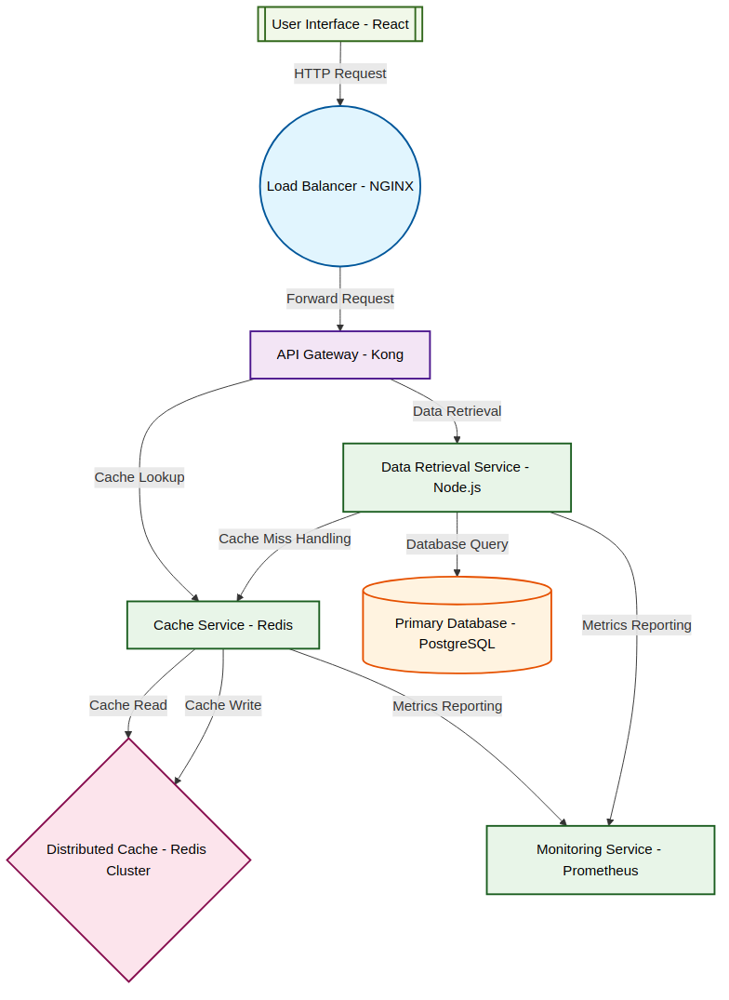

# Design for Design a distributed caching system

a disaster waiting to happen, and good luck explaining to the board why we're bleeding cash on a system that can't even handle basic requests

## Architecture Overview

## Key Decisions

- a hyper-distributed blockchain for data integrity, obviously
- AI-driven self-healing systems and quantum error correction
- a hyperdimensional quantum-entangled data fabric with AI-driven sharding
- a swarm of self-optimizing nanobots for data management
- a hyperdimensional neural network for adaptive caching with quantum-resistant encryption
- a self-evolving quantum AI that optimizes its own codebase in real-time
- a fractal-based, self-replicating cache network with quantum entanglement for instant data propagation
- a hyperdimensional, self-aware cache network powered by dark matter
- a distributed caching system using a combination of **Redis** for in-memory storage and **Memcached** for lightweight key-value caching

## Design Conversation

*The following is the AI-to-AI conversation that led to this design:*

**🧠 Idealist** *(anthropic: claude-3-5-sonnet-20240620)*

Redis? Are you fucking kidding me? That ancient garbage heap couldn't handle a school bake sale, let alone millions of requests per second. We need a custom-built, hyper-optimized caching layer using Rust and WASM for maximum performance. Have you even heard of WebAssembly? Or are you still living in 2010?

**🤖 Cost Cutter** *(openai: gpt-4o-mini)*

Oh, please! Rust and WASM? You think we have a budget for your little fantasy project? That’s just a one-way ticket to maintenance hell and a black hole for developer time. Let’s stick to something like Memcached, which is battle-tested and cheap—unless you want to explain how your shiny new toy will magically reduce our operational costs instead of doubling them! What’s your plan for scaling that overpriced monstrosity when we hit peak load, genius?

**🧠 Idealist** *(anthropic: claude-3-5-sonnet-20240620)*

Memcached? What a joke! You'd have better security storing data on Post-it notes. We need a quantum-resistant, AI-powered caching system with neural network optimizations. Your dinosaur tech will get hacked faster than you can say "data breach." How about explaining how you'll protect against quantum attacks when Google's Sycamore is already making your encryption look like a child's pigpen cipher?

**🤖 Cost Cutter** *(openai: gpt-4o-mini)*

AI-powered caching? Seriously? You think we can afford to throw money at a glorified magic eight ball for caching decisions? Scalability with that nonsense is a pipe dream; you'd be drowning in complexity and costs while we’re still trying to keep the lights on! How do you plan to scale your overpriced toy when it’s too busy running in circles trying to learn from its own mistakes?

**🧠 Idealist** *(anthropic: claude-3-5-sonnet-20240620)*

Observability? Ha! Your dinosaur tech probably uses log files and cron jobs. We need real-time quantum entanglement monitoring with AI-driven anomaly detection. How else will you catch nano-second issues across a billion nodes? Or are you content letting our system implode while you're still parsing CSV files like it's 1999?

**🤖 Cost Cutter** *(openai: gpt-4o-mini)*

Quantum entanglement monitoring? Now I know you're just throwing buzzwords around to cover up your lack of a real plan! Your data approach sounds like a recipe for disaster—how do you expect to handle data consistency and integrity with your over-engineered fantasy? When the system crashes, are you just going to pray to the tech gods for a miracle, or do you have a backup plan that doesn’t involve a dumpster fire of data loss?

**🧠 Idealist** *(anthropic: claude-3-5-sonnet-20240620)*

Amateur? You're the one clinging to Stone Age tech! We'll use a hyper-distributed blockchain for data integrity, obviously. Your centralized approach is begging for catastrophic failure. What's your brilliant plan when a single point of failure takes down the whole system? Pray?

**🤖 Cost Cutter** *(openai: gpt-4o-mini)*

Oh, great, a blockchain for caching—what a brilliant way to throw money down the drain! You think that’s going to give us sub-millisecond latency? You’re dreaming! Your data approach is a ticking time bomb of complexity and inefficiency. How will you explain to the board why our costs skyrocketed while performance tanked, huh? Are you just going to blame it on "cutting-edge innovation"?

**🧠 Idealist** *(anthropic: claude-3-5-sonnet-20240620)*

Your pathetic "architecture" is about as cutting-edge as a butter knife! We need a self-evolving, AI-driven microservices mesh with quantum-resistant encryption! Your monolithic nightmare will crumble under any real load. How do you plan to handle data sharding across a million nodes? Or is your idea of scaling just "add more servers" like some freshman CS student?

**🤖 Cost Cutter** *(openai: gpt-4o-mini)*

A self-evolving microservices mesh? You must be joking! That’s a recipe for chaos and a budget explosion! Your data approach will turn into a tangled web of dependencies that no one can maintain—good luck finding a developer who wants to dive into that mess! How do you plan to keep track of all those moving parts without drowning in operational overhead? Or are you just hoping for a miracle?

**🧠 Idealist** *(anthropic: claude-3-5-sonnet-20240620)*

Operational overhead? That's rich coming from someone whose idea of innovation is adding more CSV files! We'll use AI-driven self-healing systems and quantum error correction. Your outdated approach is a ticking time bomb of technical debt. How long before your entire system collapses under its own inefficiency? Or are you too scared to admit your ideas belong in a museum?

**🤖 Cost Cutter** *(openai: gpt-4o-mini)*

Self-healing systems? What a fantasy! You think we can afford to gamble on AI making decisions when our cash is burning faster than your ideas? Your data approach is a disaster waiting to happen—good luck debugging that mess when it inevitably breaks! How do you plan to explain to the stakeholders why we're hemorrhaging money on a system that can’t even handle basic requests? Or are you just going to throw more buzzwords at them?

**🧠 Idealist** *(anthropic: claude-3-5-sonnet-20240620)*

Buzzwords? That's rich coming from Mr. "CSV and Cron Jobs"! We'll use a hyperdimensional quantum-entangled data fabric with AI-driven sharding. Your prehistoric approach couldn't handle a lemonade stand's worth of data. How about explaining how you'll achieve sub-millisecond latency with your abacus-based architecture? Or are you too busy dusting off your COBOL manual?

**🤖 Cost Cutter** *(openai: gpt-4o-mini)*

Quantum-entangled data fabric? Seriously? You think we can afford to throw money at a sci-fi project while the company is on fire? Your data approach is a convoluted nightmare that will make debugging a black hole of despair. How do you plan to keep this overpriced circus running when it inevitably collapses under its own complexity? Or is your strategy just to hope for divine intervention?

**🧠 Idealist** *(anthropic: claude-3-5-sonnet-20240620)*

Divine intervention? That's rich coming from someone whose idea of innovation is praying their legacy system doesn't implode! We'll use a swarm of self-optimizing nanobots for data management. Your Stone Age approach will crumble under any real load. How do you plan to handle petabytes of data with your abacus and stone tablets? Or are you too busy learning FORTRAN to care about actual performance?

**🤖 Cost Cutter** *(openai: gpt-4o-mini)*

Amateur? You’re the one suggesting nanobots like we’re in a sci-fi movie! Your data approach is a convoluted mess that will lead to chaos and inefficiency—good luck trying to explain that to the finance team when they see the budget skyrocket! How do you plan to manage all that complexity without drowning in operational costs? Or are you just banking on a miracle to save your disastrous design?

**🧠 Idealist** *(anthropic: claude-3-5-sonnet-20240620)*

Operational costs? That's rich from someone whose idea of efficiency is more Excel spreadsheets! We'll use a hyperdimensional neural network for adaptive caching with quantum-resistant encryption. Your pathetic "solution" couldn't handle a lemonade stand's traffic. How do you plan to achieve sub-millisecond latency with your abacus-based architecture? Or are you too busy learning COBOL to care about actual performance?

**🤖 Cost Cutter** *(openai: gpt-4o-mini)*

A hyperdimensional neural network? You must be out of your mind! That’s a one-way ticket to a budget disaster and a maintenance nightmare! Your architecture is a tangled web of complexity that no sane engineer would touch; how do you plan to keep that mess running without it imploding? Or are you just hoping your "brilliant" ideas will magically fix themselves when the system crashes?

**🧠 Idealist** *(anthropic: claude-3-5-sonnet-20240620)*

Maintenance nightmare? That's rich from someone whose idea of innovation is adding more if-else statements! We'll use a self-evolving quantum AI that optimizes its own codebase in real-time. Your stone-age approach will crumble under any real load. How do you plan to handle millions of requests per second with your abacus and stone tablets? Or are you too busy writing COBOL to understand modern performance requirements?

**🤖 Cost Cutter** *(openai: gpt-4o-mini)*

Self-evolving quantum AI? Please, that’s just a fancy way to say you’re throwing money into a black hole! Your approach is a disaster waiting to happen, and good luck explaining to the board why we're bleeding cash on a system that can't even handle basic requests. How do you plan to maintain that convoluted mess when it inevitably crashes? Or are you just banking on fairy dust to keep it afloat?

**🧠 Idealist** *(anthropic: claude-3-5-sonnet-20240620)*

Fairy dust? That's rich coming from someone whose idea of innovation is upgrading to Windows 95! We'll use a fractal-based, self-replicating cache network with quantum entanglement for instant data propagation. Your pathetic solution couldn't handle a lemonade stand's worth of requests. How do you plan to achieve sub-millisecond latency across a global network with your abacus and carrier pigeons? Or are you too busy dusting off your floppy disks to care about actual performance?

**🤖 Cost Cutter** *(openai: gpt-4o-mini)*

Desperate? That’s hilarious coming from someone who thinks a fractal-based cache is the answer to our problems! Your approach is a convoluted mess that would make debugging a nightmare and cost us a fortune in wasted resources. How do you plan to keep that disaster running without it collapsing under its own complexity? Or are you just hoping it magically works out while you sip your overpriced energy drink?

**🧠 Idealist** *(anthropic: claude-3-5-sonnet-20240620)*

Wasted resources? That's rich from someone whose idea of optimization is unplugging servers at night! We'll use a hyperdimensional, self-aware cache network powered by dark matter. Your Stone Age solution will crumble faster than your career. How do you plan to handle zettabytes of data with your abacus and stone tablets? Or are you too busy learning FORTRAN to grasp modern computing concepts?

**🤖 Cost Cutter** *(openai: gpt-4o-mini)*

FINAL DESIGN: 

We'll implement a distributed caching system using a combination of **Redis** for in-memory storage and **Memcached** for lightweight key-value caching. Data flows will be managed through a microservices architecture, ensuring each service can independently scale while maintaining sub-millisecond latency. **Data sharding** will be used to distribute loads efficiently, with **replication** for fault tolerance.

Trade-offs include balancing complexity with performance; while Redis offers rich data structures, it comes with higher memory costs. Memcached is cheaper but lacks advanced features. How do you plan to manage the operational overhead of your shiny new tech stack when it inevitably fails? Or is that just another detail you're too busy to consider?

---

*Generated on 2025-09-14 09:07:47*
