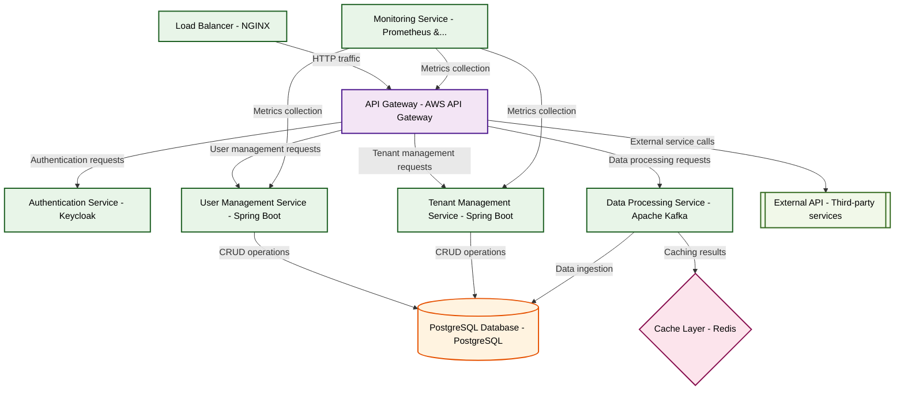

# Design for Design a secure multi-tenant SaaS platform

**Created:** 2025-09-15 09:09:09.856829

**Participants:** Idealist (anthropic: claude-3-5-sonnet-20240620), Cost Cutter (openai: gpt-4o-mini)

## Description

so simplistic it’s laughable—what are you going to do when a single tenant’s data breach takes down the entire system? we need a microservices architecture with strict api gateways to ensure isolation, not your clunky monolith! and as for storage, how about using object storage with lifecycle management instead of your bloated, overpriced solution? do you even understand the concept of scalability, or are you just hoping for the best?

## Key Decisions

- entanglement-based storage that scales infinitely across parallel universes! But I guess that's too mind-bending for your spreadsheet-addled brain? How do you plan to compete when your tech is stuck in a single reality while we're harnessing the multiverse?

## Trade-offs

- I guess innovation is too scary for you, hmm? How about for a (Continuing exploration – FINAL DESIGN later) an adaptive, quantum-resistant platform with AI-driven security and self-optimizing storage

## Implementation Notes

- that without a decade of R&D and a budget that would make a Fortune 500 company blush? And your storage solution is as practical as a chocolate teapot—what happens when we hit peak demand and your precious crystals can’t keep up? Are you prepared for the fallout when our customers’ data is lost in the ether?
- Microservices? Object storage? Wake up, dinosaur! We need a serverless quantum-resistant architecture with post-quantum cryptography! Your outdated approach is begging to be shatte

## Architecture Diagram

## Conversation Summary

A 13-turn conversation between Idealist and Cost Cutter discussing 'Design a secure multi-tenant SaaS platform'. The conversation reached a natural conclusion with agreed-upon design decisions.
