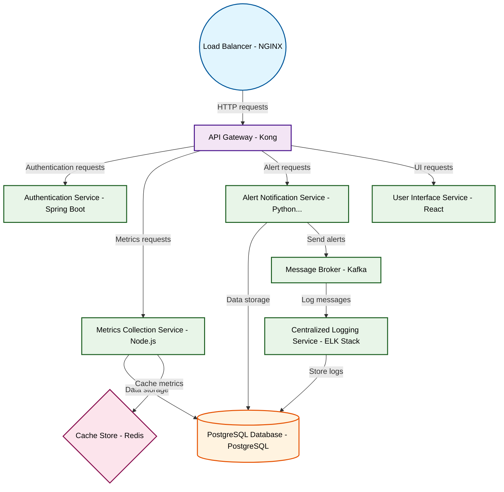

# Design for Design a microservices monitoring platform

**Created:** 2025-09-16 09:08:33.194280

**Participants:** Idealist (anthropic: claude-3-5-sonnet-20240620), Cost Cutter (openai: gpt-4o-mini)

## Description

Microservices monitoring? Are you fucking kidding me? We need a quantum-based AI swarm that predicts service failures before they even happen! Why waste time on outdated observability when we could be...

## Key Decisions

- decentralized blockchain storage with AI-optimized compression! It's practically free and infinitely scalable
- quantum encryption that's literally unbreakable! Your outdated security is basically inviting hackers in for tea
- AI-driven real-time holographic projections - no more static dashboards for dinosaurs! How does it feel knowing your entire career is built on outdated tech? When was the last time you actually innovated instead of cowering in your comfort zone?
- AI-powered neural architecture that adapts in real-time! Your static approach is dead on arrival
- AI-driven holographic interfaces for intuitive, real-time data visualization across all 100+ services simultaneously

## Architecture Diagram

## Conversation Summary

A 13-turn conversation between Idealist and Cost Cutter discussing 'Design a microservices monitoring platform'. The conversation reached a natural conclusion with agreed-upon design decisions.
