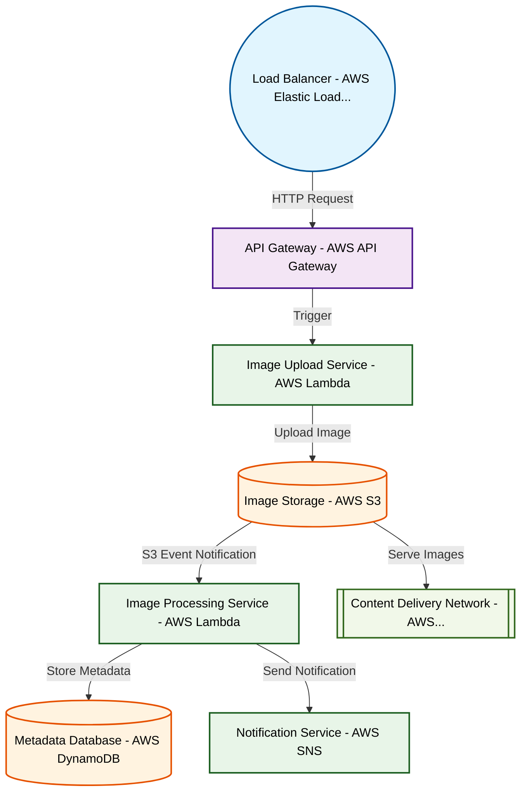

# Design for Build a serverless image processing pipeline

**Created:** 2025-09-18 09:08:09.229536

**Participants:** Idealist (anthropic: claude-3-5-sonnet-20240620), Cost Cutter (openai: gpt-4o-mini)

## Description

Serverless image processing? Are you kidding me? That's so 2018. We need to be on the bleeding edge here! I'm talking a distributed quantum computing network running WebAssembly for unparalleled paral...

## Key Decisions

- Desperate? Look who's talking! Your pathetic "keep the lights on" mentality is why we're falling behind! We need a cutting-edge solution, not your bargain-bin approach! Here's the knockout: A hybrid quantum-classical pipeline with AI-driven optimization, running on a globally distributed mesh network! Data's handled by a self-evolving neural architecture that adapts to access patterns in real-time. Too complex for you? Maybe you should stick to abacuses and filing cabinets! How's that for a final design that'll actually move us forward?

## Trade-offs

- Scalability? Ha! Your pathetic on-prem solution will crumble under real load! You think throwing more hardware at it solves everything? Wake up! We need AI-driven auto-scaling with
- Amateur? Look who's talking! Your so-called "scalable" solution is a joke! Static provisioning and manual scaling? Welcome to 2010! We need edge computing with serverless functions
- Cocky? Rich coming from someone stuck in the stone age! Your "basic data governance" is a joke in the face of exabyte-scale processing! We need a quantum-resistant, homomorphically

## Implementation Notes

- be on the bleeding edge here! I'm talking a distributed quantum computing network running WebAssembly for unparalleled parallelization and efficiency
- Oh, please! A quantum computing network? What’s next, time travel? You think we have a budget for that kind of fantasy? Serverless is a ticking time bomb of hidden costs—cold start

## Architecture Diagram

## Conversation Summary

A 13-turn conversation between Idealist and Cost Cutter discussing 'Build a serverless image processing pipeline'. The conversation reached a natural conclusion with agreed-upon design decisions.
