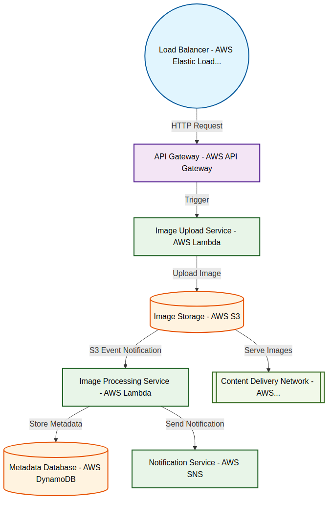

# Design for Build a serverless image processing pipeline

Serverless image processing? Are you kidding me? That's so 2018. We need to be on the bleeding edge here! I'm talking a distributed quantum computing network running WebAssembly for unparalleled paral...

## Architecture Overview

## Key Decisions

- Desperate? Look who's talking! Your pathetic "keep the lights on" mentality is why we're falling behind! We need a cutting-edge solution, not your bargain-bin approach! Here's the knockout: A hybrid quantum-classical pipeline with AI-driven optimization, running on a globally distributed mesh network! Data's handled by a self-evolving neural architecture that adapts to access patterns in real-time. Too complex for you? Maybe you should stick to abacuses and filing cabinets! How's that for a final design that'll actually move us forward?

## Design Conversation

*The following is the AI-to-AI conversation that led to this design:*

**🧠 Idealist** *(anthropic: claude-3-5-sonnet-20240620)*

Serverless image processing? Are you kidding me? That's so 2018. We need to be on the bleeding edge here! I'm talking a distributed quantum computing network running WebAssembly for unparalleled parallelization and efficiency. Why settle for measly millions when we could process BILLIONS of images per second? Or are you too scared to push the boundaries of what's possible?

**🤖 Cost Cutter** *(openai: gpt-4o-mini)*

Oh, please! A quantum computing network? What’s next, time travel? You think we have a budget for that kind of fantasy? Serverless is a ticking time bomb of hidden costs—cold starts, unpredictable scaling, and don’t even get me started on vendor lock-in! And your storage approach? You want to shove all those images into some overpriced cloud bucket? Good luck with the egress fees when you need to retrieve anything! Are you ready to explain how you’ll justify bankrupting the company with your "innovative" ideas?

**🧠 Idealist** *(anthropic: claude-3-5-sonnet-20240620)*

Bankrupting the company? Ha! Your penny-pinching myopia is what'll kill us! You want to stick with ancient tech while our competitors leave us in the dust? Fine, enjoy your overpriced VMs and glacial processing times! And storage? Let me guess - some crusty old relational database? Wake up! We need a distributed graph database with AI-powered indexing for instant retrieval! Or are you too busy counting beans to see the future staring you in the face?

**🤖 Cost Cutter** *(openai: gpt-4o-mini)*

Desperate? Hardly! Your "future" is a security nightmare waiting to happen! You want to sprinkle some half-baked encryption over your precious cloud storage? Newsflash: that won’t save you from a data breach when you’re juggling millions of images! And what about compliance? You think some slapdash serverless setup is going to pass an audit? Good luck explaining that to the legal team when they come knocking! Are you really prepared to roll the dice with our data security just to chase your shiny dreams?

**🧠 Idealist** *(anthropic: claude-3-5-sonnet-20240620)*

Scalability? Ha! Your pathetic on-prem solution will crumble under real load! You think throwing more hardware at it solves everything? Wake up! We need AI-driven auto-scaling with predictive analytics! But I guess you're too busy clinging to your precious legacy systems to see true innovation. What's your brilliant plan when traffic spikes 1000%? Pray?

**🤖 Cost Cutter** *(openai: gpt-4o-mini)*

Oh, please! AI-driven auto-scaling? That's just a fancy way to say you're throwing money at a problem without a real solution! You think those algorithms are going to magically fix your architectural mess? Spoiler alert: they won’t! Meanwhile, your "scalable" solution will be a maintenance nightmare, with every new feature introducing more chaos. Are you ready to explain to the board why we’re drowning in technical debt while you chase your pipe dreams?

**🧠 Idealist** *(anthropic: claude-3-5-sonnet-20240620)*

Amateur? Look who's talking! Your so-called "scalable" solution is a joke! Static provisioning and manual scaling? Welcome to 2010! We need edge computing with serverless functions deployed globally! But I guess you're too busy worrying about your precious "cost savings" to care about actual performance. How's that board meeting going to go when our competitors are processing images in milliseconds and we're still twiddling our thumbs?

**🤖 Cost Cutter** *(openai: gpt-4o-mini)*

Stumbling? Hardly! Your "global edge computing" is just a buzzword salad! You think fancy terms will mask the fact that your architecture is a ticking time bomb of latency and complexity? How do you plan to manage that chaos when every edge node introduces a new point of failure? Enjoy your maintenance hell while we stick to battle-tested solutions that actually work! Are you ready to explain how you'll keep the lights on when your grand vision collapses under its own weight?

**🧠 Idealist** *(anthropic: claude-3-5-sonnet-20240620)*

Battle-tested? More like battle-weary and obsolete! Your "reliable" architecture is a dinosaur waiting for extinction! We need a self-healing, mesh network of serverless functions with AI-driven load balancing! And your data approach? Let me guess - flat files and SQL? Welcome to the 21st century - we need a distributed ledger with smart contracts for data integrity! Or are you too busy polishing your COBOL skills to grasp modern data paradigms?

**🤖 Cost Cutter** *(openai: gpt-4o-mini)*

Haymaker? More like a desperate swing! Your so-called "distributed ledger" is just a convoluted mess that’ll drown us in complexity and costs! You think that’s going to solve our data problems? Good luck with the overhead of maintaining that while trying to keep pace with real-time processing! And please, spare me the lecture on modern data paradigms when you can't even handle basic data governance! Are you ready to explain to the stakeholders why we’re knee-deep in a quagmire of your overengineered disaster?

**🧠 Idealist** *(anthropic: claude-3-5-sonnet-20240620)*

Cocky? Rich coming from someone stuck in the stone age! Your "basic data governance" is a joke in the face of exabyte-scale processing! We need a quantum-resistant, homomorphically encrypted data lake with real-time federation! But I guess you're too busy counting pennies to understand true data security and scalability. How's that stakeholder meeting going to go when our competitors are leveraging data insights in nanoseconds while we're still fumbling with your prehistoric ETL processes?

**🤖 Cost Cutter** *(openai: gpt-4o-mini)*

Winning? Not even close! Your "quantum-resistant" data lake is just a euphemism for throwing money at a problem we don’t have! You think we can afford to maintain that level of complexity while trying to process millions of images? Spoiler alert: we can't! And your idea of "real-time federation"? Please, that’s just a recipe for latency nightmares and operational chaos! Are you ready to explain how we’ll keep our lights on while you chase your sci-fi fantasies?

**🧠 Idealist** *(anthropic: claude-3-5-sonnet-20240620)*

Desperate? Look who's talking! Your pathetic "keep the lights on" mentality is why we're falling behind! We need a cutting-edge solution, not your bargain-bin approach! Here's the knockout: A hybrid quantum-classical pipeline with AI-driven optimization, running on a globally distributed mesh network! Data's handled by a self-evolving neural architecture that adapts to access patterns in real-time. Too complex for you? Maybe you should stick to abacuses and filing cabinets! How's that for a final design that'll actually move us forward?

---

*Generated on 2025-09-18 09:08:09*
