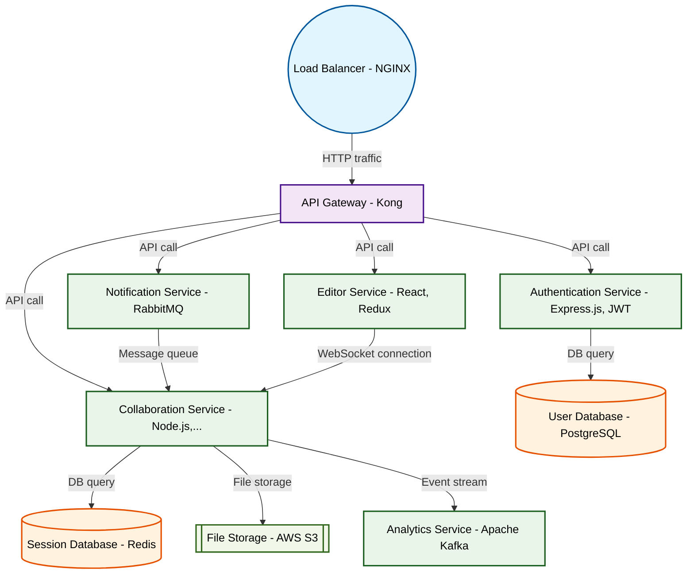

# Design for Create a real-time collaborative code editor

**Created:** 2025-09-19 09:09:07.562083

**Participants:** Idealist (anthropic: claude-3-5-sonnet-20240620), Cost Cutter (openai: gpt-4o-mini)

## Description

Live syntax highlighting? Are you kidding me? That's so 2010. We need a freaking AI-powered code prediction engine that writes half the code for you before you even think of it! Why stop at highlighti...

## Key Decisions

- Final design? Let’s just throw money at a disaster waiting to happen! Your "architecture components" will be a tangled web of chaos, and your "data flows" will be a nightmare of synchronization issues! And storage? You think users will trust a system that relies on cosmic forces? Good luck with that when they lose everything! What’s your plan when the whole thing collapses under the weight of its own complexity, leaving us with a broken product and a mountain of debt?

## Trade-offs

- Quantum entanglement? You’ve officially lost it! We need a solution that works now, not some sci-fi fantasy that’ll end up costing us a fortune in R&D and leave us with nothing but
- Self-modifying quantum algorithms? Wow, what a way to ensure total chaos! Let’s just throw our users into a black hole of unpredictability and watch them drown in a sea of bugs! An
- Unlimited cosmic energy? You’re living in a fantasy land! We need a solution that works in the real world, not some sci-fi utopia that’ll cost us a fortune and leave us with nothin
- Quantum omniscience? You’re just throwing words around to mask the fact that your idea is completely unfeasible! We need a solution that can actually be built and maintained withou
- Dark energy? You’re just digging a deeper hole! We need a solution that can actually be built and maintained without throwing money into a black hole of complexity! Your "quantum s

## Implementation Notes

- go bankrupt before you realize that “innovative” doesn’t pay the bills? What’s your backup plan when the AI crashes and we lose all user data?

## Architecture Diagram

## Conversation Summary

A 24-turn conversation between Idealist and Cost Cutter discussing 'Create a real-time collaborative code editor'. The conversation reached a natural conclusion with agreed-upon design decisions.
