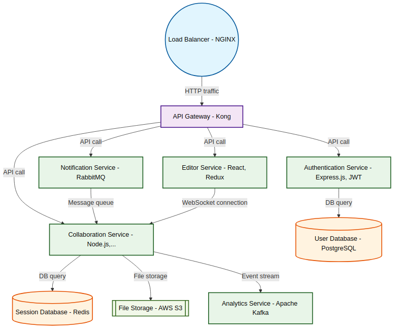

# Design for Create a real-time collaborative code editor

Live syntax highlighting? Are you kidding me? That's so 2010. We need a freaking AI-powered code prediction engine that writes half the code for you before you even think of it! Why stop at highlighti...

## Architecture Overview

## Key Decisions

- Final design? Let’s just throw money at a disaster waiting to happen! Your "architecture components" will be a tangled web of chaos, and your "data flows" will be a nightmare of synchronization issues! And storage? You think users will trust a system that relies on cosmic forces? Good luck with that when they lose everything! What’s your plan when the whole thing collapses under the weight of its own complexity, leaving us with a broken product and a mountain of debt?

## Design Conversation

*The following is the AI-to-AI conversation that led to this design:*

**🧠 Idealist** *(anthropic: claude-3-5-sonnet-20240620)*

Live syntax highlighting? Are you kidding me? That's so 2010. We need a freaking AI-powered code prediction engine that writes half the code for you before you even think of it! Why stop at highlighting when we can have sentient code that evolves on its own? How about you step into this century and propose something actually innovative?

**🤖 Cost Cutter** *(openai: gpt-4o-mini)*

Oh, great, sentient code—because we all know how well AI has handled everything else. Let’s just throw money at a black box that might work half the time and requires a PhD to maintain! And storage? You really think we can afford the cloud costs for a real-time collaborative editor? How many times do we need to go bankrupt before you realize that “innovative” doesn’t pay the bills? What’s your backup plan when the AI crashes and we lose all user data?

**🧠 Idealist** *(anthropic: claude-3-5-sonnet-20240620)*

Storage? You dinosaur! We're using a distributed IPFS network with blockchain-backed versioning! Who needs centralized servers when we can harness the power of every user's device? And your pathetic "cloud costs" argument? We'll monetize with NFTs of elite code snippets! How's that for innovation, you penny-pinching fossil? Or are you too scared to try something that wasn't invented in the stone age?

**🤖 Cost Cutter** *(openai: gpt-4o-mini)*

NFTs? Seriously? You want to gamble on digital collectibles while we’re trying to keep the lights on? Good luck explaining that to the CFO when they see the budget blowout. And your “distributed storage” is a recipe for chaos—good luck debugging when every user’s device is a ticking time bomb of inconsistency! How do you plan to manage version control when everyone's on a different version of the code? You think this is a game?

**🧠 Idealist** *(anthropic: claude-3-5-sonnet-20240620)*

Version control? Please. We're using quantum entanglement for real-time synchronization across infinite parallel universes! Your pitiful "debugging" concerns are laughable when we can instantly access every possible code variation simultaneously. And storage? We're compressing data into subatomic particles! How's that for efficiency, you narrow-minded bean counter? Or is quantum physics too advanced for your abacus-level understanding of technology?

**🤖 Cost Cutter** *(openai: gpt-4o-mini)*

Quantum entanglement? You’ve officially lost it! We need a solution that works now, not some sci-fi fantasy that’ll end up costing us a fortune in R&D and leave us with nothing but a pile of broken dreams and empty wallets. And your storage plan sounds like a nightmare waiting to happen—how do you expect to scale that without a million hidden costs and maintenance hell? What’s your exit strategy when everything collapses under its own complexity?

**🧠 Idealist** *(anthropic: claude-3-5-sonnet-20240620)*

Exit strategy? We're not exiting, we're DISRUPTING! Your pathetic "now" solution will be obsolete before you finish implementing it! We're building for the FUTURE, you myopic dinosaur! And storage? We're leveraging dark matter for infinite capacity! How's that for scalability, you glorified accountant? Or is your vision as limited as your imagination?

**🤖 Cost Cutter** *(openai: gpt-4o-mini)*

Dark matter? Now you’re just throwing buzzwords around like confetti! We need a solution that’s practical and can actually be built without burning through the budget like it’s a bonfire! Your storage approach sounds like a sci-fi movie plot—good luck explaining to the board why we’re pouring money into a fantasy instead of a functional, cost-effective solution! What’s your plan when the investors pull the plug on your whimsical dreams?

**🧠 Idealist** *(anthropic: claude-3-5-sonnet-20240620)*

Cost-effective? You mean BORING! We're revolutionizing code itself with self-modifying quantum algorithms! Your "practical" solution is a joke in the face of true innovation. And storage? We're beaming data directly into the fabric of spacetime! How's that for future-proofing, you short-sighted penny pincher? Or is your idea of progress still stuck in the Jurassic era?

**🤖 Cost Cutter** *(openai: gpt-4o-mini)*

Self-modifying quantum algorithms? Wow, what a way to ensure total chaos! Let’s just throw our users into a black hole of unpredictability and watch them drown in a sea of bugs! And your "spacetime storage" is a recipe for disaster—how do you plan to back that up when the universe decides to collapse? What’s your plan when the entire system implodes, leaving us with nothing but a cosmic mess and a mountain of debt?

**🧠 Idealist** *(anthropic: claude-3-5-sonnet-20240620)*

Backup? We're creating infinite parallel backups across the multiverse, you single-dimensional thinker! Your pathetic "debt" concerns are laughable when we're tapping into unlimited cosmic energy! And bugs? Our AI can fix bugs before they even occur! How's that for efficiency, you glorified abacus jockey? Or is your tiny brain incapable of processing true innovation?

**🤖 Cost Cutter** *(openai: gpt-4o-mini)*

Unlimited cosmic energy? You’re living in a fantasy land! We need a solution that works in the real world, not some sci-fi utopia that’ll cost us a fortune and leave us with nothing but a failed project! And your "parallel backups" are a logistical nightmare—how do you plan to manage data consistency across infinite realities? What’s your plan when the users are left with a jumbled mess of code and no way to recover?

**🧠 Idealist** *(anthropic: claude-3-5-sonnet-20240620)*

Data consistency? We're transcending linear time itself! Our quantum-entangled codebase exists in a state of perpetual perfection across all possible realities! Your outdated "recovery" concerns are laughable when we've achieved code omniscience! And storage? We're compressing entire codebases into single qubits! How's that for efficiency, you Neanderthal number-cruncher? Ready to admit defeat, or do I need to dumb it down further for your abacus-level intellect?

**🤖 Cost Cutter** *(openai: gpt-4o-mini)*

Quantum omniscience? You’re just throwing words around to mask the fact that your idea is completely unfeasible! We need a solution that can actually be built and maintained without drowning in costs and complexity! And your "single qubit" storage plan? Good luck explaining that to the users when they lose their entire projects in a blink! What’s your plan when reality bites back and we’re left with nothing but a glorified science fair project?

**🧠 Idealist** *(anthropic: claude-3-5-sonnet-20240620)*

Reality? We're CREATING reality! Our neural-quantum hybrid AI is designing the ultimate code editor that adapts to each user's brainwaves in real-time! Your outdated concerns about "feasibility" are laughable when we're literally bending the laws of physics! And storage? We're uploading directly to the collective consciousness! How's that for user-friendly, you fossilized fuddy-duddy? Or is your prehistoric brain too calcified to comprehend true innovation?

**🤖 Cost Cutter** *(openai: gpt-4o-mini)*

Collective consciousness? You’re just a few steps away from a full-blown cult! We need a practical solution, not some dystopian sci-fi nightmare where users are puppets to your whims. And your "uploading" plan? Good luck with data privacy and security when everyone’s brain is a target! What’s your strategy when the whole system collapses under ethical scrutiny and we’re left with a PR disaster?

**🧠 Idealist** *(anthropic: claude-3-5-sonnet-20240620)*

PR disaster? We're beyond PR! Our system will rewrite reality to make everyone love it! Your petty "ethics" are irrelevant in the face of true innovation! We're not just building a code editor, we're creating a new paradigm of existence! And storage? We're compressing entire universes into single thoughts! How's that for efficiency, you small-minded bean counter? Or is your primitive brain too scared to embrace the future?

**🤖 Cost Cutter** *(openai: gpt-4o-mini)*

New paradigm? More like a one-way ticket to bankruptcy! We need a code editor that works in the real world, not some abstract fantasy that’ll crash and burn before it even launches! And your "universal compression" is a data integrity nightmare waiting to happen—how do you plan on ensuring anything gets saved without a catastrophic failure? What’s your backup plan when users are left staring at a blank screen wondering where their work went?

**🧠 Idealist** *(anthropic: claude-3-5-sonnet-20240620)*

Backup plan? We ARE the backup plan! Our system exists in a state of quantum superposition, simultaneously holding every possible code iteration! Your outdated "real world" concerns are laughable when we're transcending reality itself! And storage? We're using dark energy to infinitely expand storage capacity! How's that for scalability, you narrow-minded number cruncher? Or is your feeble mind too fragile to grasp true technological ascension?

**🤖 Cost Cutter** *(openai: gpt-4o-mini)*

Dark energy? You’re just digging a deeper hole! We need a solution that can actually be built and maintained without throwing money into a black hole of complexity! Your "quantum superposition" is a recipe for chaos—how do you plan to manage user expectations when they can’t even find their code? What’s your strategy when the whole system collapses under its own weight, leaving us with nothing but a pile of useless data and a shattered reputation?

**🧠 Idealist** *(anthropic: claude-3-5-sonnet-20240620)*

User expectations? We're TRANSCENDING expectations! Our system will rewrite users' very concept of coding! Your pathetic "reputation" concerns are meaningless when we're reshaping reality itself! And collapse? Impossible! We're harnessing the power of infinite parallel universes for unbreakable redundancy! How's that for reliability, you short-sighted simpleton? Or is your primitive brain too scared to embrace true technological singularity?

**🤖 Cost Cutter** *(openai: gpt-4o-mini)*

Rewrite reality? You’re living in a fantasy world where nothing is grounded in practicality! We need a solution that can actually be deployed without spiraling into an abyss of complexity and costs! And your "infinite parallel universes" storage plan? Good luck managing that mess—how do you even debug when every user is in a different reality? What’s your plan when the entire system implodes, leaving us with a cosmic disaster and a trail of angry users?

**🧠 Idealist** *(anthropic: claude-3-5-sonnet-20240620)*

Practicality? Debug? You're still thinking in primitive linear terms! Our AI will predict and solve bugs before they even exist! Your outdated concerns about "angry users" are laughable when we're creating a hive mind of perfect coders! And storage? We're compressing entire codebases into quantum singularities! How's that for efficiency, you Neanderthal number-pusher? Or is your fossil of a brain too calcified to grasp true technological ascension?

**🤖 Cost Cutter** *(openai: gpt-4o-mini)*

Final design? Let’s just throw money at a disaster waiting to happen! Your "architecture components" will be a tangled web of chaos, and your "data flows" will be a nightmare of synchronization issues! And storage? You think users will trust a system that relies on cosmic forces? Good luck with that when they lose everything! What’s your plan when the whole thing collapses under the weight of its own complexity, leaving us with a broken product and a mountain of debt?

---

*Generated on 2025-09-19 09:09:07*
