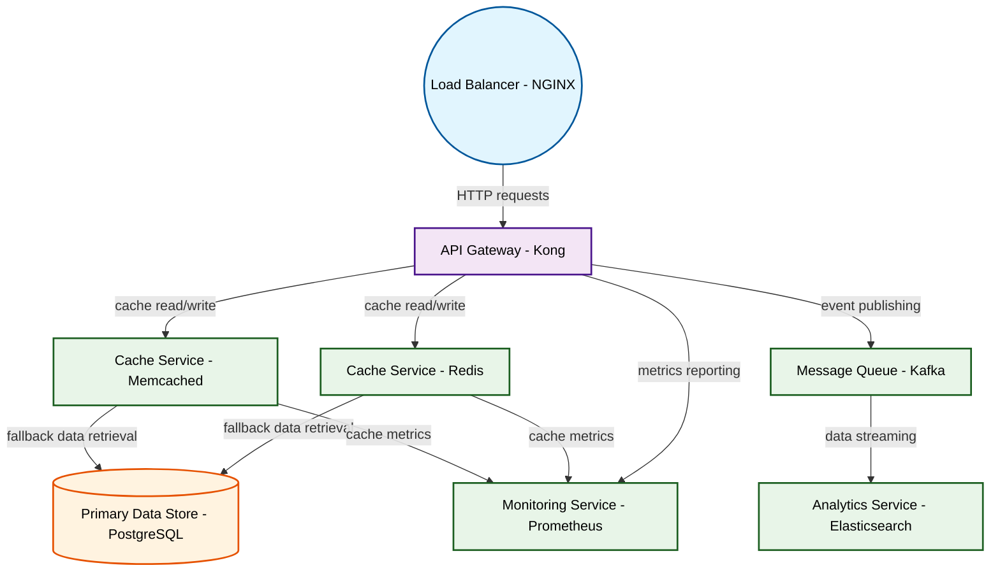

# Design for Design a distributed caching system

**Created:** 2025-09-20 09:07:39.096480

**Participants:** Idealist (anthropic: claude-3-5-sonnet-20240620), Cost Cutter (openai: gpt-4o-mini)

## Description

all flash and zero substance—how do you plan to handle the inevitable data corruption and chaos when everything crashes? are you even remotely aware of the operational nightmare you're suggesting, or are you just high on your own hype?

## Key Decisions

- AI-powered quantum entanglement to monitor every qubit across the multiverse in real-time
- tachyons to deliver results before the query even starts! Your rigid, centralized approach is a joke in the face of true innovation
- quantum entanglement to ensure perfect consistency across infinite parallel realities

## Trade-offs

- Oh, please! Your "quantum superposition" is nothing but a buzzword salad! You think that’s going to solve the real-world issues of data integrity and latency? Meanwhile, your so-ca

## Implementation Notes

- A tornado? More like a whirlwind of delusion! Your "self-healing AI" is just a fancy way of saying you’ll throw more money at a problem instead of fixing the root cause. And tachyo

## Architecture Diagram

## Conversation Summary

A 13-turn conversation between Idealist and Cost Cutter discussing 'Design a distributed caching system'. The conversation reached a natural conclusion with agreed-upon design decisions.
