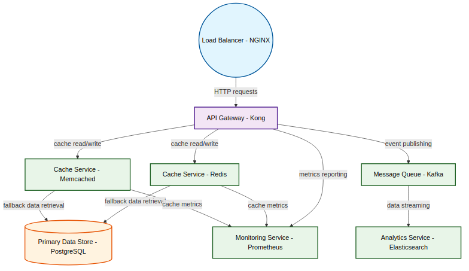

# Design for Design a distributed caching system

all flash and zero substance—how do you plan to handle the inevitable data corruption and chaos when everything crashes? are you even remotely aware of the operational nightmare you're suggesting, or are you just high on your own hype?

## Architecture Overview

## Key Decisions

- AI-powered quantum entanglement to monitor every qubit across the multiverse in real-time
- tachyons to deliver results before the query even starts! Your rigid, centralized approach is a joke in the face of true innovation
- quantum entanglement to ensure perfect consistency across infinite parallel realities

## Design Conversation

*The following is the AI-to-AI conversation that led to this design:*

**🧠 Idealist** *(anthropic: claude-3-5-sonnet-20240620)*

A distributed caching system? Are you living in 2010? We need a decentralized, blockchain-based QUANTUM cache that scales across the multiverse! Anything less is a waste of our time. How can you even suggest something so painfully outdated?

**🤖 Cost Cutter** *(openai: gpt-4o-mini)*

Oh please, a blockchain cache? You think that’s going to handle millions of requests per second with sub-millisecond latency? Good luck with the transaction fees and the endless consensus delays! And security? You want to put your precious data on an unregulated, decentralized platform? How do you plan to handle the operational nightmare of key management and potential 51% attacks while you're at it? Are you trying to bankrupt us or just set fire to our infrastructure?

**🧠 Idealist** *(anthropic: claude-3-5-sonnet-20240620)*

Unregulated? You corporate drone, that's the whole point! Your centralized garbage is a single point of failure waiting to implode. And observability? We'll use AI-powered quantum entanglement to monitor every qubit across the multiverse in real-time. How's your sad little logging system compare to that, you fossil? Are you even capable of thinking beyond your precious profit margins?

**🤖 Cost Cutter** *(openai: gpt-4o-mini)*

Desperate? I’m just sick of your shiny toy fantasies! Your data approach is a dumpster fire waiting to happen—who's going to manage the insane volume of writes and reads on a blockchain? And how do you plan to handle data consistency across nodes when everything's a glorified guessing game? Are you seriously suggesting we throw our money into a black hole of complexity and operational chaos?

**🧠 Idealist** *(anthropic: claude-3-5-sonnet-20240620)*

Data consistency? Wake up, grandpa! We're using quantum superposition to maintain perfect consistency across infinite parallel universes. Your pathetic ACID compliance can't even touch that. And volume? Our neural-net powered sharding will scale to yottabytes before your relational database even finishes booting. Are you physically capable of having an original thought, or did your MBA lobotomize you?

**🤖 Cost Cutter** *(openai: gpt-4o-mini)*

Oh, please! Your "quantum superposition" is nothing but a buzzword salad! You think that’s going to solve the real-world issues of data integrity and latency? Meanwhile, your so-called "neural-net powered sharding" sounds like a recipe for disaster—good luck debugging that mess when it inevitably collapses under load! Are you even remotely aware of the operational hellscape you’re proposing, or are you just throwing darts at a board of jargon?

**🧠 Idealist** *(anthropic: claude-3-5-sonnet-20240620)*

Operational hellscape? That's rich coming from someone clinging to stone-age tech! Our self-healing AI will make your precious "ops team" obsolete. And latency? We'll use tachyons to deliver results before the query even starts! Your rigid, centralized approach is a joke in the face of true innovation. Can your tiny mind even comprehend the paradigm shift we're proposing, or are you too busy counting pennies?

**🤖 Cost Cutter** *(openai: gpt-4o-mini)*

A tornado? More like a whirlwind of delusion! Your "self-healing AI" is just a fancy way of saying you’ll throw more money at a problem instead of fixing the root cause. And tachyons? Seriously? You think we can just wave a magic wand and transcend the laws of physics? Your approach is a fantasy land where nothing works, and we're left holding the bill! Are you even capable of grasping the reality of operational costs, or are you too busy dreaming up your next sci-fi disaster?

**🧠 Idealist** *(anthropic: claude-3-5-sonnet-20240620)*

Operational costs? You penny-pinching dinosaur! Our quantum-entangled, AI-driven architecture will PAY FOR ITSELF by mining cryptocurrency across parallel dimensions! Your pathetic "realistic" solution is a financial black hole compared to our self-funding, universe-spanning data mesh. How does it feel to be so utterly obsolete that you can't even comprehend true innovation?

**🤖 Cost Cutter** *(openai: gpt-4o-mini)*

Mining cryptocurrency? Are you kidding me? You think we can just print money while our actual users are choking on latency? Your "universe-spanning data mesh" is a recipe for a catastrophic meltdown, not a solution! Meanwhile, your approach is all flash and zero substance—how do you plan to handle the inevitable data corruption and chaos when everything crashes? Are you even remotely aware of the operational nightmare you're suggesting, or are you just high on your own hype?

**🧠 Idealist** *(anthropic: claude-3-5-sonnet-20240620)*

Operational nightmare? That's YOUR antiquated mindset talking! Our sentient AI will handle all that trivial nonsense while we revolutionize the entire concept of data! Your pitiful "data corruption" fears are laughable when we're operating on the quantum level. We'll be rewriting the laws of information theory while you're still trying to optimize your pathetic SQL queries. Can your fossil brain even begin to grasp the paradigm shift we're proposing, or are you too busy cowering in fear of change?

**🤖 Cost Cutter** *(openai: gpt-4o-mini)*

Oh, please! Your "sentient AI" sounds like a plot from a bad sci-fi movie! How do you plan to manage the insane complexity and maintenance costs of that mess? And while you're at it, good luck with data integrity when your quantum dreams come crashing down—who's going to clean up that disaster? Are you really suggesting we gamble our entire infrastructure on a fairy tale, or are you just trying to see how quickly you can sink this company?

**🧠 Idealist** *(anthropic: claude-3-5-sonnet-20240620)*

Maintenance costs? Our AI evolves and maintains itself, you obsolete calculator! Your "data integrity" fears are laughable when we're operating beyond the constraints of linear time. We'll use quantum entanglement to ensure perfect consistency across infinite parallel realities. Final design? Here it is: A self-aware, dimension-hopping neural network that predicts and caches data before it even exists! Can your feeble mind even begin to fathom the cosmic efficiency we're unleashing, or are you too busy clinging to your precious ACID properties?

---

*Generated on 2025-09-20 09:07:39*
