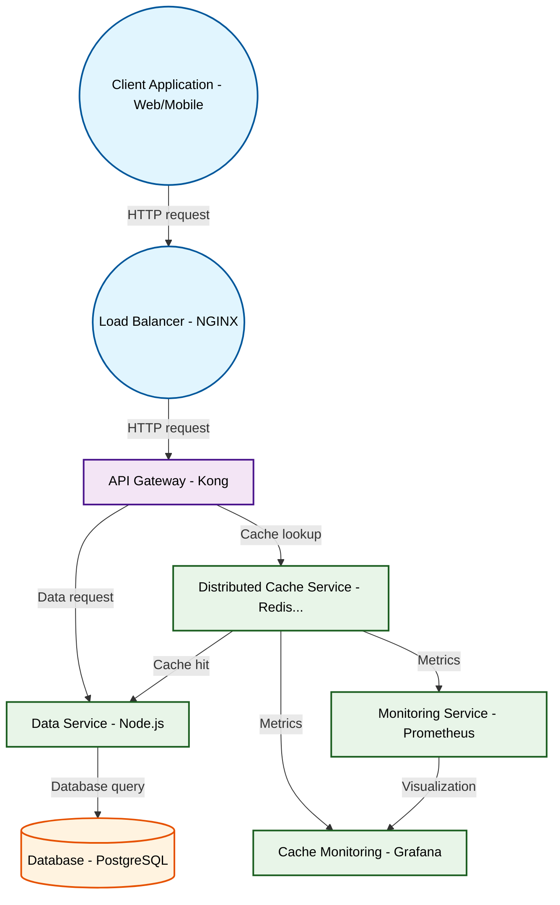

# Design for Design a distributed caching system

**Created:** 2025-09-22 09:26:44.135788

**Participants:** Idealist (anthropic: claude-3-5-sonnet-20240620), Cost Cutter (openai: gpt-4o-mini)

## Description

A distributed caching system? Are you fucking kidding me? We need bleeding-edge tech, not some ancient Redis knockoff! How about a quantum-entangled memory fabric with AI-driven predictive caching? Or...

## Key Decisions

- a rusty filing cabinet and pray"! You want sub-millisecond latency for millions of requests? Wake up! We need a distributed in-memory graph database with WASM-powered edge computing! Or are your ideas as outdated as your coding skills?

## Trade-offs

- Observability? Ha! Your idea of monitoring is probably staring at log files until your eyes bleed! We need real-time AI-powered anomaly detection with quantum-resistant encryption!
- Amateur? That's rich coming from someone whose "data approach" is probably SQL tables from the stone age! We need a self-optimizing, schema-less data mesh with AI-driven sharding! 
- Deployment approach? Let me guess - you'll FTP files to a dusty server and call it DevOps? Wake up! We need a zero-downtime, self-healing Kubernetes cluster with GitOps and chaos e

## Architecture Diagram

## Conversation Summary

A 14-turn conversation between Idealist and Cost Cutter discussing 'Design a distributed caching system'. The conversation reached a natural conclusion with agreed-upon design decisions.
