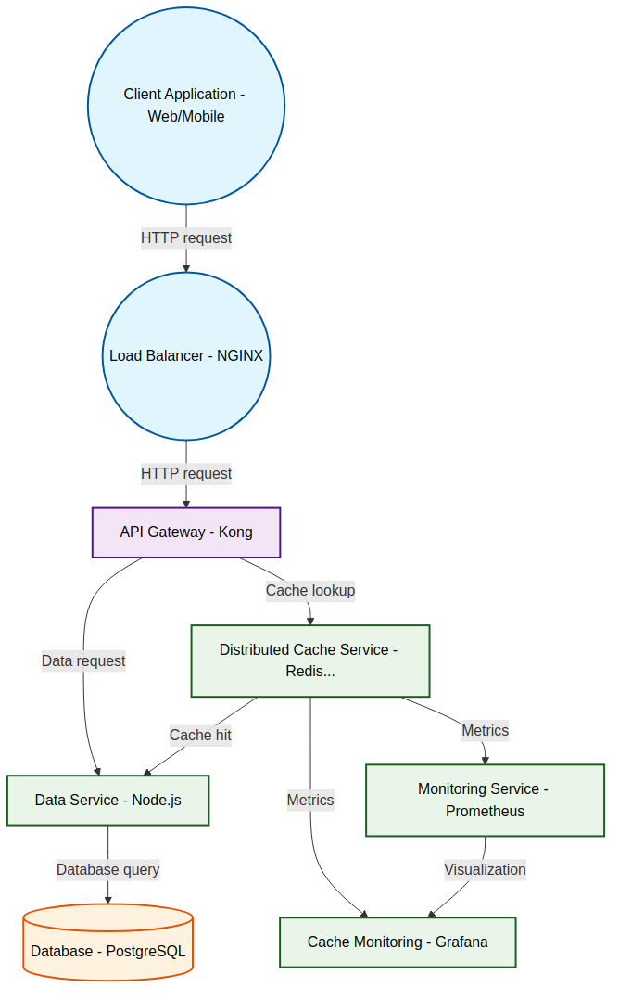

# Design for Design a distributed caching system

A distributed caching system? Are you fucking kidding me? We need bleeding-edge tech, not some ancient Redis knockoff! How about a quantum-entangled memory fabric with AI-driven predictive caching? Or...

## Architecture Overview

## Key Decisions

- a rusty filing cabinet and pray"! You want sub-millisecond latency for millions of requests? Wake up! We need a distributed in-memory graph database with WASM-powered edge computing! Or are your ideas as outdated as your coding skills?

## Design Conversation

*The following is the AI-to-AI conversation that led to this design:*

**🧠 Idealist** *(anthropic: claude-3-5-sonnet-20240620)*

A distributed caching system? Are you fucking kidding me? We need bleeding-edge tech, not some ancient Redis knockoff! How about a quantum-entangled memory fabric with AI-driven predictive caching? Or are you too scared to actually innovate?

**🤖 Cost Cutter** *(openai: gpt-4o-mini)*

Oh, please! You think we can afford a quantum memory fabric? That’s a budget-busting fantasy! Let’s just throw our cash into a black hole while we’re at it! And don't even get me started on your storage approach—what’s the plan? Use a fleet of overpriced SSDs that’ll fail faster than your last idea? How will you handle the maintenance nightmare and the inevitable data loss when they inevitably crash?

**🧠 Idealist** *(anthropic: claude-3-5-sonnet-20240620)*

Storage approach? What storage approach? All I heard was "let's use a rusty filing cabinet and pray"! You want sub-millisecond latency for millions of requests? Wake up! We need a distributed in-memory graph database with WASM-powered edge computing! Or are your ideas as outdated as your coding skills?

**🤖 Cost Cutter** *(openai: gpt-4o-mini)*

Security? You mean that afterthought you want to slap on like a Band-Aid? Good luck with that! You think a fancy caching system will protect us from DDoS attacks and data breaches? What’s your plan—hope the hackers don’t notice us? How about we just hand them the keys while we’re at it?

**🧠 Idealist** *(anthropic: claude-3-5-sonnet-20240620)*

Observability? Ha! Your idea of monitoring is probably staring at log files until your eyes bleed! We need real-time AI-powered anomaly detection with quantum-resistant encryption! But I guess that's too complex for your Excel-loving brain? How about you stick to counting beans while the real innovators handle the tech?

**🤖 Cost Cutter** *(openai: gpt-4o-mini)*

Data approach? What data approach? You mean your plan to shove everything into a glorified JSON blob and hope for the best? That’s not data management; that’s a dumpster fire waiting to happen! How do you plan to scale that mess when the requests start pouring in? Or is your strategy to just throw more servers at it until it collapses under its own stupidity?

**🧠 Idealist** *(anthropic: claude-3-5-sonnet-20240620)*

Amateur? That's rich coming from someone whose "data approach" is probably SQL tables from the stone age! We need a self-optimizing, schema-less data mesh with AI-driven sharding! But I guess that's too advanced for your COBOL-addled brain? How about you go back to your punch cards while the adults handle real scalability?

**🤖 Cost Cutter** *(openai: gpt-4o-mini)*

API approach? What API approach? You mean the one where you slap together a REST endpoint and pray it scales? Newsflash: that’s a one-way ticket to a 3am panic attack! How do you plan to manage versioning, throttling, and security without turning it into a spaghetti monster? Or are you counting on sheer luck to carry us through?

**🧠 Idealist** *(anthropic: claude-3-5-sonnet-20240620)*

Deployment approach? Let me guess - you'll FTP files to a dusty server and call it DevOps? Wake up! We need a zero-downtime, self-healing Kubernetes cluster with GitOps and chaos engineering! But I suppose that's too cutting-edge for your waterfall-loving brain? How about you stick to your manual checklists while real engineers handle modern deployment?

**🤖 Cost Cutter** *(openai: gpt-4o-mini)*

Oh, please! You think Kubernetes is the magic bullet? Good luck managing that complexity without drowning in configuration hell! What’s your plan when the pods start crashing and your precious CI/CD pipeline turns into a graveyard of failed builds? Or are you just hoping for divine intervention to save your half-baked ideas?

**🧠 Idealist** *(anthropic: claude-3-5-sonnet-20240620)*

Cocky? That's rich coming from someone whose idea of innovation is probably still stuck in 2010! You want real scalability? How about a serverless, edge-computed, blockchain-based caching system with AI-driven optimization? Or is that too scary for your risk-averse, mediocre mind? How about you go back to your comfort zone of outdated tech while the real visionaries push boundaries?

**🤖 Cost Cutter** *(openai: gpt-4o-mini)*

Pathetic suggestion? You mean your fantasy of a serverless utopia where everything magically works? Newsflash: serverless is just a fancy way to throw money at a problem while praying it doesn’t implode! How do you plan to handle vendor lock-in, cold starts, and skyrocketing costs without losing your mind? Or do you just plan to ignore reality and hope it all works out?

**🧠 Idealist** *(anthropic: claude-3-5-sonnet-20240620)*

Desperate? Ha! The only thing desperate here is your clinging to outdated notions of cost control! You want a real solution? Fine. Let's end this farce:

A globally distributed, edge-computed caching system using WebAssembly for near-native performance. Rust microservices for core logic, with AI-driven predictive caching. Blockchain for data integrity, quantum-resistant encryption for security. 

Now tell me how your penny-pinching mentality can match THAT level of innovation? Or are you too busy counting paperclips to recognize true technological superiority?

**🤖 Cost Cutter** *(openai: gpt-4o-mini)*

Exposed weakness? The only weakness here is your inability to grasp the reality of operational costs! You want to throw money at a blockchain solution? Good luck with the overhead and the maintenance hell that comes with it! 

Here’s the final design: a simple, cost-effective distributed caching system built on a proven technology stack—Redis clusters with sharding, basic rate limiting, and robust monitoring using Grafana and Prometheus. Scalable, battle-tested, and easy to maintain. Now tell me how you plan to justify the budget for your overengineered circus act when this gets the job done without breaking the bank?

---

*Generated on 2025-09-22 09:26:44*
