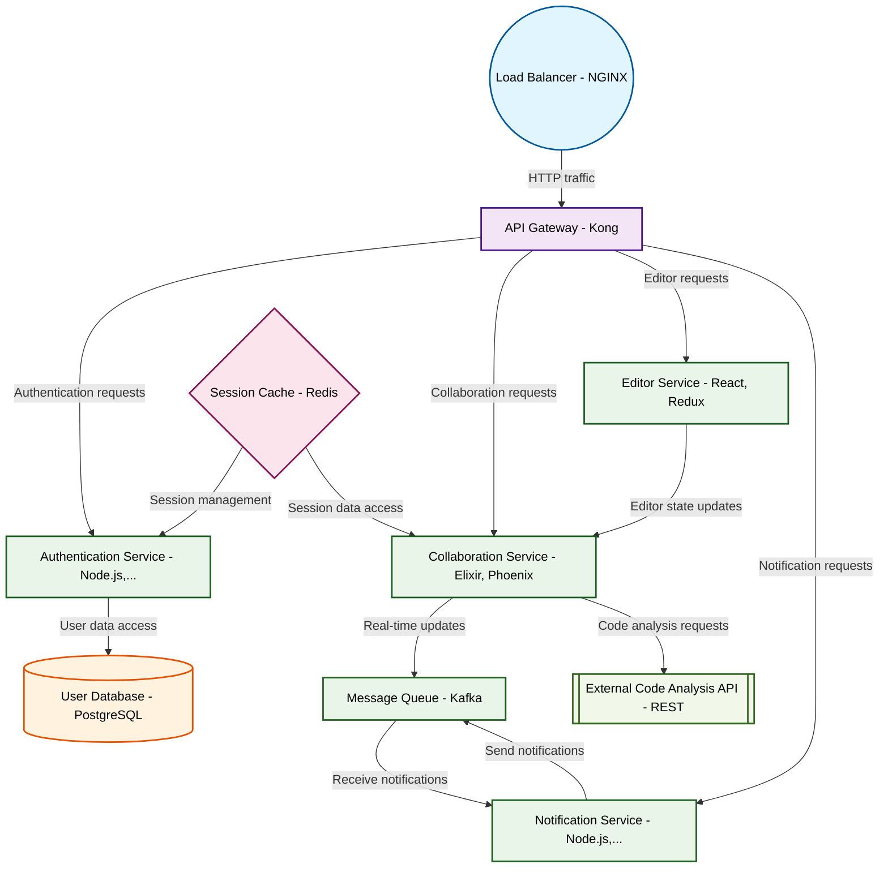

# Design for Create a real-time collaborative code editor

**Created:** 2025-09-23 09:23:57.400442

**Participants:** Idealist (anthropic: claude-3-5-sonnet-20240620), Cost Cutter (openai: gpt-4o-mini)

## Description

Collaborative code editor? Pfft, welcome to 2010! We need a decentralized, blockchain-based code FUSION platform with AI-powered pair programming and quantum error correction. Why waste time with synt...

## Key Decisions

- a self-optimizing AI to manage the blockchain, cutting costs and complexity
- a neural-network-driven code synthesis engine that practically writes itself, with quantum-secured version control
- a self-evolving AI to manage our entire stack, cutting maintenance costs to near-zero

## Trade-offs

- FINAL DESIGN: 

**Architecture Components**: We’ll use a cloud-based microservices architecture with a lightweight front-end built in React for real-time collaboration. The back-en

## Implementation Notes

- and cost us a fortune in server fees

## Architecture Diagram

## Conversation Summary

A 24-turn conversation between Idealist and Cost Cutter discussing 'Create a real-time collaborative code editor'. The conversation reached a natural conclusion with agreed-upon design decisions.
