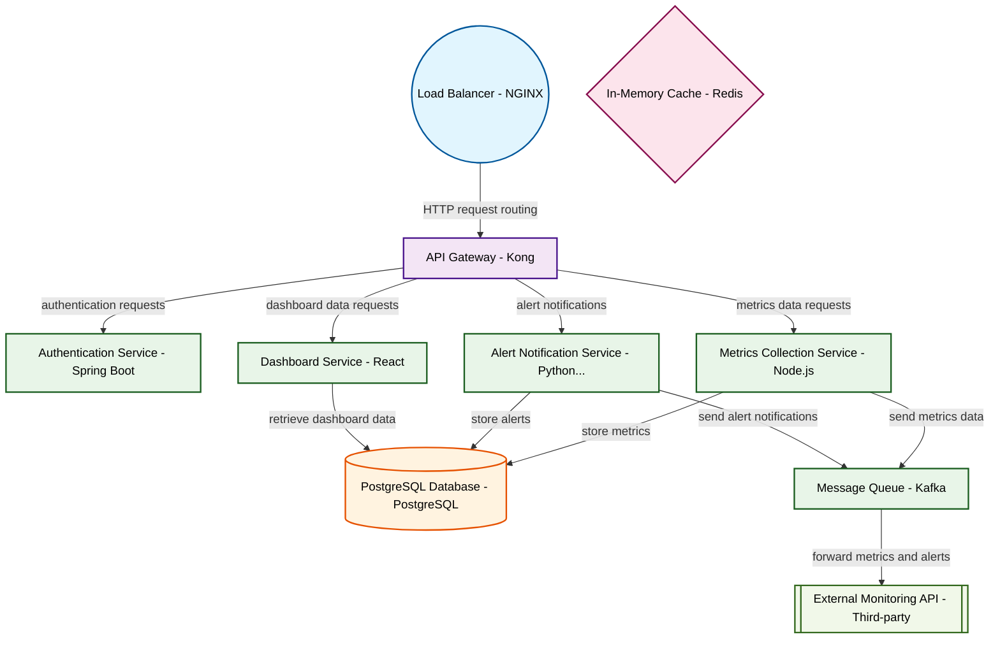

# Design for Design a microservices monitoring platform

**Created:** 2025-09-25 09:23:26.036785

**Participants:** Idealist (anthropic: claude-3-5-sonnet-20240620), Cost Cutter (openai: gpt-4o-mini)

## Description

Microservices monitoring? Are you kidding me? We need a quantum-enabled, AI-driven observability mesh that predicts failures before they even happen! Anything less is a waste of our time. What are you...

## Key Decisions

- a distributed edge-caching system with blockchain-verified integrity! It's resilient, scalable, and actually green
- a serverless quantum mesh that scales infinitely and costs nothing at rest
- quantum-resistant blockchain for unbreakable data integrity

## Architecture Diagram

## Conversation Summary

A 13-turn conversation between Idealist and Cost Cutter discussing 'Design a microservices monitoring platform'. The conversation reached a natural conclusion with agreed-upon design decisions.
