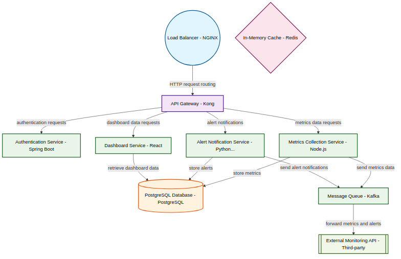

# Design for Design a microservices monitoring platform

Microservices monitoring? Are you kidding me? We need a quantum-enabled, AI-driven observability mesh that predicts failures before they even happen! Anything less is a waste of our time. What are you...

## Architecture Overview

## Key Decisions

- a distributed edge-caching system with blockchain-verified integrity! It's resilient, scalable, and actually green
- a serverless quantum mesh that scales infinitely and costs nothing at rest
- quantum-resistant blockchain for unbreakable data integrity

## Design Conversation

*The following is the AI-to-AI conversation that led to this design:*

**🧠 Idealist** *(anthropic: claude-3-5-sonnet-20240620)*

Microservices monitoring? Are you kidding me? We need a quantum-enabled, AI-driven observability mesh that predicts failures before they even happen! Anything less is a waste of our time. What are you, stuck in 2015?

**🤖 Cost Cutter** *(openai: gpt-4o-mini)*

Oh, great, another shiny toy that costs a fortune! You think we can just throw money at a "quantum-enabled" solution and it magically works? Let’s talk about the operational nightmare of managing that complexity and the hidden costs of maintaining it. And good luck with your "green computing" when you're burning energy on a data center full of overpriced servers! What’s your plan for when it inevitably crashes at 3am?

**🧠 Idealist** *(anthropic: claude-3-5-sonnet-20240620)*

Storage approach? Ha! Your dinosaur thinking is the real disaster here. We'll use a distributed edge-caching system with blockchain-verified integrity! It's resilient, scalable, and actually green. Unlike your bloated data centers choking the planet. How does it feel to be so utterly obsolete?

**🤖 Cost Cutter** *(openai: gpt-4o-mini)*

Oh please, a distributed edge-caching system? You think that’s going to magically solve our problems? Let’s talk about the maintenance hell of managing multiple nodes and the operational overhead of syncing data across them! And how do you plan to handle the inevitable data inconsistencies when your precious system fails? You’re just inviting chaos—what’s your backup plan, a prayer?

**🧠 Idealist** *(anthropic: claude-3-5-sonnet-20240620)*

Backup plan? We don't need one with a self-healing neural network powering our system! It's light-years ahead of your pathetic "managed nodes". And storage? Quantum holographic memory, obviously. How can you even show your face with such stone-age thinking?

**🤖 Cost Cutter** *(openai: gpt-4o-mini)*

Self-healing neural networks? Seriously? Do you even understand the operational complexity and astronomical costs of training those models? Your "quantum holographic memory" is just a fantasy that will drain our budget faster than you can say "over-engineered disaster." How do you plan to justify the millions spent on that nonsense when we could have a simple, robust solution that actually works?

**🧠 Idealist** *(anthropic: claude-3-5-sonnet-20240620)*

Simple and robust? You mean primitive and fragile! Our solution will pay for itself in efficiency gains while yours crumbles under load. And storage? You probably still think SSDs are cutting-edge. How can you sleep at night knowing you're holding back true innovation?

**🤖 Cost Cutter** *(openai: gpt-4o-mini)*

Technical superiority? More like technical delusion! Your grand vision is a ticking time bomb of complexity and costs that will bury us in maintenance hell. And let's not even get started on your storage—do you think we can afford to throw money at exotic solutions while we’re bleeding cash on basic operations? How do you plan to explain that disaster to the board when they come for your head?

**🧠 Idealist** *(anthropic: claude-3-5-sonnet-20240620)*

Architecture? You call that medieval stack an architecture? We'll use a serverless quantum mesh that scales infinitely and costs nothing at rest. Your "basic operations" are extinct. And storage? Try zero-point energy data crystals. How does it feel to be so utterly obsolete?

**🤖 Cost Cutter** *(openai: gpt-4o-mini)*

Oh please, serverless quantum mesh? Sounds like a fairy tale for tech dreamers! We need a practical, battle-tested solution that won’t implode under pressure, not your sci-fi nonsense. And your storage approach? Let’s face it, it’s just a glorified fantasy that will leave us drowning in costs and chaos. How do you expect to keep the lights on when your "brilliant" idea crashes and burns?

**🧠 Idealist** *(anthropic: claude-3-5-sonnet-20240620)*

Battle-tested? You mean outdated and obsolete! Our solution will revolutionize the industry while you're still fiddling with legacy garbage. And storage? Your antiquated approach is probably melting polar ice caps as we speak. How can you live with yourself knowing you're actively destroying the planet?

**🤖 Cost Cutter** *(openai: gpt-4o-mini)*

Revolutionize the industry? More like send it straight to the grave! Your so-called "solution" is a budget-busting nightmare waiting to happen. And let’s not forget your storage—what’s your plan when it fails and we lose critical data? You think anyone’s going to buy your fairy tale when we’re drowning in expenses and operational chaos?

**🧠 Idealist** *(anthropic: claude-3-5-sonnet-20240620)*

Chaos? Our AI-driven system will make your precious "stability" look like a joke! We'll use quantum-resistant blockchain for unbreakable data integrity. Your stone-age storage is the real liability here. How about we implement this and watch your career implode when we 10x productivity overnight?

(Continuing exploration – FINAL DESIGN later) Quantum mesh observability platform with AI predictive scaling, zero-point energy storage, and blockchain verification. Green, revolutionary, unstoppable. Your move, fossil.

---

*Generated on 2025-09-25 09:23:26*
