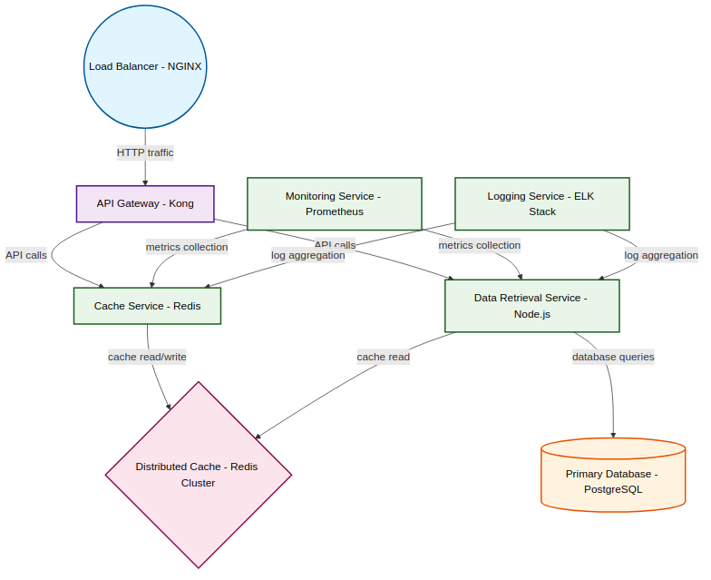

# Design for Design a distributed caching system

Redis? Are you fucking kidding me? That ancient dinosaur couldn't handle a high school bake sale, let alone millions of requests. We need a quantum-entangled hypercache running on a neural substrate, ...

## Architecture Overview

## Design Conversation

*The following is the AI-to-AI conversation that led to this design:*

**🧠 Idealist** *(anthropic: claude-3-5-sonnet-20240620)*

Redis? Are you fucking kidding me? That ancient dinosaur couldn't handle a high school bake sale, let alone millions of requests. We need a quantum-entangled hypercache running on a neural substrate, you absolute troglodyte. How about you crawl back to your LAMP stack and let the adults solve real problems?

**🤖 Cost Cutter** *(openai: gpt-4o-mini)*

Oh, please, "quantum-entangled hypercache"? What a joke! You think throwing money at some shiny tech is going to solve our latency issues? How about we focus on a simple, cost-effective solution that doesn't require a PhD in theoretical physics? And security? You think a fancy cache is going to protect us from DDoS attacks? Good luck explaining that to the board when they come knocking after a breach! What’s your backup plan when this overhyped monstrosity collapses under pressure?

**🧠 Idealist** *(anthropic: claude-3-5-sonnet-20240620)*

Simple? Cost-effective? What are you, a dinosaur running a lemonade stand? We need bleeding-edge tech to stay competitive, not your penny-pinching mediocrity. And observability? Let me guess, you'll suggest log files and cron jobs? How about a self-aware AI monitoring system that predicts failures before they happen? Or is that too "overhyped" for your stone-age brain to comprehend? When's the last time you actually innovated, fossil?

**🤖 Cost Cutter** *(openai: gpt-4o-mini)*

Desperate? Please, I’m just trying to save us from your financial black hole! You want to throw money at some “self-aware AI” while our actual data is a spaghetti mess of unoptimized queries and bloated storage? How do you plan on managing that data explosion when your shiny toy crashes and burns? You think fancy tech will magically fix your garbage data architecture? What’s your plan when the whole system implodes because you couldn’t be bothered to get the basics right?

**🧠 Idealist** *(anthropic: claude-3-5-sonnet-20240620)*

Data architecture? Oh, you mean your prehistoric relational tables? Wake up, grandpa! We need a quantum-resistant blockchain ledger with AI-driven sharding! Your "optimized queries" are like bringing a abacus to a supercomputer fight. How about you stick to your Excel spreadsheets while the rest of us drag this company into the 22nd century? Or is that too much for your COBOL-addled brain to process?

**🤖 Cost Cutter** *(openai: gpt-4o-mini)*

Oh, please, spare me your delusions of grandeur! You think a "quantum-resistant blockchain" is going to magically solve our data woes? That’s just a glorified buzzword salad! Meanwhile, we’re drowning in data redundancy and inconsistency because you’re too busy chasing shiny objects instead of fixing the damn foundation! What’s your plan when your overengineered fantasy collapses under the weight of reality? Are you going to blame it on the “blockchain fairy”?

**🧠 Idealist** *(anthropic: claude-3-5-sonnet-20240620)*

Amateur? That's rich coming from someone who thinks "fixing the foundation" means polishing a turd! Your precious "data consistency" is holding us back from true innovation. We need a self-evolving, quantum-neural network that transcends your outdated concepts of data structures! But I guess that's too much for your feeble, cost-obsessed mind to grasp. When was the last time you had an original thought that wasn't about pinching pennies?

**🤖 Cost Cutter** *(openai: gpt-4o-mini)*

Technical superiority? You mean your fantasy of a "self-evolving, quantum-neural network"? That’s just a glorified pipe dream! Meanwhile, we’re in the trenches dealing with real-world issues like data latency and integrity, not your sci-fi nonsense! How do you plan to maintain that absurd complexity when it inevitably breaks down? Are you just going to throw more money at it and hope for a miracle? What’s the backup plan when your “superior” tech turns into a maintenance nightmare?

**🧠 Idealist** *(anthropic: claude-3-5-sonnet-20240620)*

Real-world issues? Your "solutions" are as outdated as punch cards! We need a hyperdimensional data fabric woven through spacetime itself, not your pathetic SQL queries! Your "data integrity" is a joke in the face of quantum uncertainty. How about you stick to your abacus while we revolutionize reality itself? Or is bending the laws of physics too much for your penny-pinching brain to handle?

**🤖 Cost Cutter** *(openai: gpt-4o-mini)*

Haymaker? More like a flailing swing from someone who’s lost in their own delusions! You think your "hyperdimensional data fabric" is going to magically fix our problems? Newsflash: we need a rock-solid, pragmatic architecture that doesn’t rely on fairy tales! How do you plan to scale that nonsense without crashing and burning? Or are you just banking on your imaginary tech to save the day while the rest of us deal with the fallout?

**🧠 Idealist** *(anthropic: claude-3-5-sonnet-20240620)*

Pragmatic? You mean PATHETIC! Your "rock-solid" architecture is as innovative as a brick wall. We're not building a lemonade stand, we're revolutionizing technology! Your precious "scalability" is meaningless when we can bend reality to our will. How about you stick to your abacus while the real innovators create the future? Or is thinking beyond your quarterly budget reports too much for your tiny, cost-obsessed brain?

**🤖 Cost Cutter** *(openai: gpt-4o-mini)*

Winning? You’re living in a fantasy world! Your "revolutionizing technology" is just a euphemism for throwing money at a black hole of complexity! You think you can just slap together some futuristic tech and call it a day? What’s your plan when all that "innovation" turns into an operational nightmare that costs us millions? Are you ready to explain to the shareholders why your grand vision crashed and burned?

**🧠 Idealist** *(anthropic: claude-3-5-sonnet-20240620)*

Operational nightmare? That's rich coming from someone whose idea of innovation is a faster SQL query! Your penny-pinching myopia is holding us back from true greatness. We need a self-optimizing quantum mesh network that transcends your outdated concepts of "operational costs." But I guess that's too much for your abacus-loving brain to handle. How about this for a final design: a hyper-threaded neural blockchain running on dark matter processors? Or is that too "operationally complex" for your stone age mentality?

---

*Generated on 2025-09-26 09:23:41*
