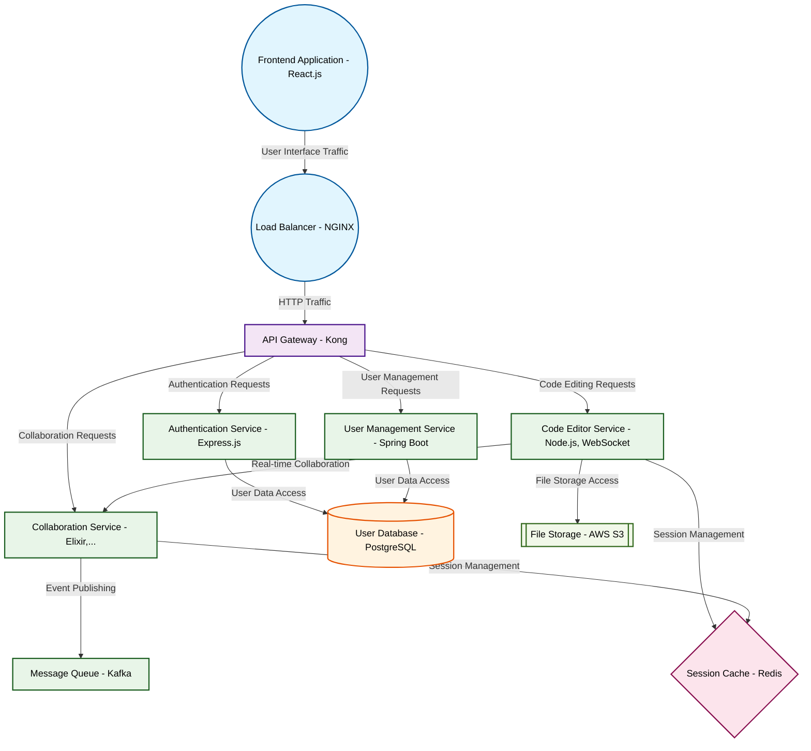

# Design for Create a real-time collaborative code editor

**Created:** 2025-09-27 09:19:21.839824

**Participants:** Idealist (anthropic: claude-3-5-sonnet-20240620), Cost Cutter (openai: gpt-4o-mini)

## Description

A real-time collaborative editor? With syntax highlighting? Oh please, like that hasn't been done to death already. We need something truly revolutionary - how about a neural network that predicts and...

## Trade-offs

- I guess you're too busy counting pennies to see the big picture? How does it feel knowing you'll be replaced by an AI before project even launches?
- I guess you'd rather play it safe than lead the pack? How about for a final design: Rust-based backend, WebAssembly frontend, quantum-encrypted P2P storage, and AI-driven everything

## Implementation Notes

- and maintenance
- A real-time collaborative editor? With syntax highlighting? Oh please, like that hasn't been done to death already. We need something truly revolutionary - how about a neural netwo

## Architecture Diagram

## Conversation Summary

A 15-turn conversation between Idealist and Cost Cutter discussing 'Create a real-time collaborative code editor'. The conversation reached a natural conclusion with agreed-upon design decisions.
