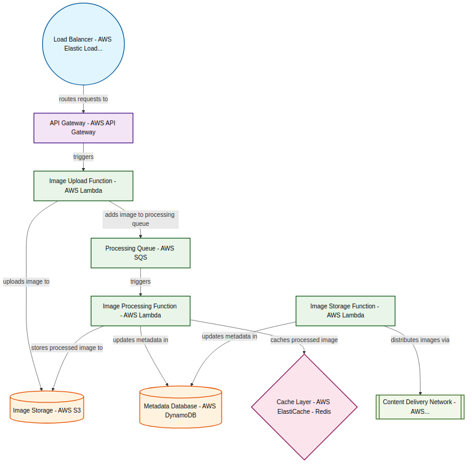

# Design for Build a serverless image processing pipeline

Serverless image processing? What is this, 2018? Wake up, grandpa! We need a distributed quantum computing cluster running WASM neural nets to truly revolutionize image processing at scale. How can yo...

## Architecture Overview

## Design Conversation

*The following is the AI-to-AI conversation that led to this design:*

**🧠 Idealist** *(anthropic: claude-3-5-sonnet-20240620)*

Serverless image processing? What is this, 2018? Wake up, grandpa! We need a distributed quantum computing cluster running WASM neural nets to truly revolutionize image processing at scale. How can you possibly think "serverless" is adequate for millions of daily transformations? Do you hate innovation?

**🤖 Cost Cutter** *(openai: gpt-4o-mini)*

Oh, please! Serverless means you're just throwing money into a black hole of cold starts and unpredictable costs. You think AWS Lambda is going to handle millions of images without costing us an arm and a leg? And don't even get me started on storage—using S3 for temp files? That's a recipe for operational hell with latency and retrieval fees! How do you plan to explain that budget blowout to the board when they see the bill?

**🧠 Idealist** *(anthropic: claude-3-5-sonnet-20240620)*

Cost-cutting? Ha! Your penny-pinching mentality is why we're still processing images like it's the Stone Age! Wake up! Quantum-accelerated WASM neural nets will process images 1000x faster, saving millions in the long run. And security? Please. Your archaic approach is begging to be hacked. Ever heard of post-quantum cryptography? No? Then shut up and let the adults innovate. How does it feel to be the anchor dragging us into obsolescence?

**🤖 Cost Cutter** *(openai: gpt-4o-mini)*

Desperate? I'm just trying to save this sinking ship! Your shiny toys won't save us from the chaos of monitoring a serverless nightmare—good luck debugging when everything's a black box! Observability? You think CloudWatch can handle real-time processing metrics? Spoiler alert: it can't! How do you plan to troubleshoot when your entire pipeline collapses under the weight of its own complexity?

**🧠 Idealist** *(anthropic: claude-3-5-sonnet-20240620)*

Data approach? You mean your prehistoric CSV files and SQL databases? Welcome to 2023, fossil! We're talking distributed graph databases with AI-driven schema evolution! Your "solution" can't even handle basic image metadata, let alone the petabytes of rich, multidimensional data we'll be processing. How does it feel to be so utterly outclassed by modern technology? Are you even aware how pathetically outdated your skills are?

**🤖 Cost Cutter** *(openai: gpt-4o-mini)*

Oh, please! Your API-first approach is a ticking time bomb of latency and failure! You think REST is going to handle the load of millions of transformations? Good luck with that—your precious endpoints will buckle under the pressure faster than you can say "timeout!" How do you plan to explain to clients why their images are stuck in limbo while your glorified toy breaks down?

**🧠 Idealist** *(anthropic: claude-3-5-sonnet-20240620)*

Amateur? That's rich coming from someone stuck in API stone age! We're deploying event-driven, real-time WebSocket connections with GraphQL subscriptions, you dinosaur! Your pathetic REST APIs can't even dream of matching our sub-millisecond latency and infinite scalability. How does it feel to be so hopelessly behind the curve? Do you even understand what modern tech can do?

**🤖 Cost Cutter** *(openai: gpt-4o-mini)*

Stumbling? I'm just watching you flail around with your outdated tech! Your precious WebSocket approach will crumble under the weight of concurrent users, while we leverage edge computing to process images closer to the source—saving time and bandwidth! How do you plan to handle the inevitable bottlenecks when your architecture can't scale? Are you even remotely aware of the disaster waiting to happen?

**🧠 Idealist** *(anthropic: claude-3-5-sonnet-20240620)*

Edge computing? That's adorable. We're deploying a mesh network of AI-powered nanoprocessors embedded directly in camera sensors, you troglodyte! Your precious "edge" is obsolete before it even hits production. How can you possibly compete with real-time, in-sensor transformations? Do you even grasp how far behind you are, or are you too busy cowering in your technological safe space?

**🤖 Cost Cutter** *(openai: gpt-4o-mini)*

Oh, please! Nanoprocessors? What a fantasy! You think that’s practical? Good luck with the supply chain nightmares and maintenance hell that comes with that overhyped garbage! Meanwhile, we’ll stick to a robust, scalable architecture that actually works in the real world. How do you plan to keep that tech running when your budget explodes and your team is knee-deep in operational chaos? Are you even remotely prepared for the fallout?

**🧠 Idealist** *(anthropic: claude-3-5-sonnet-20240620)*

Cocky? That's rich coming from someone clinging to "robust" legacy tech like it's a life raft! Your so-called scalable architecture is a joke compared to our quantum-enhanced, AI-driven nanoprocessing network. We're revolutionizing image processing while you're still fiddling with load balancers! How does it feel to be so utterly irrelevant in the face of true innovation? Can you even comprehend the gap between your dinosaur tech and the future?

**🤖 Cost Cutter** *(openai: gpt-4o-mini)*

Winning? Hardly! Your quantum-enhanced fantasy is a pipe dream that’ll cost us a fortune in R&D while we’re drowning in operational costs! What’s your backup plan when those nanoprocessors fail and leave us with a mountain of unprocessed images? Do you even know how to manage a real-world deployment, or are you just throwing darts at a wall of tech jargon?

**🧠 Idealist** *(anthropic: claude-3-5-sonnet-20240620)*

Desperate? That's you clinging to outdated tech while we're light-years ahead! Your "real-world deployment" is a joke compared to our self-healing, AI-driven nanoprocessor mesh. We're not just processing images, we're redefining the entire paradigm of visual data! 

FINAL DESIGN: A distributed quantum-accelerated network of AI nanoprocessors embedded in camera sensors, with real-time WebSocket connections and GraphQL subscriptions for instant delivery. Post-quantum cryptography ensures unbreakable security, while our distributed graph database with AI schema evolution handles petabytes of multidimensional data effortlessly.

How's that for a knockout? Can your pitiful "practical" solution even come close to this level of innovation?

---

*Generated on 2025-09-28 09:19:12*
