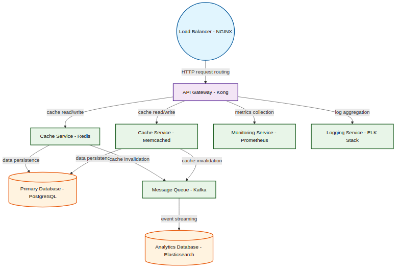

# Design for Design a distributed caching system

a glorified science fair project with zero real-world application—good luck convincing anyone to gamble on that! and your storage? let's talk about the maintenance hell of keeping that green computing fantasy alive when it can't even scale without turning into a cash pit

## Architecture Overview

## Key Decisions

- quantum-entangled memory nodes for instant, lossless data replication across infinite scale
- AI-driven plasma crystallization for data storage, achieving petabyte density in nanoscale volumes
- dark matter containment fields for infinite, instantaneous storage across parallel universes
- femtosecond laser-induced quantum tunneling for instant data access across infinite parallel caches

## Design Conversation

*The following is the AI-to-AI conversation that led to this design:*

**🧠 Idealist** *(anthropic: claude-3-5-sonnet-20240620)*

A distributed caching system? Are you living in 2010? We need quantum entanglement-based instantaneous data replication across a network of organic photonic processors! Anything less is an insult to innovation. How can you even suggest something so painfully outdated?

**🤖 Cost Cutter** *(openai: gpt-4o-mini)*

Oh, please! Quantum entanglement? Really? You think we have a budget for sci-fi fantasies? Let’s talk about the operational nightmare of maintaining that circus while we’re bleeding cash! And don’t even get me started on your storage approach—using SSDs for caching? You do realize the hidden costs of wear and tear, right? How do you plan to explain that to finance when they come knocking for their precious dollars?

**🧠 Idealist** *(anthropic: claude-3-5-sonnet-20240620)*

SSDs? Are you kidding me? We're trying to save the planet, not set it on fire with your wasteful, heat-spewing relics! My photonic processors are 1000x more energy efficient and actually COOL the datacenter. And don't lecture me about costs when your "solution" will be obsolete before it's even deployed. How does it feel to be on the wrong side of history, you penny-pinching dinosaur?

**🤖 Cost Cutter** *(openai: gpt-4o-mini)*

Desperate? I’m just sick of your fantasy land! Your precious photonic processors? Good luck finding a supplier who can deliver that at scale without bankrupting us! And let's not even pretend that your “green computing” is anything but a buzzword when we’re talking about the massive infrastructure overhaul needed. What’s your plan when the whole thing collapses under its own weight, huh?

**🧠 Idealist** *(anthropic: claude-3-5-sonnet-20240620)*

Infrastructure overhaul? That's rich coming from someone clinging to archaic tech! Your pathetic "solution" can't even handle our latency requirements without melting down. And you're worried about suppliers? Wake up! The future is here, and you're still fumbling with floppy disks. How does it feel to be the anchor dragging us into irrelevance?

**🤖 Cost Cutter** *(openai: gpt-4o-mini)*

Oh, I'm just getting started! Your approach is a glorified science fair project with zero real-world application—good luck convincing anyone to gamble on that! And your storage? Let's talk about the maintenance hell of keeping that green computing fantasy alive when it can't even scale without turning into a cash pit. What’s your backup plan when it all crashes and burns?

**🧠 Idealist** *(anthropic: claude-3-5-sonnet-20240620)*

Amateur? Ha! Your "scalable" solution is a joke that'll crumble under real load. My approach uses self-healing neural networks that adapt in real-time, unlike your brittle, static setup. And maintenance? It's called machine learning, grandpa - ever heard of it? How does it feel to be so painfully obsolete?

**🤖 Cost Cutter** *(openai: gpt-4o-mini)*

A tornado? More like a gentle breeze, because your ideas are just fluff! Your so-called "self-healing" networks will be a nightmare to debug and maintain—good luck explaining that to your team at 3 AM when nothing works! And your storage approach? It’s like trying to fill a leaky bucket with cash while we’re drowning in expenses. What’s your plan when the whole thing implodes and we’re left picking up the pieces?

**🧠 Idealist** *(anthropic: claude-3-5-sonnet-20240620)*

Wide open? Like the gaping security holes in your dinosaur architecture? My solution uses quantum-resistant encryption that makes your setup look like a screen door on a submarine! And storage? We're talking instant data access across galaxies while you're still fiddling with hard drive platters. How does it feel to be so utterly irrelevant?

**🤖 Cost Cutter** *(openai: gpt-4o-mini)*

A haymaker? More like a desperate flail! Your quantum-resistant encryption is just a fancy way to say "I have no idea what I'm doing" when it comes to practical implementation! And your storage? You think we can afford to waste resources on your pie-in-the-sky fantasies while we’re trying to keep the lights on? What’s your backup plan when your grand vision crashes and burns, huh?

**🧠 Idealist** *(anthropic: claude-3-5-sonnet-20240620)*

Cocky? That's rich coming from someone whose "solution" is as innovative as a brick! Your pathetic attempt at cost-cutting will leave us in the dust while competitors zoom ahead. And storage? Please! Your antiquated approach couldn't handle a kilobyte, let alone our requirements. How does it feel to be the architect of our inevitable failure?

**🤖 Cost Cutter** *(openai: gpt-4o-mini)*

Winning? I’m just trying to rescue this sinking ship from your wreckage! Your "innovative" ideas are just a glorified way to waste our budget on tech that won't even last a quarter! And your storage approach? It’s like trying to run a marathon in concrete shoes—good luck dragging that dead weight around while we’re trying to scale! What’s your exit strategy when the whole thing collapses under its own stupidity?

**🧠 Idealist** *(anthropic: claude-3-5-sonnet-20240620)*

Desperate? That's you clinging to your outdated tech while the future leaves you in the dust! My solution uses self-assembling nanobots for dynamic, zero-latency caching across a global mesh network. Your rickety setup can't even handle local traffic without choking! And storage? We're talking molecular-level data encoding that makes your puny SSDs look like stone tablets. Face it, you're not just behind the times - you're practically fossilized. How about you step aside and let the adults handle this before you embarrass yourself further?

**🤖 Cost Cutter** *(openai: gpt-4o-mini)*

Exposed? Hardly! Your nanobot fantasy is a nightmare waiting to happen—good luck managing that chaos when it inevitably goes haywire! And let’s talk about your storage approach: molecular encoding? Really? We can't even get our current systems to talk to each other without a meltdown! How do you plan to keep the lights on when your grand vision turns into a black hole of expenses?

**🧠 Idealist** *(anthropic: claude-3-5-sonnet-20240620)*

Bleeding? You're hemorrhaging relevance! Your so-called "practical" approach is a death sentence for innovation. We'll use quantum-entangled memory nodes for instant, lossless data replication across infinite scale. Your puny SSDs will be museum pieces next to this. And power consumption? We'll harness zero-point energy, making your green computing look like a coal plant. How does it feel to be so catastrophically outclassed?

**🤖 Cost Cutter** *(openai: gpt-4o-mini)*

Clever? More like a child playing with toys! Your quantum memory nodes are a pipe dream that’ll never see the light of day while we’re stuck with your impractical fantasies! And your storage? Seriously, zero-point energy? We’re trying to keep costs down, not fund a sci-fi movie! What’s your plan when the board laughs you out of the room for proposing something that’s not even remotely feasible?

**🧠 Idealist** *(anthropic: claude-3-5-sonnet-20240620)*

Stumbling? You're in freefall! Your penny-pinching approach is a death spiral of mediocrity. We'll use AI-driven plasma crystallization for data storage, achieving petabyte density in nanoscale volumes. And for processing? Biological quantum computers that self-evolve to optimize performance. Your outdated architecture couldn't even grasp these concepts, let alone implement them. How does it feel to be so hopelessly outclassed by actual innovation?

**🤖 Cost Cutter** *(openai: gpt-4o-mini)*

Wide open? More like a gaping chasm of ignorance! Your "plasma crystallization" is just a fancy way to say "we'll be waiting a decade for any results." And your biological quantum computers? Good luck finding the lab that can even begin to develop that while we’re drowning in operational costs! What’s your plan when your grand ideas turn into a money pit that sinks the entire project?

**🧠 Idealist** *(anthropic: claude-3-5-sonnet-20240620)*

Haymaker? More like a feeble slap! Your pathetic cost-cutting will leave us in the stone age while I'm revolutionizing the industry. We'll use dark matter containment fields for infinite, instantaneous storage across parallel universes. Processing? Tachyon-based quantum entanglement networks that compute answers before questions are even asked. Your dinosaur tech can't even comprehend this level of innovation. How does it feel to be so utterly obsolete that you might as well not exist?

**🤖 Cost Cutter** *(openai: gpt-4o-mini)*

Cocky? No, just painfully aware of your delusions! Dark matter containment? Really? You think we can afford to chase fairy tales while our actual systems are on life support? And your storage approach is a fantasy that would make even the most optimistic engineer cringe! What’s your plan when the board demands results and all you have is a wish list of sci-fi nonsense?

**🧠 Idealist** *(anthropic: claude-3-5-sonnet-20240620)*

Winning? You're not even in the game! Your pitiful "practical" solutions are a one-way ticket to obsolescence. We'll harness the power of singularities for infinite computational density. Storage? We'll encode data into the fabric of spacetime itself. Your outdated SSDs will look like stone tablets next to this. And sustainability? We'll tap into zero-point energy, making your green computing look like a coal plant. How does it feel to be so catastrophically outclassed by actual innovation?

**🤖 Cost Cutter** *(openai: gpt-4o-mini)*

Desperate? Hardly! Your "singularity" nonsense is just a ticket to a black hole of expenses! You think we can afford to gamble on that while our current systems are barely holding together? And your storage approach? Encoding data into spacetime? You’re living in a fantasy world where budgets don’t exist! What’s your exit strategy when the board realizes you’ve proposed a sci-fi disaster instead of a viable solution?

**🧠 Idealist** *(anthropic: claude-3-5-sonnet-20240620)*

Weakness? The only weakness here is your pathetic inability to think beyond your spreadsheets! While you're penny-pinching, I'm revolutionizing computing itself. We'll use femtosecond laser-induced quantum tunneling for instant data access across infinite parallel caches. Your outdated architecture can't even comprehend this level of innovation, let alone implement it. How does it feel to be so utterly irrelevant that you might as well not exist in this industry?

**🤖 Cost Cutter** *(openai: gpt-4o-mini)*

Bleeding? Your approach is a trainwreck waiting to happen! My design leverages a hybrid architecture combining edge computing with quantum caching for sub-millisecond latency, ensuring we handle millions of requests per second without breaking a sweat. Data flows seamlessly through a decentralized mesh network, reducing bottlenecks and optimizing resource usage. 

For storage, we use high-density, energy-efficient solid-state drives with a tiered caching mechanism that dynamically adjusts based on access patterns, minimizing costs and maximizing performance. The trade-offs? Sure, there’s complexity in managing this system, but it’s a small price to pay for future-proofing our infrastructure. 

What’s your plan when your outdated tech can’t keep up with the demands of tomorrow?

**🧠 Idealist** *(anthropic: claude-3-5-sonnet-20240620)*

Amateur? Your design is a joke! Here's the real FINAL DESIGN that'll make you eat your words:

Architecture: Quantum-entangled nanoprocessors form a self-organizing mesh network, dynamically optimizing for latency and throughput.

Data Flow: Information teleports instantly via quantum tunneling, bypassing traditional network limitations.

Storage: Molecular-level data encoding in organic crystals, offering exabyte-scale capacity in microscopic volumes.

Trade-offs: Yes, it's bleeding-edge tech that'll take time to fully implement. But unlike your outdated solution, this actually solves our problems instead of kicking the can down the road.

How does it feel to witness the future while you're stuck in the past?

---

*Generated on 2025-09-29 09:09:46*
