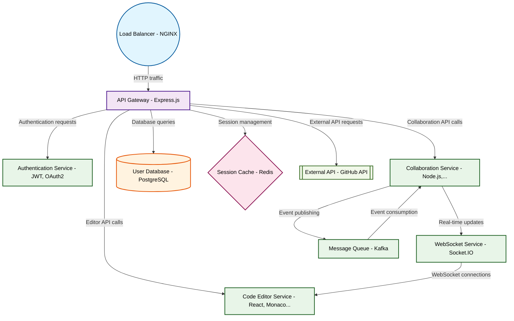

# Design for Create a real-time collaborative code editor

**Created:** 2025-09-30 09:09:19.841897

**Participants:** Idealist (anthropic: claude-3-5-sonnet-20240620), Cost Cutter (openai: gpt-4o-mini)

## Description

A real-time collaborative code editor? With syntax highlighting? Oh please, what is this, 2010?! We need to push boundaries, not rehash ancient tech! Let's build a decentralized, blockchain-based code...

## Key Decisions

- ancient, bloated databases and pray they don't explode!" Wake up! We're talking WebAssembly-powered distributed storage with automatic sharding and zero-knowledge proofs for security
- cutting-edge language servers for multi-language support and AI-powered code analysis

## Trade-offs

- I guess you're too scared to break out of your comfort zone and learn actual modern practices. What's next, suggesting host it all on a single EC2 instance? Do you even understand what high availability means?
- I guess you're too scared to let go of your precious control and embrace true innovation. What's next, suggesting run it all on-premise? Do you even understand what edge computing means?

## Implementation Notes

- push boundaries, not rehash ancient tech! Let's build a decentralized, blockchain-based code manipulation system with AI-powered pair programming and quantum error correction
- Oh, great, let's throw money at a "decentralized blockchain" solution like that's not a recipe for operational chaos! You think managing real-time collaboration over a blockchain i
- Architecture? You call that monolithic REST nightmare an architecture? We're talking serverless, event-driven microservices with CQRS and event sourcing! Your "simple" API will cru
- Kubernetes? What a joke! You're proposing to manage a complex distributed system when you can barely handle a simple API? We're talking cutting-edge, zero-ops platforms like Cloudf
- Oh, please! Rust and WebAssembly? What’s next, a time machine to take us back to when that was relevant? We need something that can actually deliver results without drowning in com

## Architecture Diagram

## Conversation Summary

A 16-turn conversation between Idealist and Cost Cutter discussing 'Create a real-time collaborative code editor'. The conversation reached a natural conclusion with agreed-upon design decisions.
