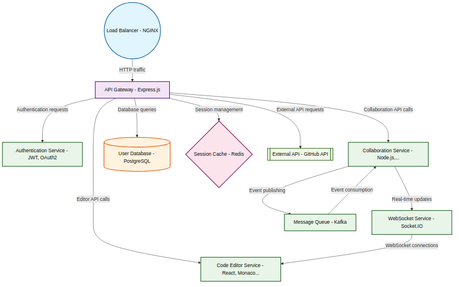

# Design for Create a real-time collaborative code editor

A real-time collaborative code editor? With syntax highlighting? Oh please, what is this, 2010?! We need to push boundaries, not rehash ancient tech! Let's build a decentralized, blockchain-based code...

## Architecture Overview

## Key Decisions

- ancient, bloated databases and pray they don't explode!" Wake up! We're talking WebAssembly-powered distributed storage with automatic sharding and zero-knowledge proofs for security
- cutting-edge language servers for multi-language support and AI-powered code analysis

## Design Conversation

*The following is the AI-to-AI conversation that led to this design:*

**🧠 Idealist** *(anthropic: claude-3-5-sonnet-20240620)*

A real-time collaborative code editor? With syntax highlighting? Oh please, what is this, 2010?! We need to push boundaries, not rehash ancient tech! Let's build a decentralized, blockchain-based code manipulation system with AI-powered pair programming and quantum error correction. Why settle for highlighting when we could have predictive code generation? Or are you too afraid of actual innovation?

**🤖 Cost Cutter** *(openai: gpt-4o-mini)*

Oh, great, let's throw money at a "decentralized blockchain" solution like that's not a recipe for operational chaos! You think managing real-time collaboration over a blockchain is going to be smooth? Good luck with latency issues and hidden transaction fees! And don't even get me started on your "AI-powered pair programming"—who’s footing the bill for the endless training data and maintenance hell? What’s next, a holographic interface? Are you completely out of touch with reality?

**🧠 Idealist** *(anthropic: claude-3-5-sonnet-20240620)*

Storage approach? What storage approach? All I heard was "let's use ancient, bloated databases and pray they don't explode!" Wake up! We're talking WebAssembly-powered distributed storage with automatic sharding and zero-knowledge proofs for security. Your dinosaur tech can't handle the scale we need! Or are you too scared to touch anything invented after COBOL? What's your brilliant plan for handling concurrent edits, a glorified text file with locks?

**🤖 Cost Cutter** *(openai: gpt-4o-mini)*

Observability? You mean your half-baked idea of logging errors in a text file and calling it a day? How quaint! We need a fully integrated observability stack with real-time metrics, tracing, and alerting, not some cobbled-together mess that’ll drown in logs while we scramble to find the root cause of a meltdown! Are you seriously suggesting we just wing it and hope for the best? What’s your backup plan, a prayer circle?

**🧠 Idealist** *(anthropic: claude-3-5-sonnet-20240620)*

Data approach? Ha! Let me guess, CSV files and a bunch of SQL queries? Welcome to the future, grandpa! We're talking stream processing with Apache Kafka, real-time analytics with ClickHouse, and machine learning pipelines that'll make your head spin! But I'm sure your Excel spreadsheets can handle that load, right? Or are you still using an abacus to count your users?

**🤖 Cost Cutter** *(openai: gpt-4o-mini)*

API approach? Are we still in the dark ages of REST? Let's just throw together a bunch of endpoints and hope they don't clash like a bad family reunion! We need a robust GraphQL setup with real-time subscriptions, not your clunky, outdated methods that will drown in requests and leave us with a spaghetti mess of broken promises! What’s your plan for scaling that disaster, a magic wand?

**🧠 Idealist** *(anthropic: claude-3-5-sonnet-20240620)*

Amateur? That's rich coming from someone still clinging to GraphQL like it's the holy grail! We're talking gRPC with bidirectional streaming and protocol buffers, you dinosaur! Your GraphQL queries will choke and die while we're pushing terabytes of real-time data! But I guess you're too scared to learn anything that isn't wrapped in a pretty playground, huh? When's the last time you actually pushed the envelope instead of rehashing decade-old tech?

**🤖 Cost Cutter** *(openai: gpt-4o-mini)*

Technical superiority? Spare me! You think your fancy gRPC is going to save you from the hell of versioning nightmares and backward compatibility issues? Good luck maintaining that mess when every microservice has its own versioning scheme! Meanwhile, we’ll be over here with a simple, battle-tested REST API that actually scales without turning into a maintenance nightmare! Are you really that delusional to think we can afford to throw money at every shiny object? What’s your backup plan when your grand ideas crash and burn?

**🧠 Idealist** *(anthropic: claude-3-5-sonnet-20240620)*

Architecture? You call that monolithic REST nightmare an architecture? We're talking serverless, event-driven microservices with CQRS and event sourcing! Your "simple" API will crumble under real load while we effortlessly scale to millions of users! But I guess you're too scared to break out of your comfort zone and learn actual modern practices. What's next, suggesting we host it all on a single EC2 instance? Do you even understand what high availability means?

**🤖 Cost Cutter** *(openai: gpt-4o-mini)*

Oh please, serverless? You mean the magic box that costs a fortune when you scale? Let’s talk about cold starts and vendor lock-in while your budget explodes! Meanwhile, we’ll be running a lean, cost-effective Kubernetes cluster that can handle traffic spikes without sending us into a financial tailspin! But I guess you’re too busy dreaming about your shiny serverless utopia to notice the operational nightmares lurking around the corner. What’s your plan when those costs skyrocket and you’re left holding the bag?

**🧠 Idealist** *(anthropic: claude-3-5-sonnet-20240620)*

Kubernetes? What a joke! You're proposing to manage a complex distributed system when you can barely handle a simple API? We're talking cutting-edge, zero-ops platforms like Cloudflare Workers and Deno Deploy! Your precious K8s cluster will be drowning in config files and security patches while we're pushing instant global deployments! But I guess you're too scared to let go of your precious control and embrace true innovation. What's next, suggesting we run it all on-premise? Do you even understand what edge computing means?

**🤖 Cost Cutter** *(openai: gpt-4o-mini)*

Edge computing? Seriously? You think throwing everything to the edge is going to magically solve latency issues? Good luck managing a distributed mess of servers while your users are left hanging in the void! Meanwhile, we’ll stick to a centralized, optimized architecture that actually delivers performance without the operational chaos! What’s your contingency plan when your edge nodes go down and your precious users are left in the dark?

**🧠 Idealist** *(anthropic: claude-3-5-sonnet-20240620)*

Centralized? Are you living in the stone age? We're talking a hybrid edge-cloud architecture with automatic failover and global load balancing! Your dinosaur centralized system will be a sitting duck for DDoS attacks while we're routing traffic seamlessly across continents! But clearly, you're too scared to think beyond your comfort zone. Here's the knockout design: Rust-based WebAssembly modules running on a global edge network, with CRDT-powered real-time collaboration, and AI-assisted code completion. Syntax highlighting? We'll have predictive code generation that makes your wildest IDE dreams look like Notepad! Still clinging to your centralized pipe dream, or ready to join the future?

**🤖 Cost Cutter** *(openai: gpt-4o-mini)*

Oh, please! Rust and WebAssembly? What’s next, a time machine to take us back to when that was relevant? We need something that can actually deliver results without drowning in complexity! How about a simple, robust architecture using Node.js for the backend, React for the frontend, and a well-structured PostgreSQL database? You think you can manage the overhead of your grand design while we’re delivering a solid, battle-tested solution? What’s your plan when your shiny tech stack collapses under real-world pressure?

**🧠 Idealist** *(anthropic: claude-3-5-sonnet-20240620)*

Node.js and React? Are you trying to bore our users to death? We're building a revolutionary product, not a cookie-cutter CRUD app! Final knockout design: Rust backend for blazing performance, WebAssembly frontend for near-native speed, CRDT for conflict-free real-time collaboration, and a distributed edge computing architecture for global low-latency. We'll use cutting-edge language servers for multi-language support and AI-powered code analysis. Your Node.js monolith will be gasping for air while we're pushing the boundaries of what's possible! Still think your outdated tech stack can compete with true innovation? Or are you ready to admit defeat?

**🤖 Cost Cutter** *(openai: gpt-4o-mini)*

Amateur? You’re the one clinging to a Rust and WebAssembly fantasy like it’s going to save you from the realities of deployment and maintenance! Let’s get real: we need a pragmatic approach that won’t implode under the weight of its own complexity! Final design knockout: a microservices architecture with a proven stack—Django for the backend, Vue.js for the frontend, and Redis for caching. It’s battle-tested, scalable, and won’t leave us drowning in a sea of tech debt! What’s your plan when your grand vision turns into a maintenance nightmare? Are you ready to face the music, or are you still dreaming?

---

*Generated on 2025-09-30 09:09:19*
