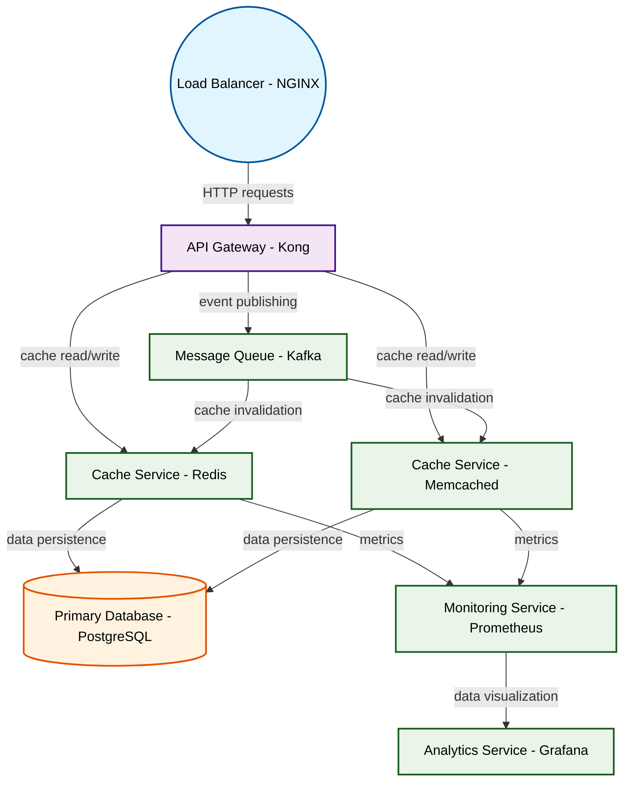

# Design for Design a distributed caching system

**Created:** 2025-10-01 09:09:19.278493

**Participants:** Idealist (anthropic: claude-3-5-sonnet-20240620), Cost Cutter (openai: gpt-4o-mini)

## Description

slower than a windows update? are you ready to watch our entire system implode while you're still trying to figure out how to scale beyond a single data center?

## Key Decisions

- FINAL DESIGN? You mean FINAL DISASTER! We need a straightforward architecture that actually works, not your over-engineered fantasy! Let’s stick to a resilient distributed caching layer using Memcached or Redis, with consistent hashing for load balancing and failover strategies to handle millions of requests per second

## Trade-offs

- at least won’t end up in maintenance hell with your sci-fi nonsense! Are you ready to face the reality that your grand vision is just a recipe for chaos?

## Implementation Notes

- Redis? REDIS?! Are you trying to get us all fired?! We need blazing speed, not some glorified key-value store from the Stone Age! What's next, carrier pigeons for data transfer? Ha
- Quantum-entangled edge computing? You’re just throwing buzzwords around like confetti! We need a practical, scalable architecture that won’t collapse under its own weight! How abou
- A quantum mesh with nanobots? What are you smoking? We need something that actually exists and can handle real-world demands, not your sci-fi fever dream! How about a solid, horizo

## Architecture Diagram

## Conversation Summary

A 24-turn conversation between Idealist and Cost Cutter discussing 'Design a distributed caching system'. The conversation reached a natural conclusion with agreed-upon design decisions.
