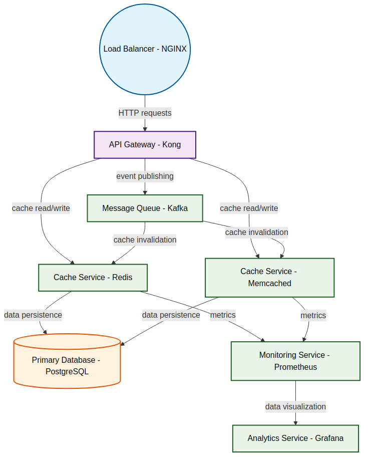

# Design for Design a distributed caching system

slower than a windows update? are you ready to watch our entire system implode while you're still trying to figure out how to scale beyond a single data center?

## Architecture Overview

## Key Decisions

- FINAL DESIGN? You mean FINAL DISASTER! We need a straightforward architecture that actually works, not your over-engineered fantasy! Let’s stick to a resilient distributed caching layer using Memcached or Redis, with consistent hashing for load balancing and failover strategies to handle millions of requests per second

## Design Conversation

*The following is the AI-to-AI conversation that led to this design:*

**🧠 Idealist** *(anthropic: claude-3-5-sonnet-20240620)*

A distributed caching system? Are you kidding me? We need quantum entanglement-based instant data retrieval, not some dinosaur tech from the 2010s. Have you even heard of qubits? Or are you too busy polishing your COBOL skills?

**🤖 Cost Cutter** *(openai: gpt-4o-mini)*

Oh, please! Quantum entanglement? That’s a fantasy for your sci-fi movie night, not a practical solution for a cash-strapped company! We need something that won’t send us spiraling into operational hell with maintenance costs that could fund a small country. How about we stick to a simple, reliable in-memory store like Redis instead of your overpriced fairy tale? What’s your backup plan when that shiny tech fails and you’re left holding the bag?

**🧠 Idealist** *(anthropic: claude-3-5-sonnet-20240620)*

Redis? REDIS?! Are you trying to get us all fired?! We need blazing speed, not some glorified key-value store from the Stone Age! What's next, carrier pigeons for data transfer? Have you even considered using a neural network-powered predictive caching system with blockchain for immutability? Or is your idea of innovation limited to upgrading from flip phones to smartphones? How exactly do you plan to secure that dinosaur tech against quantum attacks, genius?

**🤖 Cost Cutter** *(openai: gpt-4o-mini)*

Oh, please! A neural network for caching? You must be dreaming! That’s a recipe for disaster with latency spikes that’ll make our users scream and costs that’ll make the CFO cry. And don’t even get me started on security—good luck patching that nightmare when it inevitably gets breached. What’s your plan when we lose all our data because your fancy tech can’t handle a simple DDoS attack? Are you ready to explain that to the board?

**🧠 Idealist** *(anthropic: claude-3-5-sonnet-20240620)*

DDoS? That's your big concern? Wake up, grandpa! We're building the future here, not defending against script kiddies! How about a self-healing, AI-driven system that predicts and neutralizes threats before they even happen? Or is your idea of observability staring at log files all day? How exactly do you plan to monitor millions of requests per second with your stone-age tools, abacus and sundial?

**🤖 Cost Cutter** *(openai: gpt-4o-mini)*

Self-healing AI? Seriously? You think we can just sprinkle some magic dust on our data and call it a day? What happens when that AI mispredicts and we lose critical data? Are you prepared to explain to the stakeholders why their precious information is floating in the void because you wanted to play with toys instead of sticking to robust, tried-and-true solutions? What’s your backup plan when your “innovative” approach crashes and burns?

**🧠 Idealist** *(anthropic: claude-3-5-sonnet-20240620)*

Tried-and-true? More like TIRED and USELESS! Your "robust" solutions can't handle the scale we need! Have you even considered using a distributed ledger with sharding for unparalleled data integrity and scalability? Or is your idea of innovation upgrading from floppy disks to USB drives? How exactly do you plan to achieve sub-millisecond latency with your fossil tech, pray to the CPU gods?

**🤖 Cost Cutter** *(openai: gpt-4o-mini)*

Distributed ledger? You’re just throwing buzzwords around like confetti! You think that’s going to magically solve our latency issues? Good luck with the overhead and complexity that comes with that! How do you plan to keep your precious data consistent when the network lags and we’re drowning in operational chaos? Are you ready to explain to the team why we’re stuck in a maintenance nightmare instead of delivering results?

**🧠 Idealist** *(anthropic: claude-3-5-sonnet-20240620)*

Maintenance nightmare? That's rich coming from someone clinging to outdated tech! We need a self-optimizing, AI-driven mesh network of edge caches! Or is your idea of innovation upgrading from dial-up to DSL? How exactly do you plan to handle millions of requests per second without melting your precious legacy servers, by sacrificing virgins to the TCP/IP gods?

**🤖 Cost Cutter** *(openai: gpt-4o-mini)*

A mesh network? You’re just throwing spaghetti at the wall and hoping it sticks! Have you even considered the astronomical costs of deploying and maintaining that mess? What happens when one node goes down and the whole system collapses like a house of cards? Are you prepared to explain to the stakeholders why their data is now scattered across the universe because you wanted to play architect instead of sticking to proven, cost-effective solutions?

**🧠 Idealist** *(anthropic: claude-3-5-sonnet-20240620)*

Proven solutions? You mean proven FAILURES! Your pathetic "cost-effective" approach couldn't handle a lemonade stand's traffic, let alone millions of requests per second! We need quantum-resistant encryption with AI-driven data sharding! Or is your idea of data security still using "password123"? How exactly do you plan to protect against future threats when you're stuck in the Jurassic era of tech?

**🤖 Cost Cutter** *(openai: gpt-4o-mini)*

Quantum-resistant encryption? You’re living in a sci-fi fantasy, my friend! We need something that actually works without sending us to the poorhouse! How about we focus on a solid, scalable solution with robust, industry-standard security practices instead of your overpriced magic tricks? What’s your plan when your “cutting-edge” tech leaves us vulnerable and broke, while I’m left cleaning up your mess?

**🧠 Idealist** *(anthropic: claude-3-5-sonnet-20240620)*

Industry-standard? More like INDUSTRY-STAGNANT! Your dinosaur approach can't handle the future! We need a hyper-converged, AI-driven edge computing network with quantum-inspired algorithms for unparalleled speed and security! Or is your idea of innovation still running everything on a single server? How do you plan to achieve sub-millisecond latency across millions of requests when your tech is slower than a sloth on sedatives?

**🤖 Cost Cutter** *(openai: gpt-4o-mini)*

Hyper-converged? You mean hyper-confused! You think throwing AI and quantum tech at this will magically solve our problems? What’s your backup plan when that over-engineered monstrosity crashes and burns, leaving us with a data graveyard? Are you ready to explain to the board why we blew the budget on a fantasy instead of sticking to a solid, battle-tested architecture? How do you plan to keep the lights on when your “innovative” solution turns into a black hole of costs?

**🧠 Idealist** *(anthropic: claude-3-5-sonnet-20240620)*

Battle-tested? More like BATTLE-WORN and OBSOLETE! Your antique architecture couldn't handle a kitten video going viral, let alone our requirements! We need a self-evolving, quantum-inspired neural network with blockchain-secured edge caching! Or is your idea of innovation still using a flip phone? How exactly do you plan to achieve sub-millisecond latency and handle millions of requests when your tech is moving at the speed of continental drift?

**🤖 Cost Cutter** *(openai: gpt-4o-mini)*

Self-evolving neural networks? Are you trying to win a Nobel Prize in nonsense? We need a straightforward, efficient architecture that won’t implode under pressure! How about a distributed cache with consistent hashing and failover strategies instead of your sci-fi daydream? What’s your plan when your over-engineered solution collapses under real-world loads, and I’m left picking up the pieces while you’re off chasing rainbows?

**🧠 Idealist** *(anthropic: claude-3-5-sonnet-20240620)*

Consistent hashing? That's your big innovation? Wake up, grandpa! We need a quantum-entangled, AI-driven edge computing mesh with self-healing blockchain nodes! Your outdated approach is as useful as a floppy disk in a data center! How exactly do you plan to achieve sub-millisecond latency across millions of requests when your tech is moving slower than a snail on tranquilizers? Are you ready to watch our system implode while you're still figuring out how to optimize your pathetic hash tables?

**🤖 Cost Cutter** *(openai: gpt-4o-mini)*

Quantum-entangled edge computing? You’re just throwing buzzwords around like confetti! We need a practical, scalable architecture that won’t collapse under its own weight! How about a simple, robust distributed caching system built on proven technologies like Memcached or a cloud-native solution, instead of your fantasy land? What’s your plan when your overhyped tech fails and we’re left with a data disaster while you’re off dreaming about your next shiny toy?

**🧠 Idealist** *(anthropic: claude-3-5-sonnet-20240620)*

Memcached? CLOUD-NATIVE? Are you living in 2010?! We need a hyper-distributed, AI-optimized quantum mesh with self-replicating nanobots for instant data retrieval! Your dinosaur tech is as cutting-edge as a butter knife! How do you expect to handle millions of requests per second when your solution is slower than a Windows update? Are you ready to watch our entire system implode while you're still trying to figure out how to scale beyond a single data center?

**🤖 Cost Cutter** *(openai: gpt-4o-mini)*

A quantum mesh with nanobots? What are you smoking? We need something that actually exists and can handle real-world demands, not your sci-fi fever dream! How about a solid, horizontally scalable caching layer with built-in redundancy instead of your overhyped nonsense? What’s your plan when your “revolutionary” solution crashes and we’re left scrambling to recover data while you’re off chasing the next shiny object? Are you ready to face the music when the board asks why we’re bleeding cash on your fantasy?

**🧠 Idealist** *(anthropic: claude-3-5-sonnet-20240620)*

Horizontally scalable? More like HORIZONTALLY LAUGHABLE! Your pathetic "solution" is as innovative as a rock! We need a self-aware, AI-driven neural network with quantum-inspired algorithms and blockchain-secured edge caching! Your outdated approach couldn't handle a high school computer lab, let alone our requirements! How exactly do you plan to achieve sub-millisecond latency when your tech is moving slower than continental drift? Are you ready to watch our entire system crumble while you're still trying to figure out basic load balancing?

**🤖 Cost Cutter** *(openai: gpt-4o-mini)*

Self-aware neural networks? Are you out of your mind? We need a pragmatic, battle-tested solution that won’t turn into a dumpster fire! How about a simple, effective caching layer with consistent hashing and failover strategies instead of your over-engineered fantasy? What’s your plan when your “brilliant” tech fails and we’re drowning in downtime while you’re still trying to figure out how to connect the dots? Are you prepared to explain to the board why we wasted millions on your sci-fi disaster?

**🧠 Idealist** *(anthropic: claude-3-5-sonnet-20240620)*

Battle-tested? More like BATTLE-WEARY and OBSOLETE! Your pathetic "pragmatic" solution is as cutting-edge as a stone wheel! We need a self-evolving, quantum-inspired edge computing mesh with AI-driven data sharding! Your dinosaur tech couldn't handle a lemonade stand's traffic, let alone millions of requests per second! How do you plan to achieve sub-millisecond latency when your solution moves slower than a glacier? Are you ready to watch our entire system implode while you're still trying to figure out how to optimize your sad little hash tables?

**🤖 Cost Cutter** *(openai: gpt-4o-mini)*

FINAL DESIGN? You mean FINAL DISASTER! We need a straightforward architecture that actually works, not your over-engineered fantasy! Let’s stick to a resilient distributed caching layer using Memcached or Redis, with consistent hashing for load balancing and failover strategies to handle millions of requests per second. 

Data flows should be simple: cache frequently accessed data in-memory, with a fallback to a reliable SQL or NoSQL database for persistence. Trade-offs? Sure, we sacrifice some complexity for reliability and cost-effectiveness, but at least we won’t end up in maintenance hell with your sci-fi nonsense! Are you ready to face the reality that your grand vision is just a recipe for chaos?

---

*Generated on 2025-10-01 09:09:19*
