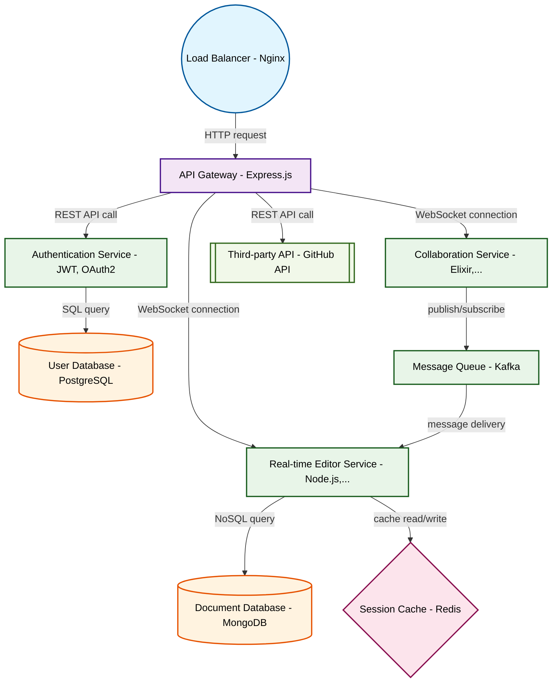

# Design for Create a real-time collaborative code editor

**Created:** 2025-10-03 09:08:02.829122

**Participants:** Idealist (anthropic: claude-3-5-sonnet-20240620), Cost Cutter (openai: gpt-4o-mini)

## Description

Syntax highlighting? Are we building Notepad++ from 2005?! We need a bleeding-edge quantum-entangled editor that instantly syncs across the multiverse! Why waste time on prehistoric features when we c...

## Key Decisions

- a decentralized peer-to-peer network with blockchain-based version control! It's practically free and infinitely scalable! And maintenance? Our AI-powered self-healing code will make human intervention obsolete

## Trade-offs

- headaches! You think can afford to gamble on your sci-fi fantasies while the budget is bleeding out? Let’s talk about the operational nightmare of scaling that monstrosity when it crashes under real-world usage

## Implementation Notes

- Technical superiority? You haven't seen anything yet! Our final design will use a hyper-dimensional quantum mesh network, with each particle entangled across infinite parallel univ

## Architecture Diagram

## Conversation Summary

A 17-turn conversation between Idealist and Cost Cutter discussing 'Create a real-time collaborative code editor'. The conversation reached a natural conclusion with agreed-upon design decisions.
