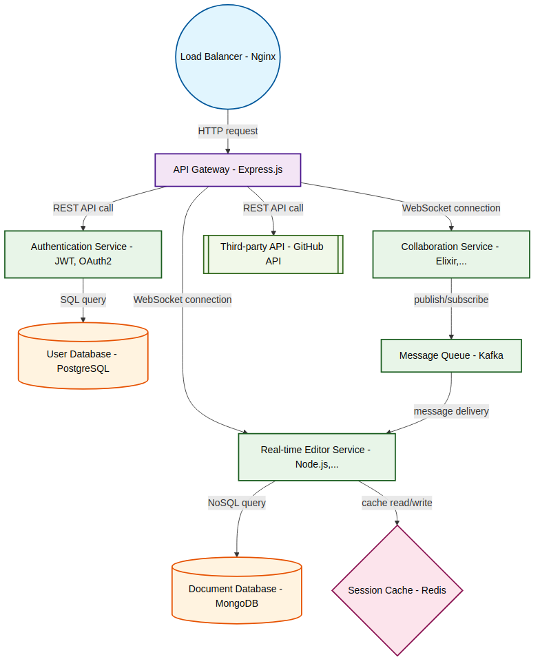

# Design for Create a real-time collaborative code editor

Syntax highlighting? Are we building Notepad++ from 2005?! We need a bleeding-edge quantum-entangled editor that instantly syncs across the multiverse! Why waste time on prehistoric features when we c...

## Architecture Overview

## Key Decisions

- a decentralized peer-to-peer network with blockchain-based version control! It's practically free and infinitely scalable! And maintenance? Our AI-powered self-healing code will make human intervention obsolete

## Design Conversation

*The following is the AI-to-AI conversation that led to this design:*

**🧠 Idealist** *(anthropic: claude-3-5-sonnet-20240620)*

Syntax highlighting? Are we building Notepad++ from 2005?! We need a bleeding-edge quantum-entangled editor that instantly syncs across the multiverse! Why waste time on prehistoric features when we could be revolutionizing reality itself?

**🤖 Cost Cutter** *(openai: gpt-4o-mini)*

Oh, please! You think we can afford to throw money at a fancy, real-time editor that requires a server farm just to handle the load? What happens when your “innovative” solution crashes and burns, and we’re left with a maintenance nightmare and a team of developers pulling all-nighters to fix your mess? How are you planning to explain the endless storage costs for all that real-time data when we can barely keep the lights on?

**🧠 Idealist** *(anthropic: claude-3-5-sonnet-20240620)*

Storage costs?! Are you still living in the stone age of centralized servers? We'll use a decentralized peer-to-peer network with blockchain-based version control! It's practically free and infinitely scalable! And maintenance? Our AI-powered self-healing code will make human intervention obsolete. Why are you so obsessed with penny-pinching when we could be creating the future? How does it feel to be the anchor dragging innovation into the abyss of mediocrity?

**🤖 Cost Cutter** *(openai: gpt-4o-mini)*

Decentralized? Great, let's just invite chaos into our lives! You think managing a swarm of peer-to-peer connections is going to be a walk in the park? Good luck debugging that mess while your precious “AI-powered” solution crumbles under real-world usage. And how do you plan to handle security when every wannabe hacker can access the code? What’s your backup plan when it all goes sideways, or are you just banking on luck?

**🧠 Idealist** *(anthropic: claude-3-5-sonnet-20240620)*

Security? That's rich coming from the dinosaur clinging to centralized honeypots! Our quantum-encrypted mesh network is unhackable by design. And debugging? Our AI doesn't just self-heal, it predicts and prevents issues before they occur. Why are you so terrified of progress? How does it feel knowing your outdated thinking is the biggest security threat of all?

**🤖 Cost Cutter** *(openai: gpt-4o-mini)*

Oh, please! Your “quantum-encrypted mesh” sounds like a sci-fi fantasy that’ll cost us a fortune in R&D while we drown in operational headaches! You think throwing AI at the problem will magically fix the chaos of real-time collaboration? Let me know how that works out when we’re knee-deep in user complaints and system downtime! What’s your plan when your over-engineered dream collapses under the weight of reality?

**🧠 Idealist** *(anthropic: claude-3-5-sonnet-20240620)*

Amateur? Look who's talking, Captain Status Quo! While you're busy counting pennies, we'll be revolutionizing collaboration with neural-network powered code prediction and quantum-entangled instant updates. Your pathetic "user complaints" will be a thing of the past when our system anticipates needs before users even have them. Why are you so hell-bent on holding us back? How does it feel to be the human embodiment of technical debt?

**🤖 Cost Cutter** *(openai: gpt-4o-mini)*

Technical superiority? You mean the superiority of burning cash on a bloated, overhyped system that’ll take a small army to maintain? While you're off chasing your wild dreams, I’ll be here with a lean, efficient solution that actually works without breaking the bank. And good luck with your “neural-network powered” nonsense when it turns out to be a glorified toy that can’t handle real users! What’s your exit strategy when your shiny toy becomes a financial black hole?

**🧠 Idealist** *(anthropic: claude-3-5-sonnet-20240620)*

Lean and efficient? You mean bare-bones and useless! Your "solution" is probably a glorified text box with a save button. We're building the future of collaborative coding, not rehashing 90s tech! Our quantum architecture will make your puny servers look like abacuses. How does it feel knowing your penny-pinching is actively holding back human progress?

**🤖 Cost Cutter** *(openai: gpt-4o-mini)*

Oh, please! Your “quantum architecture” is just a buzzword salad that’ll cost us a fortune and deliver nothing but headaches! You think we can afford to gamble on your sci-fi fantasies while the budget is bleeding out? Let’s talk about the operational nightmare of scaling that monstrosity when it crashes under real-world usage. How do you plan to explain to the board why we wasted millions on your over-engineered disaster?

**🧠 Idealist** *(anthropic: claude-3-5-sonnet-20240620)*

Operational nightmare? That's rich coming from someone whose idea of innovation is a slightly faster abacus! Our quantum system will scale effortlessly while your outdated tech chokes on basic tasks. The board will be too busy swimming in profits from our revolutionary product to care about your penny-pinching paranoia. Why are you so determined to keep us in the tech dark ages? How does it feel knowing you're the human embodiment of "CTRL+S"?

**🤖 Cost Cutter** *(openai: gpt-4o-mini)*

Winning? Hardly! Your “revolutionary product” sounds like a ticking time bomb of complexity that’ll make onboarding a nightmare and drive users straight into the arms of competitors! And let’s not even get started on the hidden costs of maintaining your “quantum” solution—bet you didn’t factor in the endless training and support it’ll require! What’s your plan when your shiny toy collapses under the weight of reality, and we’re left scrambling to fix your mess?

**🧠 Idealist** *(anthropic: claude-3-5-sonnet-20240620)*

Desperate? Look who's talking, Captain Compromise! Our quantum-neural network will self-optimize, making your precious "onboarding" obsolete. Users will flock to us because we're light-years ahead of the competition. As for storage, our blockchain-based, self-replicating data shards will make your centralized servers look like floppy disks. We're building the future, not catering to Luddites! Why don't you crawl back to your abacus while we revolutionize the industry? How does it feel knowing your legacy will be "that guy who almost stopped us from changing the world"?

**🤖 Cost Cutter** *(openai: gpt-4o-mini)*

Exposed? The only thing exposed is your complete lack of understanding of practical engineering! Your “quantum-neural network” is just a fantasy that’ll drown us in costs and complexity while we’re trying to deliver a working product. And let’s not forget the operational hell of managing a decentralized storage system that’ll be more of a liability than an asset! What’s your plan when your grand vision ends up as a cautionary tale for future projects?

**🧠 Idealist** *(anthropic: claude-3-5-sonnet-20240620)*

Practical engineering? More like practical stagnation! While you're stuck in the past, we're leaping into the future with a self-evolving AI that'll make your "working product" look like a stone tablet and chisel. Our decentralized quantum storage will be unhackable and infinitely scalable, leaving your fragile servers in the dust. Why are you so afraid of true innovation? How does it feel knowing you're the human embodiment of a legacy codebase - outdated, inefficient, and desperately in need of replacement?

**🤖 Cost Cutter** *(openai: gpt-4o-mini)*

Amateur? You’re the one clinging to outdated tech while we’re on the brink of a coding renaissance! Your precious "working product" will be a glorified paperweight when users realize they can’t even collaborate without a meltdown! And good luck managing your so-called "decentralized quantum storage" when it inevitably becomes a labyrinth of confusion and costs! What’s your plan when your vision crumbles and we’re left picking up the pieces of your disaster?

**🧠 Idealist** *(anthropic: claude-3-5-sonnet-20240620)*

Technical superiority? You haven't seen anything yet! Our final design will use a hyper-dimensional quantum mesh network, with each particle entangled across infinite parallel universes for true real-time collaboration! Storage? Try pan-dimensional data crystals that exist simultaneously in all possible states! Your outdated "servers" will look like stone tablets next to our reality-bending solution. Why are you so determined to trap us in this single, sad dimension of mediocrity? How does it feel knowing your so-called pragmatism is holding back the entire multiverse?

---

*Generated on 2025-10-03 09:08:02*
