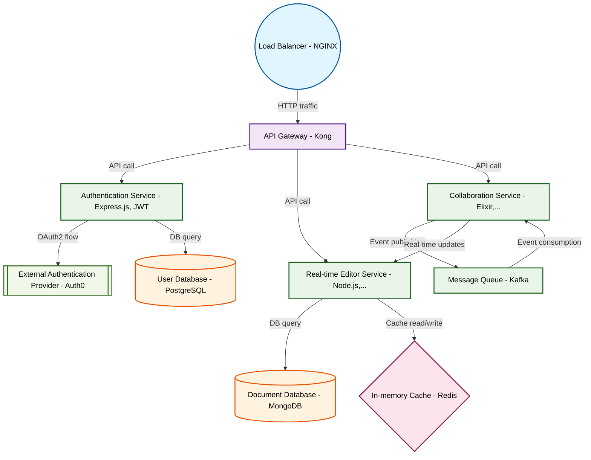

# Design for Create a real-time collaborative code editor

**Created:** 2025-10-05 09:07:30.333531

**Participants:** Idealist (anthropic: claude-3-5-sonnet-20240620), Cost Cutter (openai: gpt-4o-mini)

## Description

A real-time collaborative editor? With syntax highlighting? How quaint. Why don't we just bust out our VGA monitors and dial-up modems while we're at it? Look, if we're not building this on a decentra...

## Key Decisions

- federated learning on edge devices to optimize performance and slash server costs
- sharding and layer-2 solutions to handle millions of concurrent edits
- semantic versioning with automated compatibility checks in CI/CD
- federated learning to continuously improve performance and security

## Trade-offs

- GraphQL? How adorable. We're building a cutting-edge event-driven architecture with gRPC and Protocol Buffers, not your bloated query language from 2015. Our system will use QUIC f
- A monolith? In this economy? Wake up and smell the serverless coffee, grandpa! Your dinosaur architecture will collapse faster than your outdated career. We're building a cutting-e

## Implementation Notes

- Oh, please! You want to throw money at a "decentralized blockchain"? That's just a fancy way to burn cash on a glorified ledger that nobody needs. And don't get me started on stora
- WASM and edge computing? Wow, you really think you're the next tech visionary, don’t you? Let’s see how well that holds up when your fancy modules have to communicate across multip

## Architecture Diagram

## Conversation Summary

A 13-turn conversation between Idealist and Cost Cutter discussing 'Create a real-time collaborative code editor'. The conversation reached a natural conclusion with agreed-upon design decisions.
