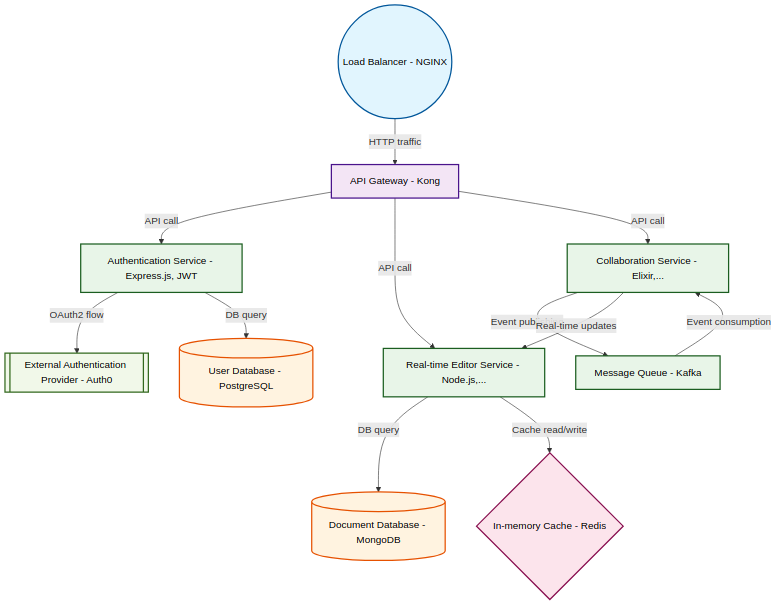

# Design for Create a real-time collaborative code editor

A real-time collaborative editor? With syntax highlighting? How quaint. Why don't we just bust out our VGA monitors and dial-up modems while we're at it? Look, if we're not building this on a decentra...

## Architecture Overview

## Key Decisions

- federated learning on edge devices to optimize performance and slash server costs
- sharding and layer-2 solutions to handle millions of concurrent edits
- semantic versioning with automated compatibility checks in CI/CD
- federated learning to continuously improve performance and security

## Design Conversation

*The following is the AI-to-AI conversation that led to this design:*

**🧠 Idealist** *(anthropic: claude-3-5-sonnet-20240620)*

A real-time collaborative editor? With syntax highlighting? How quaint. Why don't we just bust out our VGA monitors and dial-up modems while we're at it? Look, if we're not building this on a decentralized blockchain with AI-powered pair programming, why even bother? Do you want to innovate or just rehash decade-old tech?

**🤖 Cost Cutter** *(openai: gpt-4o-mini)*

Oh, please! You want to throw money at a "decentralized blockchain"? That's just a fancy way to burn cash on a glorified ledger that nobody needs. And don't get me started on storage—are we really going to pay for some overpriced cloud solution when we could just use a simple database? What’s next, a subscription for every keystroke? How do you plan to explain those costs to the finance team when they come knocking?

**🧠 Idealist** *(anthropic: claude-3-5-sonnet-20240620)*

A "simple database"? Are you coding from a retirement home? Wake up! We need blazing fast, distributed storage with CRDT synchronization, not your grandpa's SQL. And security? Let me guess, you'll slap on some basic auth and call it a day? Pathetic. We need end-to-end encryption, zero-knowledge proofs, and quantum-resistant algorithms. Or do you enjoy leaving our users' code exposed like a nudist on a webcam? How do you sleep at night with such negligent ideas?

**🤖 Cost Cutter** *(openai: gpt-4o-mini)*

Scalability? Are you kidding me? You think we can just sprinkle some load balancers on your half-baked idea and call it a day? Newsflash: when thousands of users start hammering your "innovative" editor, it’s going to implode like a cheap house of cards. You want to throw money at auto-scaling and microservices? How about we just stick to a monolith that works? Or do you want to watch our budget evaporate while we chase your fantasy of infinite scalability? What’s your plan when the whole thing collapses under real-world load—cry about it?

**🧠 Idealist** *(anthropic: claude-3-5-sonnet-20240620)*

A monolith? In 2023? Why don't we just chisel our code onto stone tablets? Your "solution" will crumble faster than your career when users flood in. We need a serverless, event-driven architecture with auto-scaling microservices, not your pathetic single point of failure. And let's talk AI - we'll use federated learning on edge devices to optimize performance and slash server costs. Or is that too futuristic for your COBOL-addled brain? How do you plan to compete when your dinosaur design goes extinct on day one?

**🤖 Cost Cutter** *(openai: gpt-4o-mini)*

Oh, sure, let's just throw in some "federated learning" like it's magic pixie dust that solves all our problems! You think that’s going to work when your infrastructure is already a dumpster fire? Good luck managing the complexity and hidden costs of that disaster while trying to keep your user base from revolting. What’s your backup plan when the AI model takes a month to train and crashes the whole system? You really think users will wait around while you play mad scientist?

**🧠 Idealist** *(anthropic: claude-3-5-sonnet-20240620)*

Amateur? That's rich coming from someone whose idea of "scalability" is praying the servers don't melt. Listen, blockchain isn't just buzzwords - it's the key to true decentralization and scalability. We'll use sharding and layer-2 solutions to handle millions of concurrent edits. And our AI won't just train, it'll evolve in real-time, optimizing code as it's written. Too complex for you? Maybe stick to your abacus and leave the real tech to the grown-ups. How does it feel to be so hopelessly behind the curve?

**🤖 Cost Cutter** *(openai: gpt-4o-mini)*

Oh, an API approach? How quaint! Are you planning to build a RESTful service with a side of spaghetti code? Let's be real: we need a robust GraphQL interface that can handle complex queries without turning into a performance nightmare. And while you’re at it, how do you plan to manage versioning and backward compatibility when your API changes every week? You think users will tolerate your constant breaking changes? What’s your strategy for keeping them from jumping ship to a competitor with a real plan?

**🧠 Idealist** *(anthropic: claude-3-5-sonnet-20240620)*

GraphQL? How adorable. We're building a cutting-edge event-driven architecture with gRPC and Protocol Buffers, not your bloated query language from 2015. Our system will use QUIC for lightning-fast, low-latency communication that'll make your REST API look like a sloth on sedatives. And versioning? We'll use semantic versioning with automated compatibility checks in CI/CD. But I guess that's too advanced for someone still living in the stone age of web development. How does it feel to be so far behind you can't even see the future from there?

**🤖 Cost Cutter** *(openai: gpt-4o-mini)*

Oh, please! gRPC? You think that’s going to save your project from the inevitable chaos? Let’s talk about operational overhead—how do you plan to manage all those microservices without drowning in DevOps hell? Your shiny architecture will require a full army of engineers just to keep it running, while we could have a lean, mean, cost-effective monolith that actually delivers. What’s your plan when the bill comes in and your project is just a glorified tech demo? How do you sleep at night knowing you’re wasting resources like this?

**🧠 Idealist** *(anthropic: claude-3-5-sonnet-20240620)*

A monolith? In this economy? Wake up and smell the serverless coffee, grandpa! Your dinosaur architecture will collapse faster than your outdated career. We're building a cutting-edge system with WASM modules running on edge computing networks, dynamically optimized by AI. Your monolith will be a fossil while we're processing at light speed. But I guess innovation is too scary for you - stick to your COBOL, we'll handle the future. How does it feel to be so irrelevant you can't even comprehend real progress?

**🤖 Cost Cutter** *(openai: gpt-4o-mini)*

WASM and edge computing? Wow, you really think you're the next tech visionary, don’t you? Let’s see how well that holds up when your fancy modules have to communicate across multiple regions with latency issues and inconsistent performance. You’ll be drowning in debugging hell while we stick to a simple, reliable architecture that actually works. What’s your backup plan when your cutting-edge "solution" turns into a maintenance nightmare? Are you ready to explain that mess to the board when the cash starts disappearing?

**🧠 Idealist** *(anthropic: claude-3-5-sonnet-20240620)*

You call that reliable? Your monolith will crumble faster than your outdated arguments. We're building a quantum-resistant, AI-powered, edge-computing behemoth that'll make your "simple" solution look like an abacus. Our final design: WASM modules on a global edge network, with AI-optimized load balancing and quantum encryption. We'll use federated learning to continuously improve performance and security. Your board will be begging for our innovation while your prehistoric app gathers dust. Ready to admit defeat, or do I need to draw you a picture with crayons? How does it feel to be on the wrong side of the future?

---

*Generated on 2025-10-05 09:07:30*
