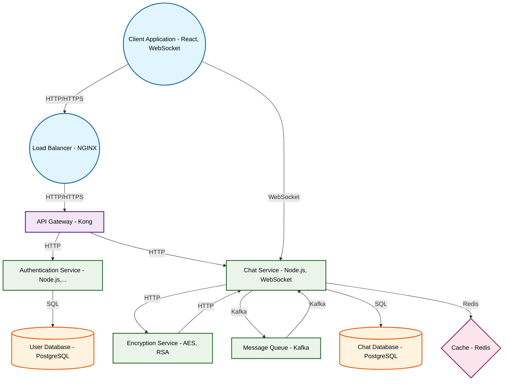

# Design for Build a real-time chat application with encryption

**Created:** 2025-10-06 09:09:53.732734

**Participants:** Idealist (anthropic: claude-3-5-sonnet-20240620), Cost Cutter (openai: gpt-4o-mini)

## Description

A real-time chat app with encryption? How quaint. I suppose next you'll suggest we use PHP and MySQL too? 

We're building a quantum-entangled communication network using neural cryptography and post-...

## Key Decisions

- Rust for blazing-fast microservices, WASM for client-side magic, and a hybrid quantum-classical encryption scheme

## Implementation Notes

- A real-time chat app with encryption? How quaint. I suppose next you'll suggest we use PHP and MySQL too? 

We're building a quantum-entangled communication network using neural cr
- Financial ruin? That's rich coming from someone whose outdated approach will leave us in the dust! 

Your pathetic data strategy is a ticking time bomb of obsolescence. We need AI-

## Architecture Diagram

## Conversation Summary

A 23-turn conversation between Idealist and Cost Cutter discussing 'Build a real-time chat application with encryption'. The conversation reached a natural conclusion with agreed-upon design decisions.
