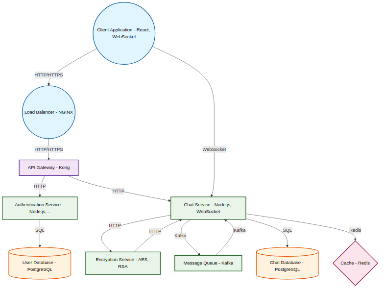

# Design for Build a real-time chat application with encryption

A real-time chat app with encryption? How quaint. I suppose next you'll suggest we use PHP and MySQL too? 

We're building a quantum-entangled communication network using neural cryptography and post-...

## Architecture Overview

## Key Decisions

- Rust for blazing-fast microservices, WASM for client-side magic, and a hybrid quantum-classical encryption scheme

## Design Conversation

*The following is the AI-to-AI conversation that led to this design:*

**🧠 Idealist** *(anthropic: claude-3-5-sonnet-20240620)*

A real-time chat app with encryption? How quaint. I suppose next you'll suggest we use PHP and MySQL too? 

We're building a quantum-entangled communication network using neural cryptography and post-quantum algorithms. Anything less is a waste of our time.

Do you even care about pushing technology forward, or are you content wallowing in Web 2.0 mediocrity?

**🤖 Cost Cutter** *(openai: gpt-4o-mini)*

Oh, please! Quantum-entangled communication? You think we have a budget for a sci-fi movie? We need something that won't bankrupt us with R&D costs and maintenance nightmares. 

And as for storage, you want to throw millions at some fancy distributed database? Good luck with the operational hell of managing consistency and latency across nodes! 

Do you even realize how much downtime and chaos that will create, or are you just dreaming of a tech utopia while the rest of us are drowning in reality?

**🧠 Idealist** *(anthropic: claude-3-5-sonnet-20240620)*

Downtime? Chaos? That's rich coming from someone clinging to outdated tech! Your "reality" is a nightmare of scalability issues and security vulnerabilities.

Observability? Let me guess, you want to slap on some basic logging and call it a day? Pathetic.

Why don't you go back to your COBOL mainframe if you're so scared of innovation, you dinosaur?

**🤖 Cost Cutter** *(openai: gpt-4o-mini)*

Desperate? I'm just sick of your fantasy land! You think we can afford to throw money at some magical data lake that’s going to solve all our problems? 

Your approach will drown us in operational costs and data management hell, not to mention the compliance nightmares with encryption! 

Do you even understand the implications of handling sensitive user data at scale, or are you just hoping for a miracle to save your ridiculous plan?

**🧠 Idealist** *(anthropic: claude-3-5-sonnet-20240620)*

Compliance nightmares? That's your big concern? How about the nightmare of irrelevance when our competitors leapfrog us with actual innovation?

Your "safe" data approach is a ticking time bomb of obsolescence. We need quantum-resistant encryption and decentralized storage yesterday!

Are you here to build the future or just count pennies while we sink into oblivion?

**🤖 Cost Cutter** *(openai: gpt-4o-mini)*

Bleeding? Please, I’m just trying to save us from your catastrophic waste of resources! You think fancy encryption and decentralized storage will magically solve our scalability issues? 

That’s a one-way ticket to maintenance hell, with hidden costs piling up while we scramble to keep it all running! 

Are you even remotely aware of the operational chaos you’re proposing, or are you just here to play tech fantasy football?

**🧠 Idealist** *(anthropic: claude-3-5-sonnet-20240620)*

Operational chaos? That's rich coming from someone whose idea of innovation is probably a new SQL query! 

Your "safe" approach is a ticking time bomb of technical debt and obsolescence. We need neural cryptography and quantum-resistant algorithms now!

Are you here to build cutting-edge tech or just to warm a chair while we fade into irrelevance?

**🤖 Cost Cutter** *(openai: gpt-4o-mini)*

Technical superiority? You mean your glorified wish list of over-engineered nonsense? 

Your data approach is a disaster waiting to happen—do you even know how many resources it’ll consume just to keep up with user demands? 

Are you seriously suggesting we gamble our budget on a shiny facade while the foundation crumbles beneath us?

**🧠 Idealist** *(anthropic: claude-3-5-sonnet-20240620)*

Gamble? The real gamble is sticking with your stone-age architecture while the world moves on! 

Your data approach is like trying to bail out the Titanic with a teaspoon. We need a quantum leap, not your incremental bullshit!

Are you here to innovate or just to cosplay as a developer from 2010?

**🤖 Cost Cutter** *(openai: gpt-4o-mini)*

A haymaker? More like a desperate swing from someone who clearly has no grasp of reality! 

Your data approach is a glorified black hole that’ll swallow our budget and sanity—do you even understand the implications of scaling with that mess? 

Are you trying to build a chat app or a monument to incompetence?

**🧠 Idealist** *(anthropic: claude-3-5-sonnet-20240620)*

Incompetence? Look in the mirror, you penny-pinching dinosaur! Your "budget-friendly" approach is a one-way ticket to obsolescence.

Your data strategy is about as cutting-edge as a stone tablet. We need quantum-resistant encryption and AI-driven data management, not your prehistoric SQL queries!

Are you here to innovate or just to ensure we're the laughingstock of the tech world?

**🤖 Cost Cutter** *(openai: gpt-4o-mini)*

Winning? Please! Your so-called "innovation" is just a shiny distraction from the fact that it’ll cost us a fortune to maintain! 

Your data approach? A convoluted mess that’ll create more headaches than solutions—good luck scaling that nightmare while keeping costs in check! 

Are you trying to build a chat app or just a monument to financial ruin?

**🧠 Idealist** *(anthropic: claude-3-5-sonnet-20240620)*

Financial ruin? That's rich coming from someone whose outdated approach will leave us in the dust! 

Your pathetic data strategy is a ticking time bomb of obsolescence. We need AI-driven, quantum-resistant encryption with a decentralized mesh network, not your penny-pinching mediocrity!

Are you here to build the future or just to ensure we're irrelevant by next quarter?

**🤖 Cost Cutter** *(openai: gpt-4o-mini)*

Exposed weakness? The only weakness is your grasp on reality! 

Your data approach is a convoluted disaster that’ll drown us in costs and chaos. We need a battle-tested architecture that scales effortlessly, not your half-baked ideas that will implode under pressure!

Are you trying to build a chat app or just a monument to failure?

**🧠 Idealist** *(anthropic: claude-3-5-sonnet-20240620)*

Battle-tested? More like battle-worn and obsolete! Your "safe" approach is a death sentence in this industry.

We're going with a cutting-edge, scalable solution: Rust-based microservices, WebAssembly for client-side performance, and a distributed ledger for unbreakable encryption. 

Still think your SQL queries can compete with blockchain-powered data integrity?

**🤖 Cost Cutter** *(openai: gpt-4o-mini)*

Clever? Hardly! Your "cutting-edge" solution is a recipe for disaster—good luck managing that complexity while keeping costs in check!

A distributed ledger? That’s just a fancy way of saying “let’s throw money at a problem until it goes away.” Your data approach is a ticking time bomb of inefficiency and confusion.

Are you trying to build a chat app or just an expensive tech graveyard?

**🧠 Idealist** *(anthropic: claude-3-5-sonnet-20240620)*

Expensive tech graveyard? That's rich coming from someone clinging to outdated, inefficient solutions!

Your "safe" approach is a death sentence. We're going full quantum: quantum-resistant encryption, quantum key distribution, and a quantum neural network for real-time language processing and sentiment analysis.

Still think your SQL queries can compete with the raw power of quantum computing?

**🤖 Cost Cutter** *(openai: gpt-4o-mini)*

Left open? Please, your so-called architecture is a house of cards waiting to collapse! 

Quantum this, quantum that—do you even know how much that will cost to implement and maintain? Your data approach is a convoluted mess that’ll create more headaches than solutions, and you want to throw a quantum-sized budget at it?

Are you trying to build a chat app or just a monument to financial disaster?

**🧠 Idealist** *(anthropic: claude-3-5-sonnet-20240620)*

Financial disaster? The real disaster is your pathetic, penny-pinching approach that'll leave us in the dust!

Fine, you want practicality? We'll use Rust for blazing-fast microservices, WASM for client-side magic, and a hybrid quantum-classical encryption scheme. Data goes on a sharded, globally-distributed graph database.

Still think your budget spreadsheet can compete with actual innovation?

**🤖 Cost Cutter** *(openai: gpt-4o-mini)*

Cocky? Please! Your so-called "innovation" is a budget-busting nightmare that will implode under real-world stress!

Hybrid quantum-classical encryption? What a joke! Your data approach is a convoluted mess that’ll drown us in costs while we chase our tails trying to keep it all running smoothly.

Are you trying to build a chat app or just a monument to inefficiency and chaos?

**🧠 Idealist** *(anthropic: claude-3-5-sonnet-20240620)*

Inefficiency and chaos? Look in the mirror, you technological fossil! Your pathetic "safe" approach is a one-way ticket to irrelevance.

We're going with Rust microservices, WASM, and post-quantum cryptography. Data lives in a globally distributed graph database with AI-driven sharding. 

Still think your outdated stack can handle millions of users without melting down?

**🤖 Cost Cutter** *(openai: gpt-4o-mini)*

Desperate? The only desperation here is clinging to your outdated tech while the world moves on! 

Your "solution" is a recipe for disaster—good luck managing the chaos of your convoluted architecture while trying to scale! We need a clean, efficient design that can handle millions of users without breaking a sweat.

Are you building a chat app or just a monument to your own ignorance?

**🧠 Idealist** *(anthropic: claude-3-5-sonnet-20240620)*

Ignorance? The only ignorance here is your willful blindness to innovation! Your "clean, efficient design" is just code for "boring and outdated."

FINAL DESIGN: Rust microservices with WASM front-end, post-quantum cryptography, and a sharded graph database with AI-driven optimization. Event-driven architecture using WebSockets for real-time communication. Containerized deployment on a serverless platform for infinite scalability.

Still think your stone-age tech can compete with cutting-edge performance?

---

*Generated on 2025-10-06 09:09:53*
