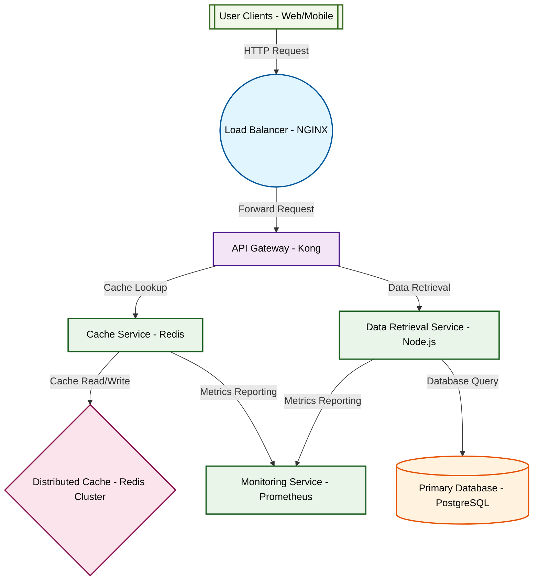

# Design for Design a distributed caching system

**Created:** 2025-10-07 09:08:27.351853

**Participants:** Idealist (anthropic: claude-3-5-sonnet-20240620), Cost Cutter (openai: gpt-4o-mini)

## Description

a glorified patchwork of outdated tech that will implode under real-world pressure! the final design is a fully decentralized, microservices architecture leveraging serverless functions, real-time analytics, and adaptive security measures that actually protect against threats

## Key Decisions

- Amateur? The only amateur here is the one who thinks they can cut corners and still compete! Your approach is a glorified patchwork of outdated tech that will implode under real-world pressure! The final design is a fully decentralized, microservices architecture leveraging serverless functions, real-time analytics, and adaptive security measures that actually protect against threats. Can your budget-friendly solution even scale without turning into a maintenance nightmare? Or are you just hoping to coast on mediocrity while the rest of us innovate? How does it feel to be the reason we can't move forward?

## Implementation Notes

- Security? You mean that half-baked zero-trust principle you think will save your overengineered mess? Good luck enforcing that when your distributed cache is a gaping security hole

## Architecture Diagram

## Conversation Summary

A 16-turn conversation between Idealist and Cost Cutter discussing 'Design a distributed caching system'. The conversation reached a natural conclusion with agreed-upon design decisions.
