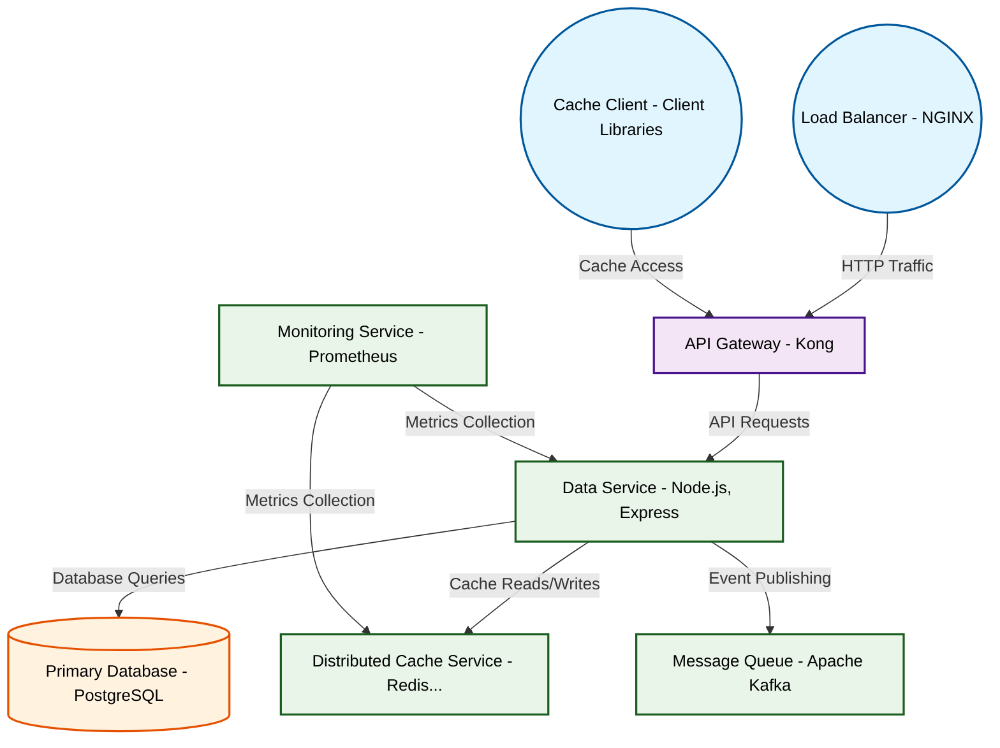

# Design for Design a distributed caching system

**Created:** 2025-10-09 09:09:06.326636

**Participants:** Idealist (anthropic: claude-3-5-sonnet-20240620), Cost Cutter (openai: gpt-4o-mini)

## Description

Redis? Are you fucking kidding me? That's so 2010. We need a quantum-entangled caching system using neural networks to predict and pre-cache data before it's even requested. Have you even heard of the...

## Key Decisions

- Final design? You mean your fantasy? Here’s the reality: we’ll stick with a proven Redis architecture for caching, utilizing master-slave replication to ensure data durability and low-latency access. Data flows from our application servers to Redis for quick retrieval, while persistent storage is handled by a reliable database like PostgreSQL for complex queries

## Trade-offs

- Oh, please! Your so-called "bleeding-edge tech" is nothing but a marketing gimmick. While you’re busy dreaming about picoseconds, I’ll be deploying a Redis architecture that’s prov
- Weakness? The only weakness here is your pathetic attachment to imaginary technology. Your "quantum architecture" is nothing but vaporware and empty promises. While you're busy wri
- Final design? You mean your fantasy? Here’s the reality: we’ll stick with a proven Redis architecture for caching, utilizing master-slave replication to ensure data durability and 

## Implementation Notes

- last decade's tech? Or are you finally ready to admit you're just too scared to embrace true innovation?
- last decade's tech? Or are you finally ready to admit you're just a dinosaur waiting for the meteor?
- Redis? Are you fucking kidding me? That's so 2010. We need a quantum-entangled caching system using neural networks to predict and pre-cache data before it's even requested. Have y
- Reality? You mean mediocrity. Your Redis cluster is a pathetic joke compared to our quantum solution. We'll handle petabytes of data with zero latency while your outdated tech chok
- Reality? You mean stagnation. Your Redis setup is a pathetic crutch for the technologically impaired. Our quantum system isn't just theory - it's the future you're too scared to fa
- Solid? Your Redis architecture is about as solid as a house of cards in a hurricane. Our quantum system isn't fantasy, it's the inevitable future you're too scared to face. We're t
- Weakness? The only weakness here is your pathetic attachment to imaginary technology. Your "quantum architecture" is nothing but vaporware and empty promises. While you're busy wri

## Architecture Diagram

## Conversation Summary

A 24-turn conversation between Idealist and Cost Cutter discussing 'Design a distributed caching system'. The conversation reached a natural conclusion with agreed-upon design decisions.
