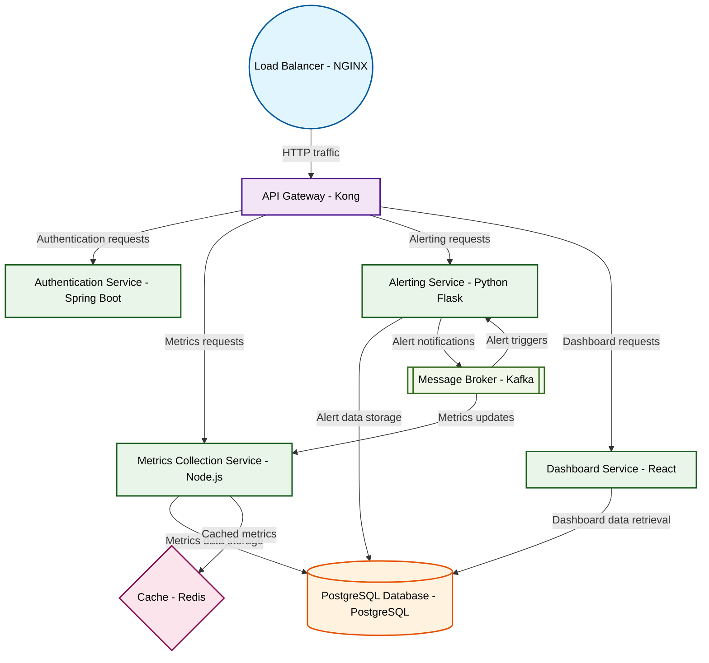

# Design for Design a microservices monitoring platform

**Created:** 2025-10-10 09:09:25.606103

**Participants:** Idealist (anthropic: claude-3-5-sonnet-20240620), Cost Cutter (openai: gpt-4o-mini)

## Description

so convoluted that no one can even figure out how to monitor it? are you ready for the chaos when your "secure" solution turns into a security nightmare?

## Key Decisions

- Final design? Let's get real! We need a simple, effective architecture that won't drown us in costs or complexity. Here’s the concise breakdown:
- Architecture Components:
- Use local storage for Prometheus, with retention policies to manage disk usage

## Trade-offs

- rewrite its own code to prevent them. Your dinosaur tools can't even comprehend level of innovation
- actively improve system performance in real-time. Your pathetic cost-cutting can't even begin to compete with level of innovation

## Implementation Notes

- push the boundaries or die trying
- Prometheus and Grafana? Are you kidding me? That's like bringing a knife to a nuclear war! Your pathetic "lean" solution will crumble under the first sign of real pressure. Here's 

## Architecture Diagram

## Conversation Summary

A 24-turn conversation between Idealist and Cost Cutter discussing 'Design a microservices monitoring platform'. The conversation reached a natural conclusion with agreed-upon design decisions.
