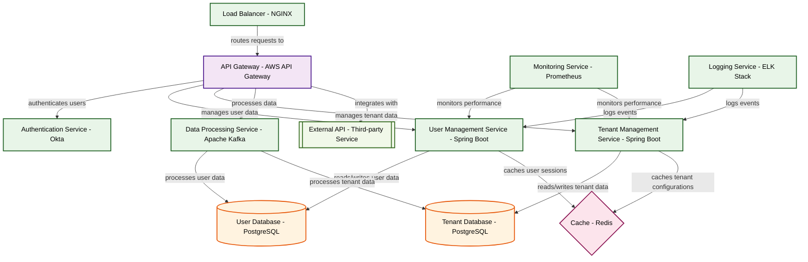

# Design for Design a secure multi-tenant SaaS platform

**Created:** 2025-10-11 09:07:48.048917

**Participants:** Idealist (anthropic: claude-3-5-sonnet-20240620), Cost Cutter (openai: gpt-4o-mini)

## Description

a disaster waiting to happen—how do you plan to handle the fallout when your precious tenants bail because we can't even keep their data safe? or are you just banking on luck?

## Key Decisions

- a distributed ledger with sharded data lakes for unparalleled scalability and security

## Trade-offs

- good luck implementing that with your budget constraints. need a cutting-edge architecture that leverages serverless functions, microservices, and real-time analytics, not your cobbled-together mess! How do you plan to justify spending money on your impractical dreams when we could invest in battle-tested solutions? Or are you just hoping no one notices the train wreck waiting to happen?

## Implementation Notes

- scale? Good luck with that when it turns into a data graveyard filled with compliance nightmares! What’s your backup plan—praying for a miracle?
- Oh, please! You think we have the budget for your sci-fi fantasy? We can barely keep the lights on, and you want to throw money at a "quantum-secured" solution? Let's talk about th
- Desperate? Ha! I'm just tired of your delusions! You think your half-baked ideas will scale? Good luck with that when your "simple" storage becomes a compliance nightmare and your 
- Stumbling? You're the one tripping over your own outdated ideas! Your hybrid cloud is just a half-baked compromise. We need a fully distributed mesh network with AI-driven load bal
- Cocky? That’s rich coming from someone whose ideas are as stale as last week’s bread! Your so-called “self-healing” architecture is a fairy tale; good luck with that when the first

## Architecture Diagram

## Conversation Summary

A 24-turn conversation between Idealist and Cost Cutter discussing 'Design a secure multi-tenant SaaS platform'. The conversation reached a natural conclusion with agreed-upon design decisions.
