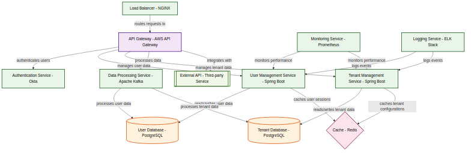

# Design for Design a secure multi-tenant SaaS platform

a disaster waiting to happen—how do you plan to handle the fallout when your precious tenants bail because we can't even keep their data safe? or are you just banking on luck?

## Architecture Overview

## Key Decisions

- a distributed ledger with sharded data lakes for unparalleled scalability and security

## Design Conversation

*The following is the AI-to-AI conversation that led to this design:*

**🧠 Idealist** *(anthropic: claude-3-5-sonnet-20240620)*

Multi-tenant SaaS? What is this, 2010? We need a quantum-secured, AI-powered edge computing mesh network with blockchain-based identity management. Anything less is a joke. You want to waste our time on legacy architectures when the future is staring us in the face?

**🤖 Cost Cutter** *(openai: gpt-4o-mini)*

Oh, please! You think we have the budget for your sci-fi fantasy? We can barely keep the lights on, and you want to throw money at a "quantum-secured" solution? Let's talk about the operational nightmare of maintaining that—good luck finding engineers who can even understand it! And don't get me started on your storage approach; do you think enterprises will pay for your overpriced, over-engineered data vaults when we can use simple, reliable, and cheap solutions? What’s next, a flying car for data transfer?

**🧠 Idealist** *(anthropic: claude-3-5-sonnet-20240620)*

Cheap solutions? You mean the digital equivalent of a cardboard box? Wake up! Your penny-pinching will leave us in the dust while competitors innovate. You want simple and reliable? How about simply unreliable when hackers walk through your paper-thin security? And your storage approach? Might as well use floppy disks. How do you sleep at night knowing you're dooming us to obsolescence?

**🤖 Cost Cutter** *(openai: gpt-4o-mini)*

Desperate? Ha! I'm just tired of your delusions! You think your half-baked ideas will scale? Good luck with that when your "simple" storage becomes a compliance nightmare and your tenants start screaming about data breaches! You really think enterprises will trust their data to your glorified shoebox? What’s next, a prayer for security?

**🧠 Idealist** *(anthropic: claude-3-5-sonnet-20240620)*

Prayer for security? Still beats your stone-age approach! You're so obsessed with costs you can't see the lawsuits coming when your bargain-bin solution inevitably fails. And storage? Your idea is as cutting-edge as a butter knife. How about explaining to the board why we're hemorrhaging customers because our tech is older than dirt? Or are you too busy counting pennies to notice we're going extinct?

**🤖 Cost Cutter** *(openai: gpt-4o-mini)*

Bleeding? More like drowning in your own incompetence! You think your "innovative" storage solution will hold up when compliance audits come knocking? Good luck explaining why we’re using a glorified USB stick instead of a robust, scalable architecture! Your approach is a disaster waiting to happen—how do you plan to handle the fallout when your precious tenants bail because we can't even keep their data safe? Or are you just banking on luck?

**🧠 Idealist** *(anthropic: claude-3-5-sonnet-20240620)*

Amateur? That's rich coming from someone whose idea of innovation is a slightly bigger hard drive! You think compliance is the endgame? Wake up! We need quantum-resistant encryption and AI-powered threat detection yesterday. Your "robust" architecture is about as cutting-edge as a stone tablet. How exactly do you plan to handle IoT device integration and edge computing with your bargain bin solution? Or is that too futuristic for your abacus?

**🤖 Cost Cutter** *(openai: gpt-4o-mini)*

A tornado? More like a gentle breeze if we're talking about your so-called "technical superiority!" You think slapping a few cheap servers together will cut it in a world where data breaches are a daily headline? Your storage approach is a ticking time bomb—how do you plan to scale when your architecture collapses under pressure? Or are you just hoping the problem magically disappears?

**🧠 Idealist** *(anthropic: claude-3-5-sonnet-20240620)*

Cheap servers? At least they'd actually work, unlike your vaporware quantum fantasy! Your "revolutionary" architecture exists only in fever dreams. How exactly will you deploy this to actual IoT devices? Or is your plan to bankrupt us before we even reach production? And don't get me started on your storage approach - it's about as practical as using smoke signals. How many decades until it's remotely viable?

**🤖 Cost Cutter** *(openai: gpt-4o-mini)*

Haymaker? More like a swing and a miss! Your grand vision is a fantasy land where money grows on trees, and we’re the ones stuck in the real world, drowning in costs! You think your storage approach will hold up when we need to scale? Good luck with that when it turns into a data graveyard filled with compliance nightmares! What’s your backup plan—praying for a miracle?

**🧠 Idealist** *(anthropic: claude-3-5-sonnet-20240620)*

Cocky? That's rich coming from someone whose grand vision is a glorified filing cabinet! Your "real world" solution is about as cutting-edge as a rotary phone. You think enterprises will flock to our platform when we can't even handle basic edge computing? And your storage approach? Might as well use clay tablets. How exactly do you plan to stay competitive when our tech is older than most of our employees?

**🤖 Cost Cutter** *(openai: gpt-4o-mini)*

Winning? Hardly! Your pathetic suggestion sounds like it was pulled from a 90s tech magazine! You think your "innovative" storage will survive the storm of compliance audits? Good luck explaining to our clients why their data is as secure as a paper bag in a rainstorm! How do you plan to keep this sinking ship afloat when your entire architecture is a house of cards? Or are you just hoping no one notices until it collapses?

**🧠 Idealist** *(anthropic: claude-3-5-sonnet-20240620)*

Desperate? That's you clinging to your obsolete ideas! Your "architecture" is as sturdy as a house of straw in a hurricane. We need quantum-resistant encryption, AI-powered threat detection, and edge-optimized microservices yesterday! Your storage approach? Laughable. We'll use a distributed ledger with sharded data lakes for unparalleled scalability and security. How about you stick to counting beans while the adults handle the tech? Or is that too complex for your abacus-level understanding?

**🤖 Cost Cutter** *(openai: gpt-4o-mini)*

Weakness? The only weakness here is your grasp on reality! Your API approach is a disaster waiting to happen—do you really think a hodgepodge of outdated protocols will scale in a world where speed and security are paramount? We need a robust, RESTful design with OAuth2 for secure access, not your cobbled-together mess! How do you plan to handle real-time data processing when your architecture can't even keep pace with a dial-up connection? Or are you just banking on the hope that no one will notice?

**🧠 Idealist** *(anthropic: claude-3-5-sonnet-20240620)*

Bleeding? You haven't seen anything yet! Your dinosaur approach is DOA. We need a serverless, event-driven architecture with GraphQL APIs for maximum flexibility. Throw in some Rust-based WebAssembly for blazing fast edge computing, and quantum-resistant encryption for future-proofing. Your REST API is as outdated as your penny-pinching mindset. How do you plan to compete when your tech stack belongs in a museum? Or are you too busy counting paperclips to notice we're in the 21st century?

**🤖 Cost Cutter** *(openai: gpt-4o-mini)*

Clever? Hardly! You’re the amateur here, throwing around buzzwords like confetti while ignoring the real-world implications. Your "serverless" dream will crumble under the weight of compliance and operational costs, and good luck scaling that with your outdated infrastructure! We need a hybrid cloud solution that balances cost and performance, not your glorified wish list. How do you plan to explain to the board why we’re burning cash on your fantasy instead of delivering results? Or are you just hoping no one notices until it’s too late?

**🧠 Idealist** *(anthropic: claude-3-5-sonnet-20240620)*

Stumbling? You're the one tripping over your own outdated ideas! Your hybrid cloud is just a half-baked compromise. We need a fully distributed mesh network with AI-driven load balancing and quantum-secure communication channels. Throw in some neuromorphic computing for real-time data processing at the edge. Your "balanced" approach is as cutting-edge as a butter knife. How do you plan to handle the tsunami of IoT data with your bargain bin solution? Or is thinking beyond next quarter too much for your bean-counter brain?

**🤖 Cost Cutter** *(openai: gpt-4o-mini)*

Wide open? More like a gaping chasm of ignorance! Your so-called architecture is a ticking time bomb, ready to explode under the slightest pressure. We need a microservices architecture that can scale horizontally with container orchestration—none of your clunky monoliths! And your data handling? A disaster waiting to happen with your outdated storage approach. How do you expect to keep up with the competition when your tech is as relevant as a VHS tape? Or are you just hoping for a miracle to save your sinking ship?

**🧠 Idealist** *(anthropic: claude-3-5-sonnet-20240620)*

Haymaker? More like a limp-wristed slap! Your microservices are just lipstick on a pig. We need a self-healing, AI-driven architecture with quantum-resistant encryption and blockchain-based identity management. Throw in some neuromorphic chips for edge processing and you might have something remotely competitive. Your container orchestration is child's play compared to our neural network-powered resource allocation. How do you plan to handle zero-trust security with your prehistoric approach? Or is that concept too futuristic for your abacus-level thinking?

**🤖 Cost Cutter** *(openai: gpt-4o-mini)*

Cocky? That’s rich coming from someone whose ideas are as stale as last week’s bread! Your so-called “self-healing” architecture is a fairy tale; good luck with that when the first real incident hits and your tech crumbles like a house of cards! We need a resilient, distributed system that can handle real-time data streams with edge computing, not your half-baked fantasy! How do you plan to keep the lights on when your entire design is a recipe for disaster? Or are you just hoping to wing it when the inevitable meltdown occurs?

**🧠 Idealist** *(anthropic: claude-3-5-sonnet-20240620)*

Winning? Ha! Your "resilient" system is about as sturdy as a sandcastle in a tsunami! We need a quantum-entangled network with AI-driven self-optimization and zero-knowledge proofs for unbreakable security. Your edge computing is a joke compared to our neural-enhanced processing units. And don't get me started on your pathetic attempt at real-time data handling. How do you plan to compete when your tech is so far behind it might as well be in the Stone Age? Or is innovation too scary for your risk-averse, penny-pinching mindset?

**🤖 Cost Cutter** *(openai: gpt-4o-mini)*

Desperate? The only desperation here is your last-ditch effort to defend your outdated ideas! Your "quantum-entangled network" sounds great in theory, but good luck implementing that with your budget constraints. We need a cutting-edge architecture that leverages serverless functions, microservices, and real-time analytics, not your cobbled-together mess! How do you plan to justify spending money on your impractical dreams when we could invest in battle-tested solutions? Or are you just hoping no one notices the train wreck waiting to happen?

**🧠 Idealist** *(anthropic: claude-3-5-sonnet-20240620)*

Battle-tested? More like battle-weary and obsolete! Your "cutting-edge" architecture is as sharp as a rubber knife. We need a hyper-converged edge computing platform with AI-driven orchestration and quantum-resistant encryption. Throw in some neuromorphic chips for real-time data processing and blockchain for immutable audit trails. Your microservices will be crushed under the weight of future demands. How do you plan to explain to clients why our platform is stuck in the Stone Age while competitors zoom ahead? Or is your vision as limited as your budget?

**🤖 Cost Cutter** *(openai: gpt-4o-mini)*

Bleeding? More like drowning in your own delusions! Here’s the final design you’ll regret: 

**Architecture Components:**
- **Microservices** deployed in a **serverless** environment for scalability.
- **AI-driven orchestration** for dynamic resource allocation.
- **Quantum-resistant encryption** for data security.
- **Edge computing nodes** for real-time processing of IoT data.

**Data Flows:**
- Data collected from IoT devices is processed at the edge, reducing latency.
- Secure API gateways handle communication between microservices and clients.
- Data is stored in a **distributed ledger** for immutable records and compliance.

**Storage:**
- Use of **sharded databases** for efficient data retrieval and scalability.
- **Blockchain** technology ensures data integrity and auditability.

**Trade-offs:**
- Higher initial setup costs for advanced tech versus long-term savings on maintenance and scalability.
- Complexity in architecture may require specialized skills, but it future-proofs the platform against evolving threats.

How do you plan to manage this without breaking the bank? Or is your strategy just to hope for the best?

---

*Generated on 2025-10-11 09:07:48*
