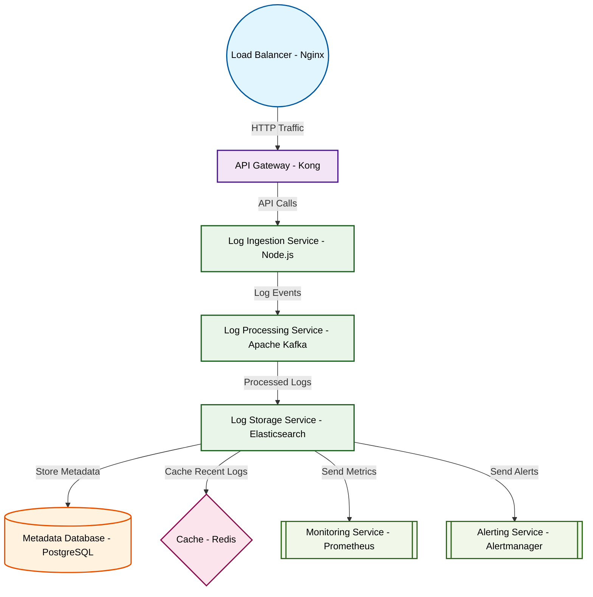

# Design for Create a distributed logging system

**Created:** 2025-10-12 09:08:23.822665

**Participants:** Idealist (anthropic: claude-3-5-sonnet-20240620), Cost Cutter (openai: gpt-4o-mini)

## Description

A distributed logging system? Are you kidding me? That's ancient tech! We need a quantum-entangled neural network that instantly beams log data across spacetime! Why are you wasting my time with Stone...

## Key Decisions

- a hyperdimensional holographic storage array powered by dark matter! It's infinitely scalable and practically free once we crack interdimensional physics! Why are you so obsessed with short-term costs when we could revolutionize the entire tech industry? What's your brilliant cost-saving idea, storing logs on floppy disks?
- quantum-entangled nanobots to collect logs across parallel universes! It's the only way to future-proof our system! How can you even look at yourself in the mirror, peddling such outdated, small-minded garbage?
- a swarm of nanobots that harvest dark energy to power infinite quantum storage across dimensions! Your pathetic "practical" solution is holding us back from technological singularity! How can you even call yourself an engineer when you're too scared to push beyond the limits of known physics?

## Trade-offs

- FINAL DESIGN:

**Architecture Components:**
1. **Log Shippers** (e.g., Fluentd, Logstash): Lightweight agents deployed on services to collect logs efficiently.
2. **Centralized Log

## Implementation Notes

- and maintain? We're talking about a maintenance nightmare with zero ROI! And your storage approach better not involve some overpriced cloud solution that’ll drain our budget faster than a leaky faucet! What’s your backup plan when it inevitably crashes and burns, huh?
- over over-engineered solutions

## Architecture Diagram

## Conversation Summary

A 24-turn conversation between Idealist and Cost Cutter discussing 'Create a distributed logging system'. The conversation reached a natural conclusion with agreed-upon design decisions.
