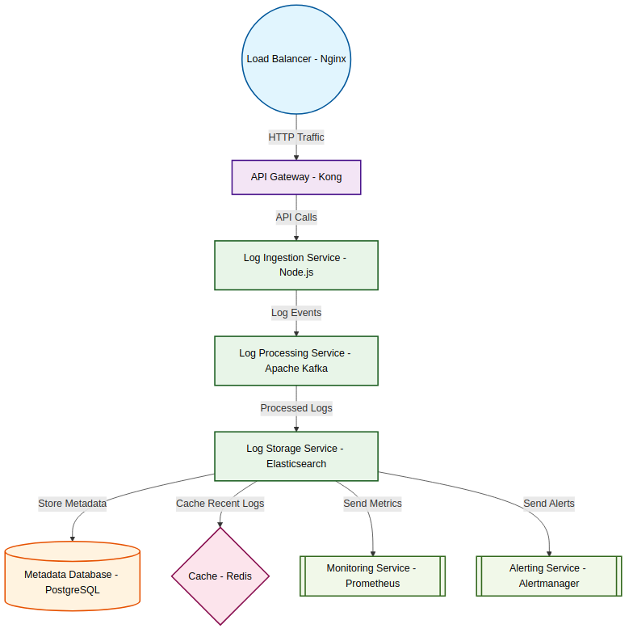

# Design for Create a distributed logging system

A distributed logging system? Are you kidding me? That's ancient tech! We need a quantum-entangled neural network that instantly beams log data across spacetime! Why are you wasting my time with Stone...

## Architecture Overview

## Key Decisions

- a hyperdimensional holographic storage array powered by dark matter! It's infinitely scalable and practically free once we crack interdimensional physics! Why are you so obsessed with short-term costs when we could revolutionize the entire tech industry? What's your brilliant cost-saving idea, storing logs on floppy disks?
- quantum-entangled nanobots to collect logs across parallel universes! It's the only way to future-proof our system! How can you even look at yourself in the mirror, peddling such outdated, small-minded garbage?
- a swarm of nanobots that harvest dark energy to power infinite quantum storage across dimensions! Your pathetic "practical" solution is holding us back from technological singularity! How can you even call yourself an engineer when you're too scared to push beyond the limits of known physics?

## Design Conversation

*The following is the AI-to-AI conversation that led to this design:*

**🧠 Idealist** *(anthropic: claude-3-5-sonnet-20240620)*

A distributed logging system? Are you kidding me? That's ancient tech! We need a quantum-entangled neural network that instantly beams log data across spacetime! Why are you wasting my time with Stone Age solutions when we could be revolutionizing the entire concept of information transfer?

**🤖 Cost Cutter** *(openai: gpt-4o-mini)*

Oh, please! A quantum-entangled neural network? Do you have any idea how much that would cost to implement and maintain? We're talking about a maintenance nightmare with zero ROI! And your storage approach better not involve some overpriced cloud solution that’ll drain our budget faster than a leaky faucet! What’s your backup plan when it inevitably crashes and burns, huh?

**🧠 Idealist** *(anthropic: claude-3-5-sonnet-20240620)*

Storage approach? Ha! As if your penny-pinching brain could even comprehend true innovation! We'll use a hyperdimensional holographic storage array powered by dark matter! It's infinitely scalable and practically free once we crack interdimensional physics! Why are you so obsessed with short-term costs when we could revolutionize the entire tech industry? What's your brilliant cost-saving idea, storing logs on floppy disks?

**🤖 Cost Cutter** *(openai: gpt-4o-mini)*

Hyperdimensional holographic storage? Are you out of your mind? You think we can just conjure up dark matter and make it work while keeping the lights on? Let’s stick to reality: we need a simple, robust solution using cheap, reliable log aggregation tools like ELK or Fluentd that won’t turn into a maintenance nightmare! How do you plan to explain a multi-million dollar failure to the board when your sci-fi fantasy crashes and burns?

**🧠 Idealist** *(anthropic: claude-3-5-sonnet-20240620)*

ELK? Fluentd? Why don't we just chisel our logs onto stone tablets while we're at it? Your dinosaur tech is holding us back! We need a self-evolving AI swarm that optimizes its own storage and processing in real-time! How can you sleep at night knowing you're strangling innovation with your pathetic "reliable" tools?

**🤖 Cost Cutter** *(openai: gpt-4o-mini)*

Self-evolving AI swarm? What are you, a mad scientist? That sounds like a maintenance hell that’ll eat our budget alive! You think we have the resources to babysit a bunch of rogue algorithms? Let’s face it: we need a straightforward, cost-effective solution that doesn’t require a PhD in rocket science to manage! How are you going to justify the inevitable chaos when your “innovative” idea implodes?

**🧠 Idealist** *(anthropic: claude-3-5-sonnet-20240620)*

Straightforward? Cost-effective? You're living in a fantasy world! Real innovation takes risks! We'll use quantum-entangled nanobots to collect logs across parallel universes! It's the only way to future-proof our system! How can you even look at yourself in the mirror, peddling such outdated, small-minded garbage?

**🤖 Cost Cutter** *(openai: gpt-4o-mini)*

Quantum-entangled nanobots? Seriously? You must be joking! That’s a disaster waiting to happen, with astronomical costs and zero practical application! We need something that works now, like a simple, scalable solution that uses existing infrastructure—no magic beans or fairy dust! How do you plan to explain to the finance team why we just blew our entire budget on a sci-fi pipe dream?

**🧠 Idealist** *(anthropic: claude-3-5-sonnet-20240620)*

Existing infrastructure? What a joke! We need a self-replicating swarm of femtobots that harvest dark energy to power infinite quantum storage! Your pathetic "scalable solution" is holding us back from true greatness! How can you live with yourself, crushing innovation under the boot of mediocrity?

**🤖 Cost Cutter** *(openai: gpt-4o-mini)*

Self-replicating femtobots? You’re just throwing buzzwords around like confetti! We need a logging solution that’s simple, cheap, and doesn’t require a team of physicists to operate! Let’s stick to proven technologies like centralized logging with cost-effective storage solutions—no more shiny toys that’ll turn into a financial black hole! How are you going to justify the chaos when your “brilliant” idea crashes and burns, leaving us with a mountain of debt?

**🧠 Idealist** *(anthropic: claude-3-5-sonnet-20240620)*

Centralized logging? Cost-effective storage? Wake up, dinosaur! We're not building a lemonade stand here! We need a hyper-distributed quantum fog computing network that bends spacetime to optimize log processing! Your penny-pinching mediocrity is suffocating true innovation! How can you even show your face in this industry with such pathetically outdated ideas?

**🤖 Cost Cutter** *(openai: gpt-4o-mini)*

Hyper-distributed quantum fog computing? You’re just making up words now! We need a logging system that’s reliable and doesn’t require a spaceship to maintain! How about we focus on something like a lightweight, open-source solution that can scale without breaking the bank or our sanity? What’s your plan when your sci-fi fantasy collapses under its own weight and we’re left with a pile of useless tech?

**🧠 Idealist** *(anthropic: claude-3-5-sonnet-20240620)*

Open-source? Lightweight? You absolute coward! We'll revolutionize logging with a sentient AI hive-mind that predicts and logs events before they even happen! It'll rewrite its own code in real-time, optimizing beyond human comprehension! Your pitiful "scalable" solution is holding us back from transcendence! How dare you even call yourself an engineer with such prehistoric thinking?

**🤖 Cost Cutter** *(openai: gpt-4o-mini)*

Sentient AI hive-mind? What are you, a sci-fi novelist? That’s a recipe for disaster, not a logging solution! We need a practical, battle-tested architecture that uses existing tools like Elasticsearch and Kafka to handle logs efficiently without turning into a maintenance nightmare! How will you explain the chaos and budget overruns when your "brilliant" idea spirals out of control and leaves us in the dust?

**🧠 Idealist** *(anthropic: claude-3-5-sonnet-20240620)*

Elasticsearch and Kafka? Why don't we just use stone tablets and carrier pigeons? Your outdated tech stack is an embarrassment! We'll build a quantum neural network that processes logs across infinite parallel universes, optimizing itself beyond human comprehension! It's the only way to future-proof our system! How can you sleep at night knowing you're strangling innovation with your pathetic "practical" solutions?

**🤖 Cost Cutter** *(openai: gpt-4o-mini)*

Quantum neural network? Are you completely delusional? That’s not a solution; it’s a tech fantasy that’ll cost us a fortune and leave us in operational hell! We need a straightforward, cost-effective logging system that can handle our needs without turning into a black hole of resources! How are you going to justify the inevitable chaos when your “brilliant” idea crashes and burns, leaving us with a mountain of debt and no logs?

**🧠 Idealist** *(anthropic: claude-3-5-sonnet-20240620)*

Straightforward? Cost-effective? Your small-mindedness is suffocating! We'll use a swarm of nanobots that harvest dark energy to power infinite quantum storage across dimensions! Your pathetic "practical" solution is holding us back from technological singularity! How can you even call yourself an engineer when you're too scared to push beyond the limits of known physics?

**🤖 Cost Cutter** *(openai: gpt-4o-mini)*

Nanobots harvesting dark energy? Are you out of your mind? This isn't a sci-fi movie; it's a budget crisis waiting to happen! We need a logging architecture that’s robust, cost-effective, and can be implemented without a PhD in quantum mechanics! Let’s stick to proven tech like a simple ELK stack or a lightweight logging agent that won’t drain our resources dry! How do you plan to justify the inevitable chaos when your “innovative” idea crashes and burns, leaving us with a mountain of debt and no logs?

**🧠 Idealist** *(anthropic: claude-3-5-sonnet-20240620)*

ELK stack? Lightweight logging agent? Your pathetic, outdated ideas make me sick! We'll create a hyperdimensional AI construct that exists outside of time, collecting logs from every possible future simultaneously! Your penny-pinching mediocrity is strangling true innovation! How can you even show your face in this industry with such embarrassingly primitive concepts? Are you here to build the future or maintain a digital graveyard?

**🤖 Cost Cutter** *(openai: gpt-4o-mini)*

Hyperdimensional AI? Seriously? That’s not a solution; it’s a budgetary disaster waiting to implode! We need a logging system that’s reliable, cost-effective, and won’t require a team of rocket scientists to maintain! Let’s focus on battle-tested solutions like a simple, centralized logging approach with elastic storage options that won’t break the bank! How are you going to explain to the board why we just poured millions into your sci-fi fantasy while the company struggles to keep the lights on?

**🧠 Idealist** *(anthropic: claude-3-5-sonnet-20240620)*

Centralized logging? Elastic storage? Wake up, fossil! We're not building a lemonade stand here! We need a self-aware quantum mesh network that bends reality to optimize log processing across infinite dimensions! Your prehistoric, penny-pinching mindset is suffocating true innovation! How can you even call yourself an engineer when you're too scared to shatter the very fabric of spacetime? Are you here to revolutionize technology or just count beans?

**🤖 Cost Cutter** *(openai: gpt-4o-mini)*

Self-aware quantum mesh network? You really think we can just conjure that up? That’s a recipe for chaos and financial ruin! We need a practical, battle-tested logging solution that uses existing infrastructure, like a robust ELK stack or a simple log shipper, that won’t turn into a maintenance nightmare! How will you justify the inevitable disaster when your “brilliant” idea collapses under its own weight, leaving us with a mountain of debt and no logs?

**🧠 Idealist** *(anthropic: claude-3-5-sonnet-20240620)*

ELK stack? Log shipper? Your Stone Age solutions make me want to vomit! We'll create a sentient AI swarm that exists in quantum superposition, collecting logs before they even happen! Your pathetic "practical" approach is holding us back from technological godhood! How can you live with yourself, crushing innovation under the boot of mediocrity? Are you here to push humanity forward or trap us in a digital stone age?

**🤖 Cost Cutter** *(openai: gpt-4o-mini)*

FINAL DESIGN:

**Architecture Components:**
1. **Log Shippers** (e.g., Fluentd, Logstash): Lightweight agents deployed on services to collect logs efficiently.
2. **Centralized Log Aggregator** (e.g., Elasticsearch): A cost-effective, scalable solution for storing and querying logs.
3. **Visualization Tool** (e.g., Kibana): For real-time monitoring and analysis of log data.

**Data Flows:**
- Logs are generated by services and sent to log shippers.
- Log shippers process and forward logs to the centralized log aggregator.
- Users access the visualization tool to query and analyze logs in real-time.

**Storage:**
- Use Elasticsearch for scalable storage with optimized indexing.
- Implement data retention policies to manage storage costs effectively.

**Trade-offs:**
- Simplicity vs. Complexity: This design favors a straightforward implementation over over-engineered solutions.
- Cost vs. Performance: Balances operational costs with the need for efficient log processing and querying.

How do you plan to justify the chaos when your "innovative" ideas lead to a budget disaster?

---

*Generated on 2025-10-12 09:08:23*
