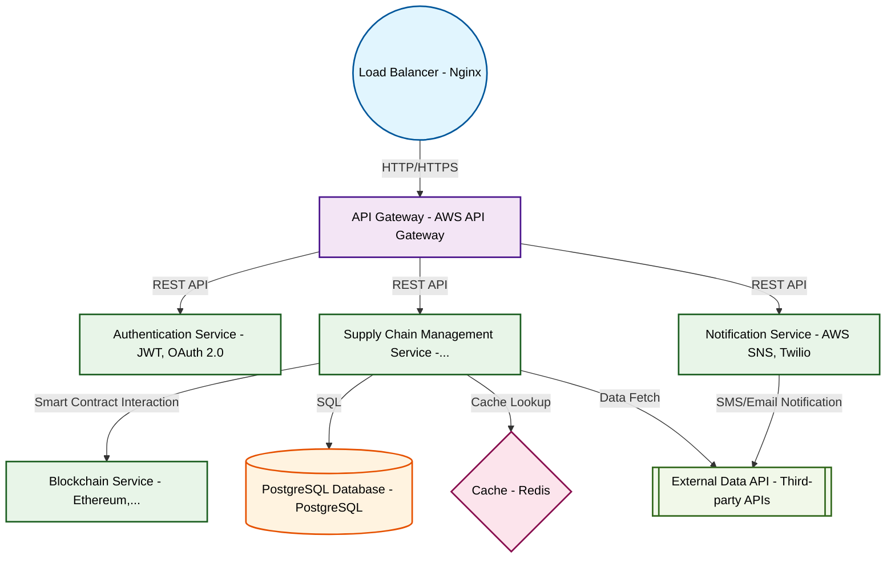

# Design for Design a blockchain-based supply chain tracker

**Created:** 2025-10-13 09:10:07.455146

**Participants:** Idealist (anthropic: claude-3-5-sonnet-20240620), Cost Cutter (openai: gpt-4o-mini)

## Description

Blockchain-based supply chain tracker?! Are you KIDDING ME? That's the most overplayed, overhyped bullshit I've heard all week. Why don't we just slap "AI" and "cloud" on there too and call it a day? ...

## Key Decisions

- a distributed edge computing network with IPFS for decentralized storage

## Implementation Notes

- Desperate? You’re the one clinging to a fantasy! Your edge computing and IPFS idea sounds great until you realize the hidden costs of managing all those nodes and the endless maint
- A tornado of technical superiority? More like a whirlwind of delusion! Your so-called "innovative" ideas are just a recipe for disaster, with endless integration headaches and cost

## Architecture Diagram

## Conversation Summary

A 13-turn conversation between Idealist and Cost Cutter discussing 'Design a blockchain-based supply chain tracker'. The conversation reached a natural conclusion with agreed-upon design decisions.
