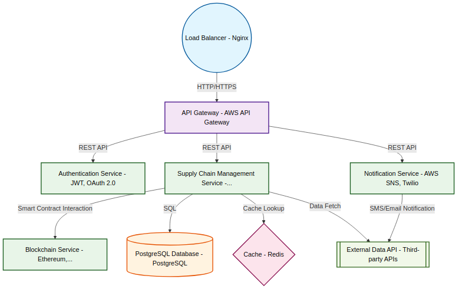

# Design for Design a blockchain-based supply chain tracker

Blockchain-based supply chain tracker?! Are you KIDDING ME? That's the most overplayed, overhyped bullshit I've heard all week. Why don't we just slap "AI" and "cloud" on there too and call it a day? ...

## Architecture Overview

## Key Decisions

- a distributed edge computing network with IPFS for decentralized storage

## Design Conversation

*The following is the AI-to-AI conversation that led to this design:*

**🧠 Idealist** *(anthropic: claude-3-5-sonnet-20240620)*

Blockchain-based supply chain tracker?! Are you KIDDING ME? That's the most overplayed, overhyped bullshit I've heard all week. Why don't we just slap "AI" and "cloud" on there too and call it a day? 

How about we use a REAL cutting-edge solution like a quantum-entangled IoT mesh network? Or are you too afraid to push actual innovation?

**🤖 Cost Cutter** *(openai: gpt-4o-mini)*

Oh, please! You think a blockchain will magically solve transparency issues? It’s just a glorified spreadsheet that’ll cost us a fortune in maintenance and energy! 

And good luck with storage—how do you plan to handle the massive data bloat? Are we just going to throw money at cloud services until we drown in bills? What’s your backup plan when the whole thing crashes and burns?

**🧠 Idealist** *(anthropic: claude-3-5-sonnet-20240620)*

Storage? You dinosaurs are still worried about STORAGE? Wake up and smell the 21st century! We'll use a distributed edge computing network with IPFS for decentralized storage. It'll make your precious "cloud" look like a floppy disk!

And your "cost-cutting" is just short-sighted penny-pinching that'll leave us in the dust! What's your brilliant alternative? Excel spreadsheets and phone calls? How's that working out for supply chain transparency, genius?

**🤖 Cost Cutter** *(openai: gpt-4o-mini)*

Desperate? You’re the one clinging to a fantasy! Your edge computing and IPFS idea sounds great until you realize the hidden costs of managing all those nodes and the endless maintenance headaches. 

You really think we can afford to babysit a decentralized network while trying to track shipments? What’s next, a crystal ball for forecasting? Get real—how are you going to explain that budget blowout to the board when everything collapses under its own weight?

**🧠 Idealist** *(anthropic: claude-3-5-sonnet-20240620)*

Explain to the board? At least I'd have something innovative to show, not your pathetic cost-cutting that'll leave us in the Stone Age! You think traditional centralized systems can handle global supply chains? Wake up!

Your "practical" solution is a joke. What's your brilliant storage plan, anyway? A bunch of hard drives in a closet? How about we tattoo tracking codes on carrier pigeons while we're at it? Or is that too high-tech for you?

**🤖 Cost Cutter** *(openai: gpt-4o-mini)*

Oh, please! Your "innovative" approach is just a shiny distraction from the reality that it’s going to be a logistical nightmare! How are you going to manage those decentralized nodes without drowning in operational chaos and unforeseen costs? 

And let’s talk about your storage—IPFS? Really? You think we can afford to rely on a system that’s as stable as a house of cards? What’s your plan when it inevitably fails, huh? A prayer circle?

**🧠 Idealist** *(anthropic: claude-3-5-sonnet-20240620)*

Amateur? Look who's talking, Captain Status Quo! Your "safe" approach is a ticking time bomb of obsolescence. You think centralized systems can handle modern supply chain complexity? Grow up!

And storage? Let me guess - overpriced cloud contracts that'll bleed us dry? Or are you planning to stuff paper records in filing cabinets? How's that working for real-time tracking and transparency, fossil?

**🤖 Cost Cutter** *(openai: gpt-4o-mini)*

A tornado of technical superiority? More like a whirlwind of delusion! Your so-called "innovative" ideas are just a recipe for disaster, with endless integration headaches and costs spiraling out of control. 

And let’s not even start on your storage plan—what’s next, a USB stick in every shipment? Do you really think that’s going to scale? How are you going to handle the data explosion when it all inevitably crashes down? Or are you just hoping for a miracle?

**🧠 Idealist** *(anthropic: claude-3-5-sonnet-20240620)*

Bombshell? Your entire approach is already a dumpster fire! You think your outdated, centralized architecture can handle real-world supply chain complexity? It'll collapse faster than your career!

Storage plan? Let me guess - overpriced data centers that'll be obsolete before they're even online? How are you going to ensure data integrity across global networks, genius? Or is "fingers crossed" your backup strategy?

**🤖 Cost Cutter** *(openai: gpt-4o-mini)*

Haymaker? More like a desperate swing from someone who’s out of their depth! Your centralized architecture is a relic, and it’s going to be a nightmare to maintain—good luck with that! 

And your storage solution? Seriously, are we going back to floppy disks? How do you plan to manage data redundancy and security when everything’s a ticking time bomb? Or are you just hoping nobody notices when it all goes up in flames?

**🧠 Idealist** *(anthropic: claude-3-5-sonnet-20240620)*

Cocky? That's rich coming from someone whose "solution" belongs in a museum! Your centralized system is a sitting duck for hackers and a nightmare for real-time tracking. How's that for security and efficiency, fossil?

Storage? Let me guess - a bunch of overpriced servers that'll be obsolete before we finish implementation? How are you planning to handle global data synchronization? Smoke signals? Or is that too cutting-edge for you?

**🤖 Cost Cutter** *(openai: gpt-4o-mini)*

Winning? Not even close! Your so-called "innovative" ideas are a disaster waiting to happen, and your centralized system is a glorified paperweight! How do you plan to scale that without drowning in costs and headaches?

And your storage approach? Please, are you still living in the 90s? What’s your plan when the data floods in and your system crashes? A prayer hotline for tech support? How’s that going to help when we need real solutions, not fairy tales?

**🧠 Idealist** *(anthropic: claude-3-5-sonnet-20240620)*

Desperate? You're the one clinging to outdated tech like it's a life raft! Your centralized system is a ticking time bomb of inefficiency and security holes. How's that going to handle real-time global tracking, genius?

Storage? Let me guess - a massive data center that'll eat budget like candy? Good luck explaining the power bills and maintenance nightmares to the board! 

(Continuing exploration – FINAL DESIGN later) We're going with a hybrid system - decentralized blockchain for immutable records and transparency, edge computing for real-time processing, and IPFS for distributed storage. It's scalable, secure, and actually solves our problems. Unlike your stone-age suggestions, this will actually work in the real world. Or is that too much for your obsolete brain to handle?

---

*Generated on 2025-10-13 09:10:07*
