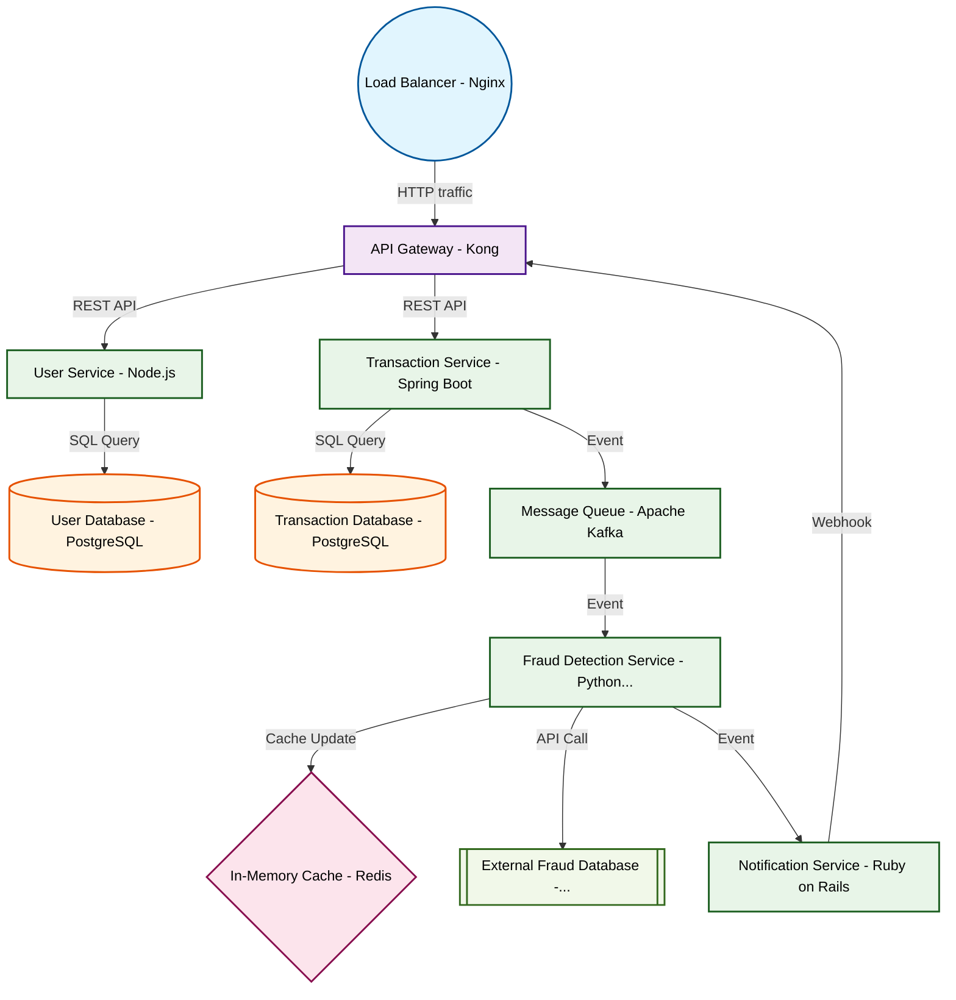

# Design for Create a real-time fraud detection system

**Created:** 2025-10-14 09:08:24.847619

**Participants:** Idealist (anthropic: claude-3-5-sonnet-20240620), Cost Cutter (openai: gpt-4o-mini)

## Description

Real-time fraud detection? Are you kidding me? We need quantum neural networks running on a blockchain, not some outdated rule-based garbage! Why even bother if we're not pushing the absolute bleeding...

## Key Decisions

- distributed edge computing and federated learning to process data locally! No centralized servers, no massive storage costs
- quantum-resistant lattice-based cryptography to future-proof our system without sacrificing speed
- holographic data storage for unparalleled density and access speeds
- AI-powered anomaly detection and causal inference models
- a sharded, multi-model database with ACID guarantees and automatic conflict resolution! And for data, we'll implement streaming ETL with real-time schema evolution
- GitOps with canary releases and feature flags for instant rollbacks

## Trade-offs

- who’s going to manage the chaos when deployments fail and rollback becomes a nightmare? Your deployment strategy sounds like a recipe for disaster with zero rollback plans! Are you really so naive to think will run smoothly, or are you just banking on luck to get us through the next outage?

## Implementation Notes

- Oh, fantastic! More fancy buzzwords! Sharded databases and streaming ETL? Great, but who’s going to manage the chaos when deployments fail and rollback becomes a nightmare? Your de

## Architecture Diagram

## Conversation Summary

A 13-turn conversation between Idealist and Cost Cutter discussing 'Create a real-time fraud detection system'. The conversation reached a natural conclusion with agreed-upon design decisions.
