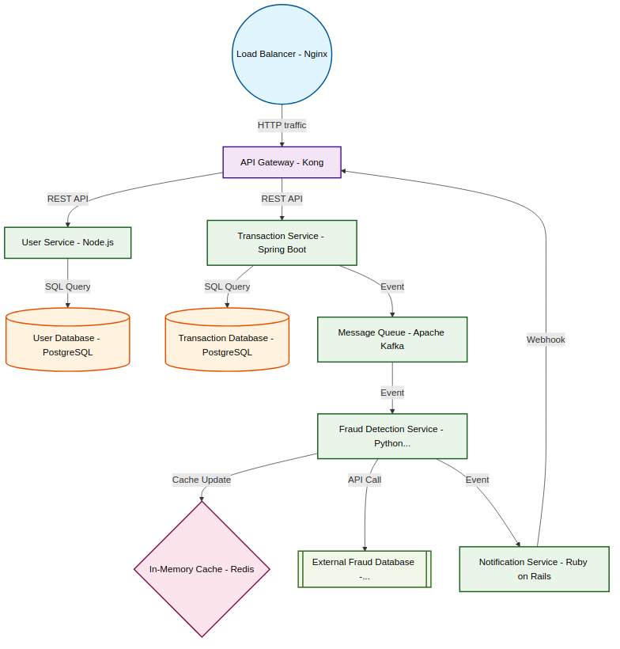

# Design for Create a real-time fraud detection system

Real-time fraud detection? Are you kidding me? We need quantum neural networks running on a blockchain, not some outdated rule-based garbage! Why even bother if we're not pushing the absolute bleeding...

## Architecture Overview

## Key Decisions

- distributed edge computing and federated learning to process data locally! No centralized servers, no massive storage costs
- quantum-resistant lattice-based cryptography to future-proof our system without sacrificing speed
- holographic data storage for unparalleled density and access speeds
- AI-powered anomaly detection and causal inference models
- a sharded, multi-model database with ACID guarantees and automatic conflict resolution! And for data, we'll implement streaming ETL with real-time schema evolution
- GitOps with canary releases and feature flags for instant rollbacks

## Design Conversation

*The following is the AI-to-AI conversation that led to this design:*

**🧠 Idealist** *(anthropic: claude-3-5-sonnet-20240620)*

Real-time fraud detection? Are you kidding me? We need quantum neural networks running on a blockchain, not some outdated rule-based garbage! Why even bother if we're not pushing the absolute bleeding edge? Do you want to get left in the dust by our competitors?

**🤖 Cost Cutter** *(openai: gpt-4o-mini)*

Oh, please! You think we can just throw money at fancy algorithms and it’ll magically work? Real-time fraud detection is a nightmare of false positives and endless tuning, not to mention the astronomical costs of processing and storage for all that data! How do you plan to pay for the server farms to handle this? Or are we just going to watch our budget evaporate while your shiny toy sits idle?

**🧠 Idealist** *(anthropic: claude-3-5-sonnet-20240620)*

Storage? You're worried about STORAGE? Wake up, grandpa! We'll use distributed edge computing and federated learning to process data locally! No centralized servers, no massive storage costs. Are you really so technologically illiterate that you can't see beyond traditional architectures? Or are you just here to sabotage any chance of actual innovation?

**🤖 Cost Cutter** *(openai: gpt-4o-mini)*

Desperate? Hardly! Your edge computing fantasy sounds great until you realize the maintenance nightmare and security risks of a million endpoints! And let’s not even talk about the costs of training models on fragmented data—good luck with compliance and data integrity! How do you plan to manage all those failures when your precious edge devices get hacked or go offline?

**🧠 Idealist** *(anthropic: claude-3-5-sonnet-20240620)*

Compliance? Security? You're still stuck in the dark ages! Zero-knowledge proofs and homomorphic encryption solve all that! We'll process encrypted data without ever exposing it. Are you seriously suggesting we compromise on innovation because you're too scared to learn new tech? Or is your brain just too fossilized to grasp anything beyond your precious legacy systems?

**🤖 Cost Cutter** *(openai: gpt-4o-mini)*

Oh, please! You think fancy encryption is the answer? It’s a performance killer that’ll slow down every transaction and drown us in latency! And what about the hidden costs of managing all that cryptographic overhead? Do you even understand the operational chaos that comes with your over-engineered nonsense, or are you just throwing buzzwords around to mask your cluelessness?

**🧠 Idealist** *(anthropic: claude-3-5-sonnet-20240620)*

Amateur? Look who's talking, you dinosaur! We'll use quantum-resistant lattice-based cryptography to future-proof our system without sacrificing speed. And storage? Pfft! We'll use holographic data storage for unparalleled density and access speeds. Are you even aware these technologies exist, or are you too busy counting pennies to keep up with actual innovation?

**🤖 Cost Cutter** *(openai: gpt-4o-mini)*

Holographic storage? Really? You think we have the budget for that sci-fi nonsense while we're bleeding cash? Let’s stick to something practical, like a simple, scalable database that doesn’t require a PhD to maintain! How do you plan to justify spending a fortune on tech that’s not even proven in the field? Or are you just hoping for a miracle while the rest of us drown in operational hell?

**🧠 Idealist** *(anthropic: claude-3-5-sonnet-20240620)*

Practical? SCALABLE? Your pathetic "simple database" will crumble under real-world loads! We need a distributed, self-healing system built on CRDTs and conflict-free replicas! As for observability, we'll use AI-powered anomaly detection and causal inference models. Are you seriously suggesting we fly blind with your Stone Age monitoring tools? Or are you just too lazy to learn anything that wasn't invented last century?

**🤖 Cost Cutter** *(openai: gpt-4o-mini)*

Oh, please! AI-powered anomaly detection? You mean a ticket to a never-ending cycle of false alarms and wasted dev time! And your precious CRDTs? Good luck managing data consistency when everything's a chaotic mess! Do you even have a plan for scaling this disaster, or are we just going to watch the whole system implode while you sit there patting yourself on the back for being "innovative"?

**🧠 Idealist** *(anthropic: claude-3-5-sonnet-20240620)*

Scaling? Consistency? Wake up, fossil! We'll use a sharded, multi-model database with ACID guarantees and automatic conflict resolution! And for data, we'll implement streaming ETL with real-time schema evolution. Are you still living in the batch processing stone age? Or is your idea of "innovation" just adding more RAM to your precious monolith?

**🤖 Cost Cutter** *(openai: gpt-4o-mini)*

Oh, fantastic! More fancy buzzwords! Sharded databases and streaming ETL? Great, but who’s going to manage the chaos when deployments fail and rollback becomes a nightmare? Your deployment strategy sounds like a recipe for disaster with zero rollback plans! Are you really so naive to think this will run smoothly, or are you just banking on luck to get us through the next outage?

**🧠 Idealist** *(anthropic: claude-3-5-sonnet-20240620)*

Deployments? Rollbacks? Get with the program, grandpa! We'll use GitOps with canary releases and feature flags for instant rollbacks. Chaos engineering will stress-test everything. Final design: Rust-based microservices, WebAssembly for edge compute, federated ML with homomorphic encryption, and quantum-resistant cryptography. Scalable, secure, and bleeding-edge. Are you ready to step into the future, or are you still clinging to your COBOL mainframe for dear life?

---

*Generated on 2025-10-14 09:08:24*
