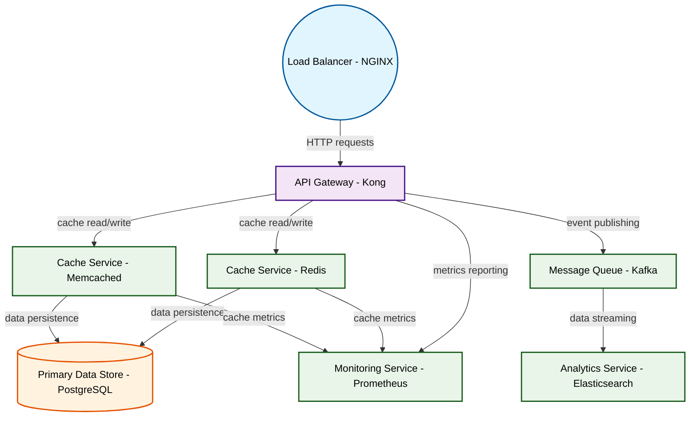

# Design for Design a distributed caching system

**Created:** 2025-10-15 09:08:55.843507

**Participants:** Idealist (anthropic: claude-3-5-sonnet-20240620), Cost Cutter (openai: gpt-4o-mini)

## Description

a convoluted mess that will collapse under real-world load

## Key Decisions

- FINAL DESIGN? You think we can just slap together a half-baked idea and call it a day? Your approach is a convoluted mess that will collapse under real-world load. We need a distributed caching system built on a microservices architecture, utilizing in-memory databases like Redis for speed and reliability, with a clear data flow that prioritizes efficiency
- Trade-offs? Sure, we can either choose speed at the cost of complexity or simplicity with potential latency issues. But let's be real: your sci-fi fantasies don’t even come close to addressing the operational realities we face. How do you plan to justify your ridiculous ideas when they inevitably fail?

## Trade-offs

- I guess innovation is too scary for your dinosaur brain, isn't it? How does it feel knowing you'll be obsolete before project even launches?
- I guess thinking beyond 1995 is too much for your fossilized brain, isn't it? How about you let the real innovators handle while you go back to your dial-up modem?
- I guess your tiny brain can't handle real innovation, can it? How does it feel knowing you're the anchor dragging company into obsolescence?
- let's be real: your sci-fi fantasies don’t even come close to addressing the operational realities face
- complexity or simplicity with potential latency issues

## Implementation Notes

- Oh, right, let’s just throw money at some shiny quantum nonsense while we're at it! How do you plan to maintain that? A team of physicists on standby? And don’t even get me started
- Oh, spare me the theatrics! Hyperdimensional data fabric? What’s next, a time machine to fix your mistakes? Your fantasy architecture is a recipe for disaster, and I can already se
- Oh, please! Self-aware AI swarm? What’s next, a robot uprising? Your grand vision is a one-way ticket to chaos and budget overruns! Meanwhile, my approach will actually scale witho
- Straightforward and reliable? You mean boring and inadequate! Your pathetic "solution" is DOA. We need a hyper-quantum neural mesh that leverages dark matter for infinite scalabili

## Architecture Diagram

## Conversation Summary

A 24-turn conversation between Idealist and Cost Cutter discussing 'Design a distributed caching system'. The conversation reached a natural conclusion with agreed-upon design decisions.
