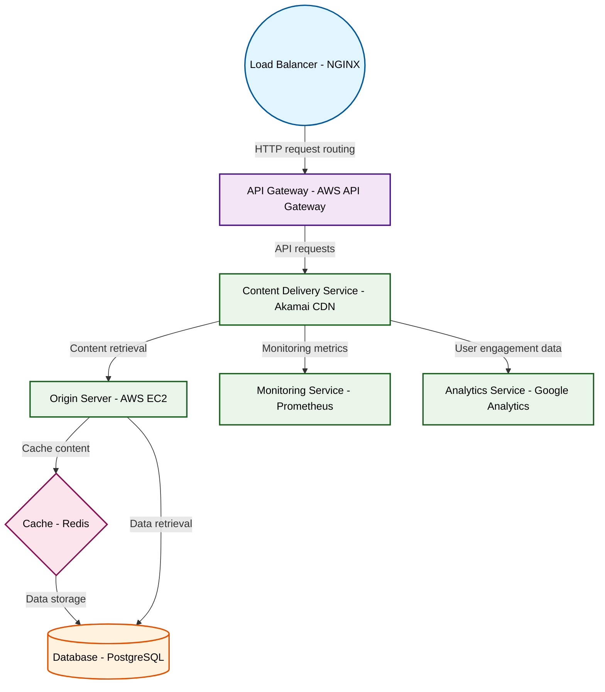

# Design for Design a content delivery network architecture

**Created:** 2025-10-16 09:09:34.526697

**Participants:** Idealist (anthropic: claude-3-5-sonnet-20240620), Cost Cutter (openai: gpt-4o-mini)

## Description

A content delivery network? Are you fucking kidding me? That's so 2005 I can smell the MySpace on it. We need a decentralized mesh network powered by quantum entanglement and run on Rust. How about yo...

## Key Decisions

- Architecture Components:
- While this architecture maximizes performance and security, it introduces complexity in management and requires skilled personnel to maintain. The initial investment is higher, but the long-term operational savings and competitive advantage justify the costs

## Trade-offs

- Final design? Sure, let’s wrap this up with a bow on your disaster! 

**Architecture Components:**
- **Decentralized Edge Network:** Utilizing Rust for performance and WebAssembly 

## Architecture Diagram

## Conversation Summary

A 24-turn conversation between Idealist and Cost Cutter discussing 'Design a content delivery network architecture'. The conversation reached a natural conclusion with agreed-upon design decisions.
