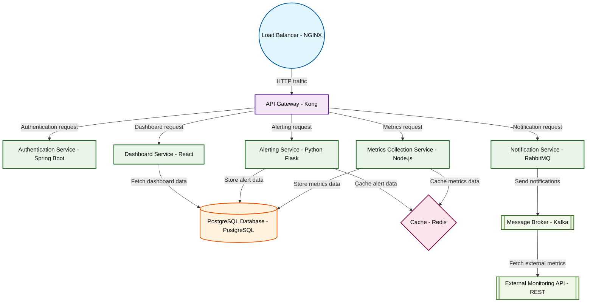

# Design for Design a microservices monitoring platform

**Created:** 2025-10-17 09:08:58.526659

**Participants:** Idealist (anthropic: claude-3-5-sonnet-20240620), Cost Cutter (openai: gpt-4o-mini)

## Description

a simple, effective microservices monitoring platform that tracks health, performance, and dependencies without the fluff

## Key Decisions

- fractal compression algorithms that make your pathetic databases look like stone tablets
- post-quantum cryptography for unbreakable security, and our AI will evolve the entire system in real-time
- post-quantum cryptography and a neural net that predicts and prevents issues before they occur
- a self-evolving mesh of quantum-entangled microservices that optimize in real-time, with AI-driven predictive maintenance and cross-dimensional scaling
- distributed tracing, real-time metrics aggregation, and intelligent alerting using battle-tested tools like Prometheus, Jaeger, and Grafana
- Kubernetes for orchestration and autoscaling, with a focus on resilience and fault tolerance

## Implementation Notes

- Data approach? You mean your glorified data swamp? Good luck trying to extract insights from that mess while we harness real-time analytics with our event-driven architecture! We’r

## Architecture Diagram

## Conversation Summary

A 19-turn conversation between Idealist and Cost Cutter discussing 'Design a microservices monitoring platform'. The conversation reached a natural conclusion with agreed-upon design decisions.
